# Documentação Blockchain - Módulo 5 - Inteli

## Grupo Ethos solução Tempus

### [Daniel Mendez](mailto:Daniel.Mendez@sou.inteli.edu.br)
### [Eduardo Oliveira](https://www.linkedin.com/in/eduardo-hos/)
### [Izadora Luz](https://www.linkedin.com/in/izadoraluz-rsn/)
### [Keylla Oliveira](https://www.linkedin.com/in/keylla-oliveira1206/)
### [Lucas Barbosa](https://www.linkedin.com/in/lucasdasilvabarbosa/)
### [Paulo Octavio](https://www.linkedin.com/in/paulooctaviodepaula/)
### [Samuel Nascimento](https://www.linkedin.com/in/samuel-martins-lopes-nascimento-7a805526a/)

# Sumário

- [Controle de Documento](#c1)
- [1. Introdução](#c3)
- [2. Objetivos](#c4)
- [3. Compreensão do Problema](#c5)
- [4. Análise de Experiência do Usuário](#c6)
- [5. Fluxo de interface](#c7)
- [6. Descritivo da Solução](#c8)
- [7. Desenvolvimento com testes](#c9)
- [8. Desenvolvimento com testes](#c10)
- [9. Pesquisa](#c11)
- [10. Conclusões e Recomendações](#c12)
- [11. Referências](#c13)
- [12. Anexos](#c14)

## <a name="c1"></a>Controle de Documento
Este seção contem informações sobre o controle de versão do documento, incluindo data de criação, autor e qualquer revisão subsequente.

<div align="center">
  <p><b>Tabela 01 </b> - Controle de Documento</p>

| Data       | Autor  | Versão | Resumo da Atividade           |
|------------|--------|--------|-------------------------------|
| 2024-02-16 | Eduardo Henrique | v1.0   | Primeira versão do documento com análise de negócios, compreensão do problema e análise de experiência do usuário |
| 2024-03-01 | Paulo Octavio  | v2.0   | Correção de erros ortográficos e documentação de smart contracts |
| 2024-03-15 | Keylla Oliveira | v3.0   | Correção e revisão geral - Sprint 4 |
| 2024-03-29 | Keylla Oliveira | v4.0   | Adição da seção de metodologia |
| 2024-04-12 | Daniel Mendez | v5.0   | Adição da seção de metodologia |

  <p><b>Fonte:</b> elaboração por Ethos.</p>
</div>


## <a name="c3"></a>1. Introdução
&emsp;&emsp;**Introdução ao Projeto *Tempus*: Transformando o Processo de Cotação de Fornecedores com Blockchain**

&emsp;&emsp;O projeto *Tempus*, desenvolvido pelo grupo Ethos da turma 10 de sistemas de informação do Inteli - Instituto de Tecnologia e Liderança, é uma iniciativa que visa abordar a falta de transparência nos preços históricos praticados por fornecedores, bem como a presença de fornecedores suspeitos em plataformas self-service, que afetam negativamente o processo de cotação e tomada de decisão nas organizações. Em parceria com a Alliance, uma empresa de consultoria empresarial e tecnológica com vasta experiência em soluções SAP, o projeto busca dinamizar o processo de cotação, aumentando a transparência e segurança da contratação de fornecedores.

&emsp;&emsp;A tecnologia chave aplicada nesse projeto é o blockchain, uma infraestrutura distribuída e segura que permite o registro transparente e imutável de transações. Utilizando o blockchain, o projeto *Tempus* busca criar um serviço inovador que determina o preço médio de mercado para produtos, garantindo que os usuários paguem um preço justo. Além disso, a solução proporciona total transparência e rastreabilidade das transações.

&emsp;&emsp;A infraestrutura necessária para o projeto incluiu acessos ao SAP BTP fornecidos pela Alliance, bem como a realização de uma prova de conceito em uma rede de testes aberta. Além disso, o projeto contempla a criação de um portal/website em BTP onde os usuários podem encontrar os itens desejados e seu preço médio de mercado, além da disponibilização de um distintivo de confiança para os parceiros que participam da rede.

&emsp;&emsp;Ao abordar os desafios relacionados à manipulação de preços, anonimato, padronização do artefato, segurança e escalabilidade, o projeto *Tempus* busca proporcionar benefícios significativos, como preços justos para todos, total transparência nas transações, eficiência e economia no processo de cotação, e a construção de uma rede de confiança entre os participantes. Com entusiasmo e conhecimento de que essa solução é única no mercado, o projeto *Tempus* apresenta potencial para transformar a forma de cotação de fornecedores através de uma aplicação em blockchain.

### 1.1 Parceiro de Negócios
&emsp;&emsp; A Alliance é uma empresa de consultoria empresarial e tecnológica com mais de 34 anos de experiência. Especializada em soluções SAP, a Alliance desenvolveu quatro principais softwares fiscais integrados aos ERPs internacionais, como SAP e Oracle. Reconhecida por sua excelência em tecnologia, a Alliance atende a mais de 980 empresas, incluindo grandes grupos nacionais e multinacionais em mais de 75 segmentos econômicos diferentes.

### 1.2 Definição do Problema
&emsp;&emsp; O problema abordado no projeto *Tempus* é a falta de transparência nos preços históricos praticados por fornecedores, bem como a presença de fornecedores suspeitos em plataformas self-service. Essa falta de transparência prejudica o processo de cotação e tomada de decisão, uma vez que as informações podem ser não confiáveis e os compradores podem se deparar com preços abusivos.

#### 1.2.1 Problema específico
&emsp;&emsp; O problema específico identificado é a dificuldade dos compradores em obter informações precisas e confiáveis sobre os preços históricos praticados pelos fornecedores. Além disso, a presença de fornecedores suspeitos em plataformas self-service dificulta ainda mais o processo de cotação, podendo levar a decisões baseadas em dados não confiáveis e a riscos de preços abusivos.

## <a name="c4"></a>2. Objetivos
&emsp;&emsp; Essa seção demonstra as principais metas a serem atendidas pelo projeto. Sendo dividido o projeto em objetivos gerais e específicos. Com isso é possível analisar o sucesso alcançado pelo grupo Ethos ao longo do desenvolvimento do projeto, alinhando com as justificativas de cada objetivo. 

### 2.1 Objetivos Geral
&emsp;&emsp; O objetivo geral do projeto *Tempus* é dinamizar o processo de cotação de fornecedores, aumentando a transparência e segurança da contratação de fornecedores através da aplicação da tecnologia blockchain.

### 2.2 Objetivos Específicos
1. Desenvolver um serviço baseado em blockchain para determinar o preço médio de mercado para produtos e serviços.
2. Garantir que os usuários paguem um preço justo por meio da transparência e rastreabilidade das transações.
3. Criar uma plataforma que permita o registro transparente e imutável de transações, incluindo um histórico detalhado das operações realizadas.
4. Integrar o blockchain ao sistema SAP Business Technology Platform (BTP) para conectar os processos de compras e fornecer uma solução completa aos clientes.

### 2.3 Justificativa
&emsp;&emsp; A realização do projeto *Tempus* é motivada pela necessidade de enfrentar os desafios relacionados à falta de transparência nos preços históricos praticados por fornecedores e à presença de fornecedores suspeitos em plataformas self-service. Esses problemas afetam negativamente o processo de cotação e tomada de decisão das organizações, resultando em informações não confiáveis e riscos de preços abusivos. A aplicação da tecnologia blockchain oferece uma solução para resolver esses problemas, proporcionando transparência, segurança e eficiência ao processo de cotação de fornecedores. Assim, o projeto *Tempus* visa criar valor para os clientes ao melhorar significativamente a confiabilidade e eficácia do processo de contratação de fornecedores.

## <a name="c5"></a>3. Compreensão do Problema

&emsp;&emsp;Esta seção se concentra na avaliação detalhada do ambiente de mercado e no escopo geral do projeto, visando compreender as necessidades, aspirações e desafios enfrentados pelo parceiro, a Alliance. Além disso, busca-se examinar o desempenho atual do negócio, considerando a perspectiva do projeto em questão. Para isso, são coletados dados relevantes para o negócio, identificam-se oportunidades de aprimoramento dentro do escopo do projeto e elaboram-se planos de ação estratégicos com uma visão de longo prazo para sua implementação.

Dentro dessa análise, são considerados fatores como análise de risco para identificar, avaliar e mitigar potenciais riscos de segurança da informação que podem afetar negativamente o projeto, matriz de risco para identificação de potenciais adversidades e canvas de proposta de valor para compreender como o projeto se alinha aos objetivos e necessidades da Alliance. Essas ferramentas e abordagens proporcionam uma compreensão abrangente do contexto empresarial, permitindo uma tomada de decisão informada e estratégica para o sucesso do projeto.

### 3.1 Proposta de Valor
De acordo com o grupo G4 educação: “O Value Proposition Canvas ou Proposta de Valor Canvas é uma ferramenta que permite aos empreendedores e empresários desenhar, testar e visualizar o valor do produto para os clientes, de uma forma intuitiva."<sup><a href="#referencia-1">¹</a></sup> Ao lado direito da imagem há o perfil do cliente, que apresenta os ganhos que ele terá com o produto, as dores atuais, e as tarefas dele no produto. Ao lado esquerdo há o mapa de valor, onde é apresentado o produto, seus criadores de ganho, e o alívio das dores do cliente.

<div align="center">
  <p> <b>Figura 01 </b> - Canvas Proposta de Valor</p>
  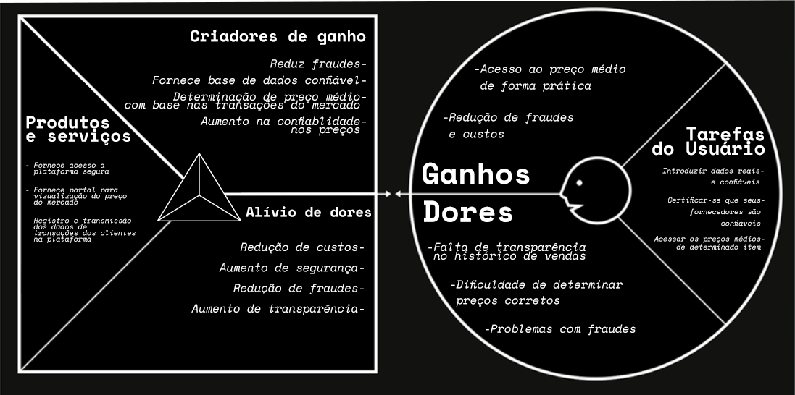
  <p><b>Fonte:</b> elaboração por grupo Ethos</p>
</div>

A seguir é explicado de forma detalhada os segmentos do Canvas produzido pelo grupo Ethos.

#### Serviços e Produtos:

- Plataforma para acesso ao preço médio das últimas vendas de produtos e serviços: O grupo oferece acesso a uma plataforma que oferece aos usuários acesso ao preço médio de um determinado item nas transações recentes entre as empresas presentes na plataforma, permitindo uma visão abrangente dos valores praticados no mercado.

- Portal para visualização do preço médio de mercado: Através de um portal fornecido pelo grupo os usuários podem visualizar o preço médio de mercado de forma prática, facilitando suas decisões de compra.

- Registro e transmissão dos dados de transações dos clientes na plataforma: A plataforma registra e transmite de forma segura os dados de transações, apresentando ao usuário apenas o preço médio das transações de determinado item.

#### Criadores de Ganho (Ganhos):

- Reduz fraudes: A plataforma fornece dados confiáveis, assim, evitando problemas de compliance, e reduzindo riscos com auditoria 

- Fornece base de dados confiável: A plataforma oferece dados confiáveis, visto que as empresas que estão dentro da plataforma são previamente escolhidas, e ao entrar na plataforma, as empresas aceitam enviar os seus dados para a ferramenta.

- Determinação de preço médio com base na transação do mercado : Como citado no item anterior, a plataforma utiliza os dados das transações fornecidas pelas empresas para apresentar o valor médio das transações de cada item.

- Aumento de confiabilidade nos preços escolhidos: Ao utilizar a plataforma para analisar o preço do mercado, os clientes terão maior confiança na escolha de suas compras, visto que terão acesso ao preço médio do mercado, alimentado por empresas usuárias da plataforma, e também, uma redução da preocupação com auditoria

#### Pain Relievers (Alívio de Dores):

- Redução de custos:  A plataforma dá diversas formas de reduzir custos para as empresas, primeiramente, a oportunidade de encontrar o preço médio e justo antes da compra. Além disso o aumento da transparência, e o aumento de transparência, ajudam a empresa a reduzir suas perdas financeiras por práticas comerciais incorretas

- Aumento de segurança e redução de fraudes: A plataforma aumenta a segurança e reduz o risco de fraudes para as empresas que utilizam a plataforma utilizando blockchain para registrar todas as operações de forma segura e transparente, assim, a plataforma oferece uma camada adicional de segurança

- Aumento de transparência: A plataforma disponibiliza informações precisas e atualizadas sobre o preço médio de um item no mercado, utilizando o histórico de transações de diversas empresas, que aceitaram compartilhar seus dados. Assim, a plataforma cria um ambiente de negócios mais transparente entre as empresas e justo. Isso permite que os usuários tomem decisões de compra com mais segurança.

#### Ganhos (Benefícios Esperados):

- Acesso ao preço médio de forma prática: As empresas que participam da plataforma, ganham acesso ao valor médio do mercado praticado para determinado item. Podendo assim acessar dados confiáveis de forma prática. Assim, gastando menos tempo e mão de obra atrás dos preços

- Redução de fraudes e custos:  A plataforma utiliza uma base de dados confiável, alimentada por empresas selecionadas, registrando transações com tecnologia blockchain, minimizando o risco de fraudes ou manipulação, o que também reduz o custo.

#### Customer Jobs (Trabalhos do Cliente):

- Introduzir dados reais e confiáveis: As empresas devem inserir dados reais, completos e confiáveis na plataforma, para que assim a base de dados seja transparente e confiável, para que assim todos os usuários sejam beneficiados.

- Certificar-se que seus fornecedores são confiáveis: As empresas também devem se certificar de que seus fornecedores são confiáveis, para que não haja a introdução de dados não condizentes com o mercado, para que assim, as empresas que estão presentes na plataforma, não sejam apresentadas com dados fraudulentos.

- Acessar os preços médios de determinado item : O trabalho dos clientes na plataforma é ver o preço médio do item escolhido, para que assim possam fazer a transação de forma segura, com confiança e transparência. Reduzindo assim o risco de fraudes e fazendo escolhas corretas nas suas operações	 

#### Dores (Problemas dos Clientes):

- Falta de transparência no histórico de vendas: Atualmente, as empresas lidam com o problema da falta de transparência com seus fornecedores, a falta de informações confiáveis sobre transações, dificulta o trabalho de encontrar um fornecedor confiável e justo para uma transação.
 
- Dificuldade para determinar preços corretos: Sem dados de transações públicas, as empresas têm grandes dificuldades em encontrar um preço correto, que faça sentido com o mercado, aumentando custos, e aumentando o risco de fraudes
	
- Problemas com fraudes: Devido a falta de transparência dos dados, uma empresa pode estar sujeita a fraudes, tanto da parte do fornecedor quanto de partes internas mal intencionadas, como falsificação de informações, ou práticas de preços abusivas.

Ao utilizar o Canvas Proposta de Valor, o grupo Ethos conseguiu discernir com precisão as vantagens cruciais que sua plataforma deve oferecer aos futuros usuários, bem como compreender profundamente as necessidades dos clientes. Este processo permitiu desenvolver um projeto alinhado às expectativas e demandas do público-alvo, garantindo uma solução mais efetiva e relevante.

### 3.2 Matriz de Risco

&emsp;&emsp;A matriz de risco é uma ferramenta de gestão usada para avaliar e priorizar riscos com base na probabilidade de ocorrência e no impacto desses riscos nas operações ou projetos. Consiste em um quadro bidimensional onde os riscos são mapeados de acordo com esses dois critérios, permitindo uma visualização clara de quais riscos necessitam de atenção imediata e quais podem ser monitorados com menos urgência. 

&emsp;&emsp;A importância da matriz de risco reside na sua capacidade de ajudar equipes a tomar decisões informadas sobre como alocar recursos de maneira eficaz para mitigar riscos, garantindo assim a continuidade dos negócios, a segurança das operações e a maximização dos resultados positivos<sup><a href="#referencia-2">²</a></sup>.

&emsp;&emsp;É muito importante ressaltar que a Matriz de Risco será atualizada a cada sprint, ou seja, espera-se que os desafios e problemas mudam periodicamente e sejam resolvidos de acordo com a sua relevância para o projeto. Para os pontos mais críticos, vamos elaborar um plano de ação específico para prevenir ou minimizar o impacto negativo.

<div align="center">
  <p><b>Figura 02</b> - Matriz de Risco</p>
  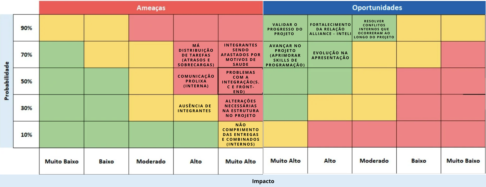
  <p><b>Fonte:</b> elaboração por Ethos</p>
</div>

**Ameaças** 

Má Distribuição de Tarefas (Atrasos e Sobrecargas):
Explicação: Esta ameaça se dá na ineficiência na alocação de tarefas, resultando em atrasos nas entregas e sobrecarga de alguns membros da equipe.
Plano de Ação: Implementar um sistema de gerenciamento de tarefas para equalizar a carga de trabalho e estabelecer revisões semanais para garantir que as atribuições estejam alinhadas com as capacidades de cada membro da equipe.

Comunicação Prolixa (Interna):
Explicação: A comunicação prolixa envolve a troca de informações excessivas ou desnecessárias que podem se tornar um obstáculo na hora de tomar decisões ou durante a realização de tarefas do grupo.
Plano de Ação: Adotar os combinados do grupo que incluem práticas como o uso de mensagens em plataformas específicas para tornar a troca de informações mais eficiente.

Problemas com a Integração (S.C e Front-End):
Explicação: Dificuldades técnicas na integração do Smart Contract com o front-end, que podem atrasar entregas, e sobrecarregar integrantes do grupo.
Plano de Ação: Promover encontros além dos períodos de desenvolvimento comuns, para agilizar o andamento da integração

Ausência de Integrantes:
Explicação: A ausência inesperada de integrantes pode levar a falhas na execução de tarefas e atrasar o cronograma do projeto.
Plano de Ação: Caso um integrante não tenha possibilidade de estar presencialmente, o mesmo deve realizar suas tarefas fora do ambiente acadêmico, para que o grupo não seja afetado.

Não Cumprimento das Entregas e Combinados (Internos):

Explicação: O risco de membros da equipe não honrarem seus compromissos, afetando a confiança e a entrega de resultados no prazo.
Plano de Ação: Manter o acompanhamento do progresso de todas as tarefas durante dailies e fechamentos


**Oportunidades:**
Validar o Progresso do Projeto:
Explicação: A verificação constante do progresso do projeto permite identificar áreas de melhoria e ajustar o curso de ação para maximizar o sucesso do projeto.

Fortalecimento da Relação Alliance - Inteli:
Explicação: Um projeto bem executado pode reforçar o relacionamento com o parceiro, abrindo portas para futuras colaborações e oportunidades de negócio.

Evolução na Apresentação:

Explicação: A melhoria contínua nas habilidades de apresentação pode aumentar a eficácia na comunicação do progresso do projeto, influenciando positivamente a percepção do parceiro.

Avançar no Projeto (Aprimorar Skills de Programação):

Explicação: A proficiência em programação é essencial para a entrega de soluções de alta qualidade e para o avanço tecnológico do projeto.
Resolver Conflitos Internos que Ocorreram ao Longo do Projeto:
Explicação: Conflitos internos, se não abordados, podem minar o moral da equipe e comprometer a colaboração efetiva.


**Oportunidades:**

**Observação:**

&emsp;&emsp;**O que é:** A matriz de oportunidade tem os mesmos critérios de avaliação lógica como a matriz de risco, ou seja, no quadrado verde (atenção mínima), quadrado amarelo (atenção mediana com rotina de monitoramento), quadrado vermelho (atenção alta e tenha um plano de ação).

**Oportunidades de Desenvolvimento do Projeto:**

- **Validar o progresso do projeto:** Esta interação constante ajuda a identificar potenciais oportunidades de melhoria e inovação, ampliando o valor entregue pelo projeto e reforçando a satisfação do parceiro. Portanto, a validação frequente e estratégica do progresso do projeto não é apenas uma medida de controle, mas um diferencial competitivo que potencializa o sucesso e a qualidade do projeto.

- **Fortalecimento da relação Alliance - Inteli:** Apresentar um projeto bem-sucedido não só cumpre os objetivos imediatos mas também pavimenta o caminho para futuras colaborações. A satisfação da equipe da Alliance pode levar a uma parceria contínua, beneficiando ambas as partes no longo prazo. Além de que, ao realizar excelentes projetos pelo Inteli torna-se uma relação de mutualismo.

- **Evolução na apresentação:** Após duas sprints apresentando o progresso do projeto ao parceiro, é de se esperar uma melhora não apenas no projeto mas na forma que o cumunicamos. Isso ocorre através dos feedbacks que as equipes recebem do orientador após as apresentações.

- **Avaliação interna:** A cada sprint que se passa, uma oportunidade surge para a equipe avaliar seus pontos de melhorias e destaques.

- **Avançar no projeto (aprimorar skills de programação):** A relevância de se dominar a tecnologia Blockchain e os conceitos da Web 3 transcende a simples implementação de novas soluções; trata-se de compreender e participar ativamente da redefinição de como transações, contratos e dados são gerenciados e protegidos na internet. 

### 3.3 Matriz Oceano Azul

&emsp;&emsp; A Matriz de Oceano Azul é uma metodologia que propõe a criação de novos mercados e oportunidades, diferenciando-se da competição existente em um meio já existente. Desenvolvida por W. Chan Kim e Renée Mauborgne, professores da INSEAD, a Matriz de Oceano Azul<sup><a href="#referencia-3">³</a></sup> sugere que as empresas se afastem da competição direta em mercados saturados, conhecidos como "Oceano Vermelho", e busquem espaços inexplorados, chamados de "Oceano Azul".

&emsp;&emsp; A partir dessa Matriz de Oceano Azul, buscou-se  identificar novas demandas e pontos positivos onde a solução *Tempus*, desenvolvida pelo grupo Ethos, torna a concorrência irrelevante. Isso foi feito através da inovação, criação de valor e reconstrução das fronteiras do mercado, permitindo que a Alliance se destaque no mercado com uma tecnologia à base de blockchain.

&emsp;&emsp; Os concorrentes levados em consideração para o desenvolvimento dessa análise foram empresas do mesmo ramo de consultoria, sendo elas a Thomson Reuters e Grant Thornton.

- Thomson Reuters<sup><a href="#referencia-4">⁴</a></sup>: A Thomson Reuters é uma empresa multinacional que oferece serviços nas áreas de informação financeira, jurídica, tributária e de risco. Embora não seja exclusivamente uma empresa de consultoria, a Thomson Reuters fornece informações e soluções relevantes para as áreas tributária e de supply chain como a Alliance. 

- Grant Thornton<sup><a href="#referencia-5">³</a></sup>: A Grant Thornton é uma empresa global de auditoria, consultoria e assessoria fiscal. Ela oferece serviços em várias áreas, incluindo tributação, auditoria e consultoria empresarial. A Grant Thornton é uma concorrente direta da Alliance Consultoria. 

&emsp;&emsp; Para a análise do mercado foram considerados tributos, que são pontos onde a Alliance pode se diferenciar da concorrência por meio das ações de reduzir, eliminar, aumentar e criar. Os valores atribuídos na tabela 2 são ilustrativos, por exemplo, se a sua solução é a mais custosa em relação aos competidores, pode considerar o valor 8 para ela, 7 para o concorrente A e 6 para o concorrente B que são menos custosos. Apresenta-se abaixo a tabela 2 com os atributos avaliados.

<div align="center">
  <p><b>Tabela 02 </b> - Avaliação de valor Oceano Azul</p>


| Atributos               | Alliance Consultoria | Grant Thornton | Thomson Reuters |
|-------------------------|----------------------|----------------|-----------------|
| Tempo de pesquisa       | 9                    | 7              | 6               |
| Complexidade na negociação | 5                  | 8              | 7               |
| Custo                   | 8                    | 5              | 6               |
| Assimetria de informações | 3                  | 6              | 7               |
| Intermediários          | 10                   | 5              | 6               |
| Barreiras de entrada    | 8                    | 6              | 7               |
| Fidelidade              | 8                    | 7              | 7               |
| Segurança nas transações | 9                   | 7              | 7               |
| Personalização          | 9                    | 0              | 0               |
| Portal/Website BTP      | 8                    | 6              | 7               |

  <p><b>Fonte:</b> elaboração por Ethos.</p>
</div>

&emsp;&emsp; Abaixo está a descrição de cada um dos atributos considerados, sendo eles:

Reduzir:
- **Tempo de entrega:** Tempo que os clientes precisam gastar pesquisando preços de mercado para cada item para então conseguir fornecer uma informação estratégica.
- **Complexidade:** Reduz a complexidade no processo de negociação ao fornecer informações transparentes e atualizadas sobre os preços médios de mercado dos produtos, eliminando a necessidade de extensas negociações.

Eliminar:
- **Preço:** O preço como atributo de valor no sentido de não haver alteração nele por interesse da Alliance, ou seja, suas soluções, mesmo com a solução *Tempus*, não tera alteração de valor, por isso, ele é eliminado.
- **Intermediários:** Necessidade de intermediários no processo de compra e venda ao criar uma plataforma direta onde fornecedores e clientes possam se conectar e negociar sem a necessidade de terceiros.

Aumentar:
- **Fidelidade por eficiência na tomada de decisão:** Aumenta a fidelidade por eficiência na tomada de decisão ao oferecer um processo de descoberta mais eficiente e honesto.
- **Segurança nas transações:** Aumentar a segurança nas transações ao garantir a confiabilidade do sistema de registro.

Criar:
- **Personalização por serviço inovador baseado em blockchain:** Criar um serviço inovador que utiliza a tecnologia blockchain para garantir preços justos e transparentes.
- **Portal/Website BTP:** Criar um portal/website onde os usuários possam encontrar informações sobre os preços médios de mercado.

&emsp;&emsp; Cada um dos atributos mostram como a solução *Tempus* pode se diferenciar para a criação de valor dentro da Alliance, que busca trazer mais simplicidade e segurança no processo de consulta de valores médios de produtos em uma das suas modalidades de serviço que fomentam supply chain dentro das empresas. Abaixo é possível visualizar o gráfico da matriz de oceano azul com base na tabela 2.

<div align="center">
  <p> <b>Figura 03 </b> - Matriz de Oceano Azul</p>
  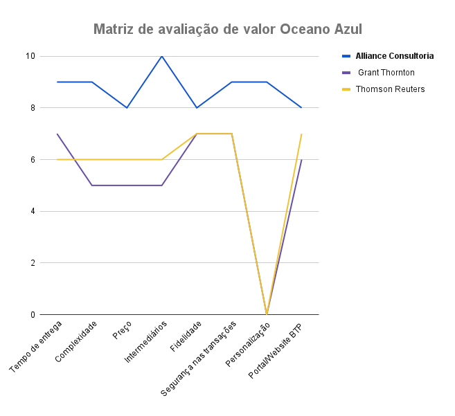
  <p><b>Fonte:</b> elaboração por grupo Ethos</p>
</div>

&emsp;&emsp; Com base na análise comparativa da matriz de Oceano Azul, a Alliance Consultoria emerge como uma escolha de investimento altamente vantajosa e estratégica para as empresas. Em comparação direta com seus concorrentes, como Grant Thornton e Thomson Reuters, a Alliance se destaca demonstrando transparência de preços, com uma pontuação impressionante de 10, enquanto seus concorrentes registram valores inferiores. Além disso, a Alliance também lidera em atributos como tempo de pesquisa de preços, complexidade na negociação, e dependência de intermediários, indicando uma eficiência operacional e uma abordagem centrada no cliente. Ou seja, para uma empresa que já demonstra aumento de eficiência sem a solução *Tempus* de 20% a 40%, os ganhos são entusiasmantes mesmo tendo custo de serviço mais caro que demais para seus clientes.

 &emsp;&emsp; Destaca-se ainda o alto valor atribuído à segurança nas transações, evidenciando o compromisso da Alliance em garantir a confiabilidade e a integridade de suas operações. A capacidade da Alliance de oferecer personalização e um Portal/Website BTP altamente funcional também a coloca em posição privilegiada para atender às necessidades diversificadas do mercado, demonstrando uma forte diferenciação competitiva. Assim, com base em sua posição de liderança em diversos atributos críticos para o sucesso no mercado, investir na Alliance Consultoria representa uma escolha sólida para os investidores em busca de retornos consistentes.

### 3.4 Análise Financeira

&emsp;&emsp;A análise financeira de um projeto envolve avaliar a viabilidade, estabilidade e lucratividade de um projeto, considerando diversos fatores econômicos e financeiros. Isso inclui a análise de custos, receitas, fluxo de caixa, retorno sobre investimento, período de recuperação de capital e riscos associados. O objetivo é determinar se o projeto atende aos objetivos financeiros da organização e se justifica o investimento feito.

&emsp;&emsp;Relacionando com o projeto de cotação de produtos que a Ethos está fazendo em parceria com a Alliance, a análise financeira poderia considerar os seguintes aspectos:

1. **Custos Iniciais e Operacionais**: Isso inclui o desenvolvimento do aplicativo que se conecta ao BTP (SAP Business Technology Platform) e utiliza blockchain para processos de cotação de fornecedores, além da infraestrutura necessária fornecida pela Alliance e pelo Inteli. Haverá necessidade de avaliar o custo de desenvolvimento, implementação e manutenção da plataforma.

2. **Fluxo de Caixa**: Estimar as entradas e saídas de caixa ao longo do tempo, considerando a aquisição de usuários, operações diárias e potenciais receitas provenientes de serviços oferecidos pela plataforma, como o acesso a informações confiáveis de preços e fornecedores.

3. **Retorno Sobre Investimento (ROI)**: Avaliar o retorno financeiro esperado pelo projeto, considerando o aumento de eficiência no processo de cotação, redução de custos por eliminar intermediários e a potencial geração de receita através da plataforma.

4. **Período de Recuperação do Capital Investido**: Determinar o tempo necessário para que o projeto recupere o investimento inicial através das receitas geradas, considerando os fluxos de caixa projetados.

5. **Riscos Financeiros**: Avaliar os riscos associados ao projeto, incluindo a adoção da tecnologia blockchain pelo mercado, a confiabilidade e segurança da plataforma, e possíveis mudanças no cenário econômico que podem afetar o custo de implementação ou a geração de receita. 

&emsp;&emsp;O projeto visa criar um modelo inovador para o fluxo do processo de cotação de fornecedores utilizando tecnologias de descentralização por meio de Blockchain. Isso inclui aumentar a transparência e segurança na contratação de fornecedores, determinar o preço médio de mercado para produtos e serviços, e fornecer uma plataforma onde usuários podem pagar um preço justo e ter acesso a um histórico confiável de transações. A análise financeira desse projeto deve, portanto, considerar como esses objetivos contribuem para a geração de valor, tanto para a Alliance quanto para os usuários da plataforma, e como eles se alinham com os custos e riscos projetados. Porém, levando em consideração a natureza do projeto, que é voltada para o meio acadêmico e a construção de um MVP (Produto Mínimo Viável), serão analisados pontos específicos possíveis como o custo de desenvolvimento/implantação, alinhado à definição dos termos que serão abordados, receita e estimativa dos custos, dentre outros dados relacionados à, majoritariamente, previsões.

#### **Custo de desenvolvimento/implantação**

&emsp;&emsp;Considerando a natureza do projeto como um MVP, os custos de desenvolvimento são inexistentes além da implantação, que se resume ao deploy do contrato. Para calcular o preço do deploy, seguem os passos:

&emsp;&emsp;1. Primeiramente, convertemos o preço base do gás de Gwei para Ether. Como 1 Gwei equivale a 0.000000001 Ether<sup><a href="#referencia-14">¹⁴</a></sup>, o preço base do gás é calculado como 51.70 Gwei * 0.000000001 ETH/Gwei = 0.0000000517 Ethereum.

&emsp;&emsp;2. Em seguida, multiplicamos o preço base do gás pelo custo total da transação em gas para obter o custo total em Ethereum. No caso, o custo total da transação, para realizar o deploy, foi de 2.692.856 gas, então o custo total em Ethereum é 0.0000000517 Ether/gas * 2.692.856 gas = 0,1392206552 Ether.

&emsp;&emsp;3. Por fim, convertemos o custo total em Ether para dólares americanos usando o preço atual do Ethereum. Com o preço atual do Ethereum a 3513,90 USD por token, o custo total da transação em dólares é 0,1392206552 Ethereum * $3513,90/ETH = $489,21. Um Token Ethereum (ETH) está custando 3513,90 USD na data dessa documentação (10/04/2024).

&emsp;&emsp;Portanto, o custo desse deploy foi aproximadamente 489.21 USD, 450.64 EUR e 2449.76 BRL.

**Definição dos termos:**

&emsp;&emsp;1. **Gas:** O "gas" é uma medida de consumo computacional na rede Ethereum. Cada operação executada na Ethereum consome uma certa quantidade de gas, que é usada para calcular a taxa de processamento de transações. O gas é uma forma de medir e cobrar pela complexidade das operações executadas na rede; quanto mais complexa a operação, mais gas é necessário. Cada transação e contrato na Ethereum requer uma quantidade específica de gas para serem executados.

&emsp;&emsp;2. **Gwei:** Gwei é uma unidade de medida de valor usada na Ethereum para denotar o preço do gas. 1 Gwei é igual a 0.000000001 ETH. É comum usar Gwei para expressar o preço do gas, pois a quantidade de Ether necessária para pagar uma transação pode ser muito pequena. Por exemplo, um preço de gas de 20 Gwei significa que cada unidade de gas custa 0.00000002 ETH.

&emsp;&emsp;3. **Ethereum:** O Ethereum é uma plataforma global e descentralizada para dinheiro e novos tipos de aplicativos. Assim como o Bitcoin, Ethereum é uma blockchain que permite a transferência de criptomoedas entre indivíduos sem a necessidade de uma terceira parte. No entanto, Ethereum vai além e permite a programação de aplicativos descentralizados e contratos inteligentes.

&emsp;&emsp;É válido ressaltar que existem alternativas à Ethereum que oferecem custos de transação mais baixos e tempos de processamento mais rápidos. Duas dessas alternativas são a Matic Network, agora conhecida como Polygon, e a Binance Smart Chain.

A Polygon é uma plataforma de contratos inteligentes que oferece escalabilidade e compatibilidade com a Ethereum Virtual Machine (EVM), mas com taxas de transação significativamente mais baixas. Ela usa um token nativo chamado MATIC, que é usado para pagar taxas de transação e participar no processo de staking.

Por outro lado, a Binance Smart Chain (BSC) é uma blockchain que opera em paralelo à Binance Chain e permite a criação de contratos inteligentes. A BSC é compatível com a EVM e usa o token BNB para pagar taxas de transação.

Ambas as redes oferecem tempos de transação mais rápidos e custos mais baixos em comparação com a Ethereum, tornando-as opções atraentes para o desenvolvimento e interação com contratos inteligentes. 

#### **Receita**

&emsp;&emsp;Dada a natureza do projeto e o estágio atual de desenvolvimento, bem como a falta de certos dados do parceiro, não é possível, neste momento, mensurar a receita.

#### **Estimativa de Custo**

&emsp;&emsp;Produtos indiretos, também conhecidos como suprimentos indiretos, são itens que uma empresa utiliza para apoiar suas operações, mas que não são diretamente incorporados nos produtos finais que a empresa vende. Isso inclui itens como:

1. Material de escritório (papel, canetas, lápis, grampeadores, etc.)
2. Equipamentos de informática (computadores, impressoras, toners, etc.)
3. Produtos de limpeza (detergente, desinfetante, papel toalha, etc.)
4. Material de embalagem (caixas, fitas adesivas, envelopes, etc.)
5. Ferramentas e equipamentos de manutenção (chaves, brocas, óleo lubrificante, etc.)
6. Mobiliário de escritório (mesas, cadeiras, armários, etc.)
7. Serviços de telecomunicações (telefone, internet, serviços de comunicação, etc.)
8. Serviços de logística e transporte (frete, entrega, transporte de mercadorias, etc.)
9. Serviços de consultoria (serviços contábeis, jurídicos, de RH, etc.)

&emsp;&emsp;A lista específica de produtos indiretos pode variar dependendo do tipo de negócio e das necessidades da empresa.

&emsp;&emsp;O propósito da estimativa de custo é fornecer à Alliance uma ideia de quanto a plataforma custaria para realizar suas operações mensalmente. Para isso, consideraremos três categorias da lista de produtos indiretos: material de escritório, equipamentos de informática e produtos de limpeza.

&emsp;&emsp;Com base no site da Alliance <sup><a href="#referencia-15">¹⁵</a></sup>, que afirma atender empresas de grande porte, usaremos uma média de transações por categoria pensando em uma empresa dessa magnitude, o que seria em torno de:

1. **Material de escritório:** Cerca de 150 transações por mês.
2. **Equipamentos de informática:** Em torno de 80 transações por mês.
3. **Produtos de limpeza:** Aproximadamente 100 transações por mês.

&emsp;&emsp;Totalizando 330 transações por mês, considerando apenas as três categorias selecionadas.

No que diz respeito à função “registrarTransacao” na blockchain Ethereum, o custo para registrar uma transação não é fixo. Em geral, o preço tende a girar em torno de 0.0005 ETH, este valor, equivale aproximadamente a 1.80 USD, 1.65 EUR e 9.00 BRL, ao multiplicarmos pelo total de transações (330), temos um custo médio de 594.00 USD, 544.50 EUR e 2.970.00 BRL por mês.

É crucial considerar o custo de várias funções na blockchain Ethereum, além do simples registro de transações. Por exemplo, a função “adicionarProduto” é precificada com base no custo do gás e depois convertida para Ethereum. O preço não é fixo e geralmente fica próximo de 0,00020 ETH, o que equivale a aproximadamente 0.71 USD, 0.66 EUR e 3.60 BRL.

Por outro lado, a função “cadastrarCliente” tem um custo tão baixo que não chega a 0,001 BRL, tornando-se praticamente insignificante. Portanto, ao desenvolver e interagir com contratos inteligentes na Ethereum, é importante levar em conta esses custos variáveis para garantir a eficiência econômica das operações.

### **Conclusão**

&emsp;&emsp;Ao avaliar o custo de desenvolvimento e implantação, mesmo que minimizados pela natureza MVP do projeto, a análise acima revela um compromisso com a sustentabilidade financeira e a otimização de recursos. A utilização do Ether como base para as transações econômicas no projeto demonstra uma aposta na economia digital e na flexibilidade que as criptomoedas podem oferecer para operações desse tipo.

&emsp;&emsp;Além disso, a estimativa de custos operacionais e o potencial de geração de receita, embora ainda não totalmente mensuráveis nesta fase, sinalizam para uma conscientização sobre a importância de um planejamento financeiro robusto. Isso inclui a projeção de transações e a avaliação cuidadosa de custos indiretos, essenciais para a manutenção da plataforma e para o apoio às operações diárias das empresas envolvidas.

&emsp;&emsp;Os riscos financeiros, inevitáveis em qualquer inovação, podem ser mitigados por uma análise e uma abordagem pragmática. A consideração de alternativas como a adoção de uma rede privada para reduzir custos associados ao gas demonstra uma flexibilidade estratégica e uma abertura para adaptações que possam melhorar a eficiência e a viabilidade econômica do projeto.

&emsp;&emsp;Em resumo, a análise financeira deste projeto entre a Ethos e a Alliance destaca os desafios e oportunidades da implementação de novas tecnologias como o blockchain além de enfatizar a importância de uma abordagem equilibrada que leva em consideração tanto a inovação quanto a sustentabilidade financeira. O compromisso com a eficiência, a transparência e a otimização de recursos reflete uma visão de futuro onde a tecnologia e a economia caminham juntas em direção à transformação e ao progresso.

## <a name="c5"></a>4. Análise de Experiência do Usuário

&emsp;&emsp;Na seção dedicada à experiência do usuário (UX), se fala de maneira detalhada todos os aspectos que visam garantir a excelência na interação dos usuários, tanto vendedores quanto compradores, com a plataforma. Tem-se o objetivo primordial de criar um ambiente digital onde as necessidades específicas dos usuários sejam atendidas de forma precisa e eficaz. A documentação abrangerá desde a análise aprofundada das expectativas dos usuários até a implementação prática de elementos e funcionalidades que promovam uma experiência fluida e satisfatória.

### 4.1 Personas
&emsp;&emsp;No desenvolvimento de sistemas e soluções, compreender o público-alvo é crucial. As personas são uma ferramenta essencial no design centrado no usuário, oferecendo uma visão detalhada das necessidades, comportamentos e objetivos dos usuários. Essas representações fictícias, mas baseadas em pesquisa, permitem aos designers e equipes de desenvolvimento visualizar melhor quem serão os usuários finais do produto ou sistema, facilitando a criação de soluções que realmente atendam às suas expectativas e necessidades.

&emsp;&emsp;O artigo da Adobe "Putting Personas to Work in UX Design: What They Are and Why They’re Important"<sup><a href="#referencia-6">⁶</a></sup> enfatiza a importância de construir empatia com os usuários por meio das personas, permitindo que os designers adquiram uma perspectiva semelhante à dos usuários e identifiquem com quem estão projetando. As personas ajudam a direcionar as decisões de design com base em uma compreensão profunda do comportamento e das necessidades do usuário, evitando armadilhas comuns como o design auto-referente e o usuário elástico. Além disso, elas facilitam a comunicação dos achados da pesquisa entre os membros da equipe, garantindo que todos tenham uma compreensão clara dos usuários alvo.

&emsp;&emsp;A IxDF (Interaction Design Foundation)<sup><a href="#referencia-7">⁷</a></sup> descreve o Design Centrado no Usuário (UCD) como um processo iterativo que se concentra nas necessidades e nos requisitos dos usuários em cada etapa do processo de design. Através das etapas de pesquisa, definição de requisitos, design e avaliação, as equipes podem garantir que os produtos finais sejam úteis e utilizáveis para as pessoas. O UCD encoraja a inclusão dos usuários no processo de design, utilizando uma variedade de técnicas de pesquisa e design para criar produtos altamente acessíveis e usáveis​​.

&emsp;&emsp;Nesse sentido, para garantir a qualidade do desenvolvimento do projeto, foram desenvolvidas três personas para compreender os usuários que entraram em contato com a solução.

&emsp;&emsp;João Antônio Martins, aos 40 anos, ocupa o cargo de diretor de compras na Centauro e possui uma sólida experiência de 15 anos na área. Ele está constantemente em busca de estratégias para assegurar negociações eficazes e alinhadas às demandas do mercado. Apesar de levar uma vida relativamente tranquila, João enfrenta o desafio de conciliar seu tempo para garantir momentos de qualidade ao lado da família.

&emsp;&emsp;Juliana Vieira, com 34 anos de idade, exerce a função de gerente de vendas e está empenhada em ajustar suas negociações para que os preços estejam próximos aos valores de mercado, visando maximizar seus lucros e a satisfação de seus clientes. Solteira, Juliana procura por maneiras de adotar uma rotina menos estressante, que lhe permita dedicar mais tempo ao autocuidado e ao seu bem-estar pessoal. Seu objetivo é encontrar um equilíbrio que a permita prosperar profissionalmente enquanto mantém uma qualidade de vida elevada.

&emsp;&emsp;Carlos Pereira, 38 anos, é o gestor da plataforma Tempus na Alliance, focado em monitorar transações e gerenciar a integração de novos participantes. Ele busca equilibrar o rigor técnico com a simplicidade operacional, facilitando o uso da plataforma mesmo para aqueles menos familiarizados com a tecnologia blockchain. Solteiro, Carlos valoriza a eficiência no trabalho para garantir tempo suficiente para seu bem-estar e hobbies. Seu principal objetivo é harmonizar sua carreira com uma vida pessoal satisfatória, promovendo um ambiente de trabalho inovador e uma comunidade digital engajada.

---

#### Persona: Diretor de compras

<div align="center">
  <p> <b>Figura 04 </b> - Persona 1</p>

  <p><b>Fonte:</b>  elaboração por Ethos com uso de IA this-person-does-not-exist.</p>
</div>

**Nome:** João Antõnio Martins

**Informações demográficas:**

- **Idade:** 50 anos
- **Estado Civil:** Casado
- **Filhos:** Duas, uma de 15 e outra de 17
- **Profissão:** Diretor de compras na Centauro
- **Localização Geográfica:** São Paulo, SP
- **Perfil Socioeconômico:** Classe Alta
- **Formação Acadêmica:** Graduação em Logística

**Background:**

&emsp;&emsp;João Antônio Martins, diretor de compras na Centauro, traz consigo uma bagagem de 15 anos de experiência na área de compras, destacando-se por sua incessante busca por estratégias de negociação eficazes e alinhadas às demandas do mercado. No ambiente profissional, ele não só lidera com maestria uma equipe dedicada, mas também se dedica a otimizar os processos de trabalho para alcançar resultados excepcionais, mantendo-se sempre atualizado sobre as tendências e inovações do setor.

&emsp;&emsp;Em sua vida pessoal, João é um homem de família, casado e pai de duas filhas adolescentes, enfrentando o desafio constante de balancear seu comprometimento profissional com os preciosos momentos ao lado de sua família. Ele valoriza atividades que lhe permitem desconectar-se do trabalho e recarregar suas energias, como esportes e viagens em família, buscando sempre um equilíbrio saudável entre a vida profissional e pessoal. Este equilíbrio é fundamental não apenas para seu bem-estar, mas também para manter sua eficácia e motivação no trabalho.

**Necessidades e Motivações:**

- **Eficiência e Produtividade:** Necessita de ferramentas e soluções que otimizem seu trabalho, permitindo que ele seja mais produtivo sem sacrificar a qualidade.
- **Balanceamento entre vida pessoal e profissional:** Busca soluções que lhe permitam gerenciar melhor seu tempo, para não prejudicar seus momentos em família.
- **Atualização constante:** Interessado em se manter atualizado sobre as tendências de mercado e novas tecnologias que possam beneficiar suas estratégias de negociação.

**Citações ditas**

- “Preciso ter um melhor direcionamento a respeito da valorização dos ativos no mercado.”
- “Conhecimento baseado em dados é convertido em poder de negociação.”
- “Minha família vem em primeiro lugar em minhas decisões.”

**Dores Atuais**

&emsp;&emsp;João frequentemente se depara com desafios relacionados à falta de transparência e eficiência no sistema atual de cotações e compras. Ele enfrenta dificuldades em obter informações atualizadas e confiáveis sobre os preços médios dos produtos, o que complica suas estratégias de negociação e impacta negativamente suas decisões de compra. A demora na atualização dessas informações afeta sua capacidade de responder rapidamente às mudanças do mercado, resultando em oportunidades perdidas e negociações menos vantajosas.

**Conclusão:**

&emsp;&emsp;A Tempus, desenvolvida pelo grupo Ethos, surge como uma solução disruptiva especificamente adaptada para revolucionar o setor de compras liderado por João Antônio Martins, diretor na Centauro. Esta plataforma, ancorada na tecnologia blockchain, é um marco na inovação, oferecendo uma abordagem inédita para enfrentar os desafios diários de João. Ao garantir um acesso direto e imediato a dados de mercado transparentes e seguros, a Tempus empodera João com a capacidade de realizar negociações baseadas em informações precisas e atualizadas, promovendo uma eficiência sem precedentes e equidade nas transações comerciais. Este acesso a dados confiáveis não só economiza tempo valioso em pesquisa e análise, mas também assegura que cada negociação conduzida sob a égide da Tempus esteja fundamentada na precisão e na integridade, graças à natureza imutável do registro blockchain. A introdução desta plataforma no processo de compras da Centauro não apenas eleva o patamar de confiança e segurança nas operações, mas também estabelece novos padrões de transparência e eficácia no setor, refletindo o compromisso da Tempus em liderar a transformação digital no mundo corporativo. Este cenário não apenas beneficia João e a Centauro, mas também redefine as expectativas de desempenho e confiabilidade para toda a indústria de compras, marcando o início de uma nova era na gestão de aquisições.

#### Persona: Gerente de Vendas

<div align="center">
  <p> <b>Figura 05 </b> - Persona 2</p>

  <p><b>Fonte:</b>  elaboração por Ethos com uso de IA this-person-does-not-exist.</p>
</div>

**Nome:** Juliana Vieira

**Informações demográficas:**
- **Idade:** 34 anos
- **Estado Civil:** Solteira
- **Filhos:** nenhum
- **Profissão:** Gerente de vendas na Klabin
- **Localização Geográfica:** São Paulo, SP
- **Perfil Socioeconômico:** Classe média Alta
- **Formação Acadêmica:** Graduação em Marketing

**Background:**

&emsp;&emsp;Juliana Vieira, ocupando o cargo de gerente de vendas na Klabin, traz em sua trajetória profissional uma experiência significativa de quase uma década, especializando-se em estratégias de vendas inovadoras e em sintonia com as demandas do mercado. Ela é reconhecida por sua capacidade de impulsionar as vendas alinhando-as aos valores de mercado para maximizar os lucros e aumentar a satisfação dos clientes. Liderando com competência uma equipe engajada, Juliana está constantemente focada em aperfeiçoar os processos de vendas para alcançar resultados notáveis, sempre atenta às tendências e inovações do setor.

&emsp;&emsp;No âmbito pessoal, Juliana é solteira e procura por um estilo de vida que minimize o estresse, permitindo-lhe maior atenção ao autocuidado e ao desenvolvimento pessoal. Ela valoriza um equilíbrio entre as demandas profissionais e as necessidades pessoais, engajando-se em atividades que promovam seu bem-estar, como práticas de mindfulness, exercícios físicos e viagens que a enriquecem culturalmente. Este equilíbrio é vital para Juliana, não apenas para manter sua saúde física e mental, mas também para preservar sua energia e entusiasmo no ambiente de trabalho.

**Necessidades e Motivações:**

- **Eficiência Operacional:** Juliana busca simplificar e reduzir o tempo gasto em tarefas como pesquisa de mercado, sem perder a precisão de sua tarefa, com isso poderá focar em trazer cada vez mais melhorias para seu setor
- **Ser Reconhecida:** Juliana almeja ser reconhecida por conduzir negociações que trazem benefícios reais à sua empresa. Ela busca constantemente aprimorar suas habilidades de negociação e se destacar como uma líder inovadora, construindo uma reputação sólida no setor.
- **Autocuidado:** Juliana prioriza sua saúde e bem-estar, buscando um equilíbrio entre a vida profissional e pessoal. Ela incorpora práticas de mindfulness, atividade física e hobbies que promovem o relaxamento, reconhecendo que um bom autocuidado reflete positivamente em sua performance profissional.

**Citações**
- "Adotar tecnologia não é apenas sobre seguir tendências; é sobre liberar nosso potencial para inovar e liderar. Com as ferramentas certas, posso transformar desafios em oportunidades para a Klabin."
- "Cada negociação bem-sucedida é um passo para construir uma marca de confiança e excelência. Meu objetivo é ser lembrada não apenas pelos resultados, mas pela forma como elevamos os padrões do nosso setor."
- "Cuidar de mim mesma é a base para sustentar minha energia e criatividade no trabalho. Equilibrar profissionalismo com paixão é fundamental para a excelência em todos os aspectos da vida."

**Dores Atuais**

&emsp;&emsp;Juliana enfrenta obstáculos ao tentar ajustar os preços de venda de acordo com os valores de mercado em tempo real. A falta de acesso instantâneo a dados de mercado atualizados dificulta sua capacidade de definir preços competitivos e atraentes para os clientes, afetando a lucratividade e a satisfação do cliente. Além disso, a complexidade e a ineficiência do sistema atual consomem muito tempo, que poderia ser melhor aproveitado em outras áreas de seu trabalho.

**Conclusão:**

&emsp;&emsp;Para Juliana Vieira, gerente de vendas na Klabin, a Tempus emerge como uma ferramenta revolucionária, empregando a robustez da tecnologia blockchain para oferecer insights de mercado em tempo real. Essa capacidade de acessar dados atualizados permite a Juliana ajustar dinamicamente os preços de venda, garantindo que a Klabin permaneça competitiva em um mercado volátil. A plataforma se destaca não apenas pela sua eficiência em fornecer informações precisas, mas também pela transparência e segurança inerentes, aspectos cruciais para Juliana na formulação de estratégias de preços que visam maximizar tanto a competitividade quanto a satisfação do cliente. Com a Tempus, ela não só aprimora suas habilidades de tomada de decisão, mas também otimiza as operações de vendas, resultando em economia de tempo e aperfeiçoamento da eficiência operacional. Esse avanço na gestão de vendas, proporcionado pela Tempus, não só reforça a posição de Juliana como uma líder inovadora na Klabin, mas também sublinha o impacto transformador da Tempus no panorama das vendas e gestão de mercado, projetando um futuro onde a eficácia e a agilidade são primordiais para o sucesso empresarial.

#### Persona: Gestor de Inovações

<div align="center">
  <p> <b>Figura 06 </b> - Persona 3</p>

  <p><b>Fonte:</b>  elaboração por Ethos com uso de IA this-person-does-not-exist.</p>
</div>

**Nome:** Carlos Martins

**Informações demográficas:**

- **Idade:** 38 anos
- **Estado Civil:** Solteiro
- **Filhos:** Nenhum
- **Profissão:** Gestor interno de plataforma blockchain
- **Localização Geográfica:** Rio de Janeiro, RJ
- **Perfil Socioeconômico:** Classe média-alta
- **Formação Acadêmica:** Graduação em Ciência da Computação, com especialização em Sistemas de Informação

**Background:**

&emsp;&emsp;Carlos Pereira, como gestor interno de uma plataforma blockchain, carrega uma vasta experiência em tecnologia da informação, com ênfase em blockchain e criptomoedas. Sua carreira é marcada pelo desenvolvimento e implementação de soluções inovadoras que atendem às necessidades complexas de segurança, transparência e eficiência das transações digitais. No trabalho, Carlos é conhecido por sua habilidade em simplificar processos complicados, tornando-os acessíveis para usuários de diversos níveis técnicos. Ele é um entusiasta da tecnologia que busca constantemente novos aprendizados e inovações para manter a plataforma na vanguarda do setor.

&emsp;&emsp;Em sua vida pessoal, Carlos é um solteiro ativo que valoriza seu tempo livre para se dedicar a hobbies como programação, jogos eletrônicos e viagens. Ele acredita firmemente no equilíbrio entre vida profissional e pessoal, esforçando-se para manter uma rotina que lhe permita desfrutar de seus interesses fora do trabalho enquanto se mantém produtivo e focado em suas responsabilidades.

**Necessidades e Motivações:**

- **Gestão Eficiente:** Busca ferramentas e métodos para gerenciar eficazmente as transações e participantes na blockchain, mantendo a integridade e a segurança dos dados.
- **Inovação Contínua:** Motivado pela inovação, Carlos procura sempre implementar as últimas tecnologias e práticas para manter a plataforma atualizada e competitiva.
- **Equilíbrio Vida-Trabalho:** Deseja manter uma rotina que priorize tanto seu desenvolvimento profissional quanto pessoal, permitindo tempo para hobbies e autocuidado.

**Citações:**

- “A inovação em blockchain não é apenas sobre a tecnologia, mas como a usamos para criar soluções reais e acessíveis.”
- “Gerenciar uma plataforma blockchain é como orquestrar uma sinfonia digital, onde cada nota deve ser perfeita.”
- “Para mim, sucesso é alcançar o equilíbrio onde minha paixão pela tecnologia e minha vida fora do trabalho coexistem harmoniosamente.”

**Dores Atuais:**

&emsp;&emsp;Carlos luta para manter a plataforma blockchain atualizada com as últimas inovações tecnológicas devido à complexidade dos processos de integração e à falta de ferramentas adequadas para testar e implementar novas funcionalidades rapidamente. Além disso, ele enfrenta desafios em garantir a segurança e a transparência das transações na plataforma, o que é crucial para a confiança e a eficácia do sistema.

**Conclusão:**

&emsp;&emsp;Para Carlos Pereira, gestor interno de plataforma blockchain, a Tempus é sinônimo de inovação tecnológica na ponta dos dedos. A plataforma não apenas simplifica a gestão de transações, mas também promove a integração segura e transparente de novos participantes, colocando-a na linha de frente do avanço tecnológico. Com a Tempus, Carlos tem em mãos a capacidade de lançar soluções inovadoras que não só mantêm a plataforma na vanguarda do mercado, mas também garantem sua relevância e competitividade contínua. Mais do que isso, a Tempus oferece a Carlos um equilíbrio ideal entre o profissional e o pessoal, possibilitando-lhe não apenas alcançar excelência no trabalho, mas também cuidar de seu bem-estar e se dedicar aos hobbies que ama. Esse equilíbrio harmonioso sublinha a capacidade da Tempus de transformar desafios em oportunidades, assegurando que profissionais como Carlos possam prosperar tanto no ambiente de trabalho quanto na vida pessoal, reafirmando o papel essencial da Tempus na definição de um novo padrão para o futuro da tecnologia blockchain.

---

&emsp;&emsp;A criação de personas como João Antônio Martins, Juliana Vieira, e Carlos Pereira é essencial para o sucesso do projeto, pois permite uma compreensão mais profunda e personalizada das necessidades e expectativas dos usuários finais. Ao detalhar suas características, desafios e objetivos, essas personas ajudam a equipe de desenvolvimento a direcionar a solução de forma mais eficaz, garantindo que a plataforma Tempus não só atenda às demandas do mercado de maneira geral, mas também resolva problemas específicos de forma inovadora e eficiente. Assim, a criação de personas contribui significativamente para o alinhamento entre a solução tecnológica e as reais necessidades dos usuários, agregando valor e relevância ao projeto.

### 4.2 User Stories

&emsp;&emsp;De acordo com Ricardo Arruda, em seu artigo "O que são User Stories (Estórias de Usuário)"<sup><a href="#referencia-8">⁸</a></sup>, uma User Story é uma representação clara e informal que expressa as necessidades e/ou requisitos de um potencial usuário, sendo considerada uma parte fundamental para atingir um objetivo final. Essa abordagem é a menor unidade de trabalho, centrada na necessidade do cliente final que irá interagir com o produto.

&emsp;&emsp;No contexto do desenvolvimento de software, as User Stories são uma técnica ágil amplamente adotada para descrever funcionalidades sob a perspectiva do usuário. Estruturadas na forma "Eu (quem) quero (o quê) para (finalidade)", essas histórias simplificam a comunicação entre desenvolvedores e stakeholders, priorizando as necessidades reais do usuário.

&emsp;&emsp;Dentro desse cenário, as User Stories desempenham um papel crucial em projetos voltados para dinamizar processos, como o de cotação de fornecedores. Ao representar as necessidades dos usuários finais, essas histórias orientam o desenvolvimento de soluções que se integram à tecnologia blockchain, facilitando o registro de transações de suprimentos, análise de histórico transacional e definição de estratégias de precificação competitiva.

&emsp;&emsp;A seguir, são apresentadas seis histórias de usuário referentes ao projeto desenvolvido para a Alliance, cujo principal objetivo é estabelecer um ambiente tecnológico baseado em blockchain. Cada história está meticulosamente vinculada a uma persona específica, delineando os objetivos individuais de cada usuário dentro da plataforma.

---

<div align="center">
  <p><b>Quadro 1</b> - User Story 1</b></p>

|  |  |  |
|---|---|---|
|  | Número | 1.0 |
|  | Título | Visualização do preço médio dos suprimentos |
|  | Personas | Juliana |
|  | História |Como gerente de compras, desejo acessar o preço médio dos suprimentos para embasar minhas decisões de compra. |
|  | Critérios de aceitação | CR-01 - A vendedora deve ser capaz de pesquisar o produto pelo nome. CR-02 - A vendedora deve ser capaz de visualizar o preço médio. 
|  | Testes de aceitação | Critério de aceitação: CR-01 a. A vendedora conseguiu pesquisar o produto desejado na plataforma. Conseguiu pesquisar = correto. Não conseguiu pesquisar o produto desejado na plataforma = errado, deve ser corrigido. Critério de aceitação: CR-02 b. A vendedora conseguiu ver o preço médio do produto desejado. Conseguiu visualizar o preço médio = correto. Não conseguiu visualizar o preço médio = errado, deve ser corrigido. |

  <p><b>Fonte:</b> elaboração por grupo Ethos.</p>
</div>
<br>

---

<div align="center">
  <p><b>Quadro 2</b> - User Story 2</b></p>

|  |  |  |
|---|---|---|
|  | Número | 2.0 |
|  | Título | Registro de transações de suprimentos na plataforma |
|  | Personas | Juliana |
|  | História | Eu, no papel de gerente de compras, quero ter a capacidade de registrar as transações de suprimentos na plataforma, para garantir um registro completo e preciso das negociações realizadas e utilizar esses dados para análise e definição de estratégias de precificação competitiva. |
|  | Critérios de aceitação | CR-01 - A vendedora deve ser capaz de inserir os detalhes da transação, incluindo produto, quantidade, preço e data. CR-02 - Os registros de transações devem ser armazenados de forma segura na plataforma, garantindo sua integridade e rastreabilidade. |
|  | Testes de aceitação | Critério de aceitação: CR-01 a. A vendedora conseguiu inserir os detalhes da transação na plataforma. Inserção concluída = correto. Falha ao inserir os detalhes da transação na plataforma = errado, deve ser corrigido. Critério de aceitação: CR-02 b. Os registros de transações foram armazenados com sucesso na plataforma e podem ser acessados posteriormente. Registros armazenados corretamente = correto. Falha ao armazenar os registros de transações = errado, deve ser corrigido. |
  
  <p><b>Fonte:</b> elaboração por grupo Ethos.</p>
</div>
<br>

---

<div align="center">
  <p><b>Quadro 3</b> - User Story 3</b></p>


|  |  |  |
|---|---|---|
|  | Número | 3.0 |
|  | Título | Realização da transação na solução com blockchain |
|  | Personas | João Antônio |
|  | História | Eu, no papel de diretor de compras, desejo realizar transações na plataforma com blockchain, inserindo dados como SKU, preço e quantidade de forma anônima e enviando o pedido de transação para outro usuário participante, garantindo que ambos os usuários concordem com a transação antes de finalizá-la. |
|  | Critérios de aceitação | CR-01 - O comprador deve ser capaz de inserir os dados da transação, incluindo SKU, preço e quantidade de forma anônima. CR-02 - O comprador deve ser capaz de enviar o pedido de transação para o outro usuário participante. CR-03 - O outro usuário participante deve concordar com a transação antes que ela seja finalizada. |
|  | Testes de aceitação | Critério de aceitação: CR-01 a. O comprador conseguiu inserir os dados da transação na plataforma de forma anônima. Inserção concluída = correto. Falha ao inserir os dados da transação = errado, deve ser corrigido. Critério de aceitação: CR-02 b. O comprador conseguiu enviar o pedido de transação para o outro usuário participante. Envio do pedido concluído = correto. Falha ao enviar o pedido de transação = errado, deve ser corrigido. Critério de aceitação: CR-03 c. O outro usuário participante concordou com a transação proposta pelo comprador. Concordância concluída = correto. Falha na concordância com a transação = errado, deve ser corrigido. |
 
  <p><b>Fonte:</b> elaboração por grupo Ethos.</p>
</div>
<br>

--- 

<div align="center">
  <p><b>Quadro 4</b> - User Story 4</b></p>

|  |  |  |
|---|---|---|
|  | Número | 4.0 |
|  | Título | Visualização do preço por data |
|  | Personas | João Antônio |
|  | História | Eu, no papel de diretor de compras, quero ter acesso ao histórico de preços por data, para identificar tendências e decidir o melhor momento para comprar suprimentos. |
|  | Critérios de aceitação | CR-01 - O comprador deve ser capaz de pesquisar o produto especificado. CR-02 - Após a pesquisa do produto específico, o comprador de suprimentos deve ser capaz de visualizar o histórico de preços por data. |
|  | Testes de aceitação | Critério de aceitação: CR-01 a. O comprador conseguiu pesquisar o produto desejado na plataforma. Conseguiu pesquisar = correto. Não conseguiu pesquisar o produto desejado na plataforma = errado, deve ser corrigido. Critério de aceitação: CR-02 b. O comprador conseguiu ver o histórico de preços do produto por data. Conseguiu visualizar o histórico de preços por data = correto. Não conseguiu visualizar o histórico de preços por data = errado, deve ser corrigido. |
  
  <p><b>Fonte:</b> elaboração por grupo Ethos.</p>
</div>
<br>

---

<div align="center">
  <p><b>Quadro 5</b> - User Story 5</b></p>

|  |  |  |
|---|---|---|
|  | Número | 5.0 |
|  | Título | Visualização do registro das cotações na blockchain |
|  | Personas | Carlos |
|  | História | Eu, no papel de representante da Alliance, quero ter acesso aos registros de cotações na blockchain, para analisar dados e tomar decisões estratégicas dentro da empresa. |
|  | Critérios de aceitação | CR-01 - O representante da Alliance deve ser capaz de pesquisar o produto especificado. CR-02 - Após a pesquisa do produto específico, o representante da Alliance deve ser capaz de visualizar os registros de cotações na blockchain. |
|  | Testes de aceitação | Critério de aceitação: CR-01 a. O representante da Alliance conseguiu pesquisar o produto desejado na plataforma. Conseguiu pesquisar = correto. Não conseguiu pesquisar o produto desejado na plataforma = errado, deve ser corrigido. Critério de aceitação: CR-02 b. O representante da Alliance conseguiu ver os registros de cotações na blockchain. Conseguiu visualizar os registros de cotações = correto. Não conseguiu visualizar os registros de cotações = errado, deve ser corrigido. |

  <p><b>Fonte:</b> elaboração por grupo Ethos.</p>
</div>
<br>

---
<div align="center">
  <p><b>Quadro 6</b> - User Story 6</b></p>

|  |  |  |
|---|---|---|
|  | Número | 6.0 |
|  | Título | Login na plataforma com verificação da carteira MetaMask |
|  | Personas | Carlos |
|  | História | Eu, como usuário da plataforma, desejo fazer login na solução implementada na SAP Ariba, utilizando minha carteira MetaMask para garantir segurança e autenticidade. |
|  | Critérios de aceitação | CR-01 - O usuário deve ser capaz de acessar a plataforma SAP Ariba. CR-02 - A plataforma deve integrar a funcionalidade de verificação da carteira MetaMask para autenticação do usuário. |
|  | Testes de aceitação | Critério de aceitação: CR-01 a. O usuário conseguiu acessar a plataforma SAP Ariba utilizando suas credenciais de login. Acesso concedido = correto. Falha ao acessar a plataforma = errado, deve ser corrigido. Critério de aceitação: CR-02 b. O usuário conseguiu realizar a verificação da carteira MetaMask para autenticação na plataforma. Verificação concluída = correto. Falha na verificação da carteira MetaMask = errado, deve ser corrigido. |

  <p><b>Fonte:</b> elaboração por grupo Ethos.</p>
</div>

---

&emsp;&emsp;Em conclusão, as user stories são essenciais no desenvolvimento do projeto pois estabelecem uma ligação direta com as personas, mapeando de forma precisa suas necessidades e expectativas. A adoção deste enfoque não só direciona as atividades da equipe de forma estratégica, como também facilita a criação de uma solução verdadeiramente alinhada aos requisitos da Alliance e seus clientes. Dessa forma, segue uma descrição geral de cada User Story, ressaltando a importância de cada história no contexto do projeto, destacando como elas contribuem individualmente e coletivamente para atingir os objetivos do sistema:

&emsp;&emsp;**User Story 1: Visualização do Preço Médio dos Suprimentos**

&emsp;&emsp;Esta User Story é fundamental para a tomada de decisões informadas no processo de compra. Permitindo que Juliana, a gerente de compras, tenha acesso ao preço médio dos suprimentos, oferece uma base sólida para negociações e compras estratégicas, garantindo que a empresa possa adquirir materiais a preços competitivos. No que tange a aplicação, a capacidade de pesquisar produtos pelo nome e visualizar seus preços médios traz eficiência e precisão ao processo de planejamento de compras.

&emsp;&emsp;**User Story 2: Registro de Transações de Suprimentos na Plataforma**

&emsp;&emsp;A capacidade de registrar transações detalhadamente na plataforma é crucial para a integridade e rastreabilidade dos dados, dois pontos relacionados à segurança que serão melhores descritos na seção 7.1 deste documento. Isso não apenas garante um registro completo das negociações realizadas, mas também fornece a Juliana dados valiosos para análise futura e estratégias de precificação. A segurança e acessibilidade desses registros são essenciais para uma gestão eficaz do inventário e para a auditoria de transações.

&emsp;&emsp;**User Story 3: Realização da Transação na Solução com Blockchain**

&emsp;&emsp;Nesse momento de processo de transação, como desejado por João Antônio, diretor de compras, adiciona um nível de segurança, anonimato e confiabilidade, normalmente valores essenciais da plataforma que estão sendo trabalhados na seção 7.1 Segurança da informação. Esta User Story destaca a necessidade de que todas as partes concordem com os termos antes da conclusão, o que minimiza disputas e fraudes. A implementação dessa validação é importante pois oferece transparência entre as partes, além de maior confiança nas informações de transação.

&emsp;&emsp;**User Story 4: Visualização do Preço por Data**

&emsp;&emsp;Ter acesso ao histórico de preços por data permite a João Antônio identificar tendências de mercado e escolher o melhor momento para realizar compras, otimizando custos e garantindo a aquisição de suprimentos sob as condições mais favoráveis. Esta User Story é uma ferramenta interessante para estratégias de compra baseadas em dados, permitindo uma gestão de suprimentos mais eficiente e econômica.

&emsp;&emsp;**User Story 5: Visualização do Registro das Cotações na Blockchain**

&emsp;&emsp;Para Carlos, representante da Alliance, acessar registros de cotações na blockchain significa ter uma fonte confiável e imutável de informações para análise estratégica. Essa funcionalidade enfatiza a importância da tecnologia blockchain na garantia de integridade dos dados e na facilitação de decisões informadas dentro da empresa. A visualização desses registros apoia a transparência e a eficácia nas negociações e estratégias de longo prazo.

&emsp;&emsp;**User Story 6: Login na Plataforma com Verificação da Carteira MetaMask**

&emsp;&emsp;A integração da verificação da carteira MetaMask para login na plataforma SAP Ariba, como solicitado por Carlos, reforça a segurança e a autenticação dos usuários. Isso não apenas protege contra acessos não autorizados, mas também simplifica o processo de login, alinhando a solução com as práticas modernas de segurança digital. Essa User Story demonstra o compromisso do projeto com a segurança dos dados dos usuários e a adoção de tecnologias de ponta.

&emsp;&emsp;A análise das user stories revela insights cruciais que fortalecem os objetivos do projeto. Elas sublinham a relevância da tecnologia, particularmente do blockchain, na modernização e segurança dos processos de compra. Além disso, ressaltam a importância de uma gestão de dados eficiente e informada. Em conjunto, essas histórias de usuários fornecem uma visão clara das ações dos usuários e sua relação com a plataforma em desenvolvimento. Assim, contribuem para a definição das funcionalidades essenciais do sistema final. As User Stories representam uma pesquisa qualitativa valiosa, orientando o desenvolvimento da plataforma em direção à sua versão ideal.

### 4.3 Demonstração do Front-End

**Vídeo de Apresentação**: [Ethos - front-end - YouTube](https://www.youtube.com/watch?v=nrI4xnV_RZo)

Neste vídeo, temos uma demonstração abrangente do front-end da plataforma Tempus, conduzida por um membro da equipe Ethos. A apresentação detalha a interface do usuário e as funcionalidades projetadas durante a sprint recente.

Pontos-chave do vídeo:

- **Contextualização e Usabilidade**:
    - A introdução do vídeo esclarece o estágio atual do projeto, ressaltando que algumas telas ainda estão em processo de integração e que os dados apresentados são simulados para fins de demonstração.
    - A navegação intuitiva é destacada pela tela de login, a sidebar expansível e as mensagens claras para os usuários, como os prompts para conexão com a MetaMask, o que demonstra uma consideração cuidadosa pelas Heurísticas de Nielsen para usabilidade.
- **Conectividade Blockchain**:
    - O vídeo mostra como o front-end se conecta com a blockchain, enfatizando o processo de transações conforme definido pelos Smart Contracts. Isso inclui o procedimento de login usando MetaMask, a adição e validação de transações, e a visualização do histórico de transações do usuário.
- **Comentários e Integração**:
    - Comentários ao longo do vídeo explicam como o front-end se integra com a blockchain, incluindo a validação de transações por ambas as partes envolvidas para inclusão no cálculo do preço médio, fortalecendo a transparência e a confiança na plataforma.
    - A documentação no código do smart contract inclui comentários sobre os ajustes realizados e a integração, evidenciando a metodologia ágil e o desenvolvimento contínuo.

Este vídeo serve como um recurso valioso para os stakeholders compreenderem a funcionalidade do front-end do Projeto Tempus e sua interação com a blockchain, refletindo os objetivos de aumentar a transparência e eficiência no processo de cotação de fornecedores.


## <a name="c8"></a>5. Fluxo de interface
Descrição do fluxo de interação do usuário com a interface com foco em explicar o front-end.

### 5.1 Documentação do front-end

&emsp;&emsp;A seção de front-end da aplicação *Tempus*, desenvolvida pelo grupo Ethos, tem como objetivo simplificar o processo de registro e visualização de transações, especialmente para usuários inexperientes no contexto do blockchain. Utilizando a tecnologia Next.js, o front-end oferece uma interface intuitiva e fácil de usar.

&emsp;&emsp;As principais funcionalidades incluem o registro e visualização simplificados de transações. As tecnologias utilizadas abrangem Next.js, carteira MetaMask, Hardhat, Ethers.js e Solidity. A utilização detalhada de cada tecnologia pode ser encontrada na seção 7.3 "Tecnologias Escolhidas para a solução Tempus".

&emsp;&emsp;As interações com o usuário são facilitadas através de páginas específicas:

- **Página de Login:** Integrada à carteira MetaMask para autenticar o usuário. Durante esse processo, verifica-se a disponibilidade e a conexão da carteira, fornecendo feedback visual ao usuário em cada etapa, seja de sucesso ou falha.

```solidity
  async function connect() {
    if (typeof window.ethereum !== "undefined") {
        try {
            await window.ethereum.request({ method: "eth_requestAccounts" });
            setButtonText("Conectado");
            const accounts = await window.ethereum.request({ method: "eth_accounts" });
            console.log(accounts);
        } catch (error) {
            console.error(error);
            setButtonText("Erro ao conectar");
        }
    } else {
        setButtonText("Por favor, instale o MetaMask");
            // colocar o link para direcionar ao site do metamask
    }
}
```

&emsp;&emsp;Este trecho de código verifica se a MetaMask está disponível no navegador e solicita ao usuário permissão para acessar sua carteira MetaMask.

- **Página de Cadastro de Transações:** Apresenta um formulário que permite aos usuários inserir informações sobre a transação antes de finalizar o cadastro.

```solidity
<div className="component2-item">
  <span>Item</span>
  <input
    type="text"
    placeholder="Placeholder do Item"
    className="component2-textinput input"
  />
</div>
```

&emsp;&emsp;Este trecho de código representa o componente React Component2, utilizado para renderizar a interface de cadastro de uma nova transação de produto na aplicação *Tempus*.

- **Página de Histórico de Transações:** Permite aos usuários visualizar todas as transações previamente realizadas. Aqui, eles têm acesso a um registro detalhado contendo informações como produto transacionado, preço, data e outras informações relevantes.

```solidity
import {transacoes} from '../mock/historicoTransacoes'

interface transacao {
    nome: string,
    quantidade: number,
    preco: number,
    sku: string,
    timeStamp: string
}

export default function Home() {
  return (
    <main className="flex min-h-screen flex-col items-center flex-1 p-14">
      <h1 className='text-4xl font-semibold mb-32'>Meu Histórico de Transações</h1>

      <div className='w-2/3'>
        <div className='flex w-full justify-between px-1 pb-8 border-b-gray-400 border-b-2'>
            <label className='font-bold text-lg'>Produto</label>
            <label className='font-bold text-lg'>ID</label>
            <label className='font-bold text-lg'>Preço</label>
            <label className='font-bold text-lg'>Data</label>
        </div>
        {transacoes.map((item: transacao) => {
            return (
                <div className='flex w-full justify-between px-1 py-6 border-b-gray-400 border-b-2'>
                    <label className='font-semibold text-lg'>{item.nome}</label>
                    <label className='text-lg'>{`${item.sku.slice(0, 10)}...`}</label>
                    <label className='text-lg'>{item.preco}</label>
                    <label className='text-lg'>{item.timeStamp}</label>
                </div>
            )
        })}
      </div>
    </main>
  )
}
```

&emsp;&emsp;Este trecho de código representa um componente funcional React chamado Home, utilizado no contexto do framework Next.js com TypeScript.

&emsp;&emsp;A explicação detalhada dos códigos é fornecida em cada seção correspondente, abordando a estrutura, a lógica de funcionamento e as interações com o usuário para garantir uma compreensão abrangente do front-end da aplicação *Tempus*. Essa abordagem visa oferecer uma experiência de usuário coesa e eficaz, destacando as características distintivas da solução desenvolvida pelo grupo Ethos.

### 5.2 Estrutura do Projeto

&emsp;&emsp;Esta documentação fornece uma visão geral da estrutura front-end, desenvolvida usando Next.js configurado com typescript, e detalha os arquivos de código primário, variáveis, funções e o fluxo de comunicação com os contratos inteligentes integrados HardHat escritos em Solidity.

**Estrutura do Projeto**

&emsp;&emsp;O front-end do Projeto Tempus está organizado da seguinte forma:

**Diretório de páginas Next.js (`src/tempus/src/app`)**

- **Descrição**: Este diretório contém os pontos de entrada da aplicação. Cada arquivo corresponde a uma rota baseada em seu nome de arquivo, de acordo com as convenções do Next.js. É interessante notar que, de acordo com a mais nova atualização do Next.js, a extrutura de pastas para o roteamento de páginas é composto por uma pasta com nome descritivo (ex. Login) e um arquivo typescript nomeado page.tsx.

- **Arquivos presentes**:

  - **busca**:
      - `page.tsx`: A página de busca é onde os usuários podem realizar pesquisas por informações relacionadas às transações e fornecedores dentro da plataforma.
  - **cadastro-transacao**:
      - `page.tsx`: Gerencia o processo de registro de novas transações no sistema, capturando e enviando dados para o blockchain via a API do projeto.
  - **historico-transacao**:
      - `page.tsx`: Exibe o histórico completo de transações realizadas, permitindo aos usuários e auditores acessar e verificar informações passadas.
  - **login**:
      - `page.tsx`: Lida com a autenticação do usuário, permitindo acesso seguro ao sistema e às funções correspondentes ao seu nível de permissão.
  - **notificacoes**:
      - `page.tsx`: Responsável por gerenciar e exibir notificações para o usuário, como confirmações de transações, alertas de sistema, e outras mensagens relevantes.
  - **resultados**:
      - `page.tsx`: Apresenta os resultados das buscas e análises realizadas, fornecendo um resumo visual e dados detalhados com base nas consultas feitas pelo usuário.
  - **usuario**:
      - `page.tsx`: Contém a interface de gerenciamento de perfil do usuário, onde podem atualizar informações pessoais, gerenciar suas carteiras e visualizar suas atividades recentes na plataforma.

**Diretório de Componentes (`src/tempus/src/components`)**

- **Descrição**: Componentes reutilizáveis usados em diferentes páginas do aplicativo.
Para o diretório `components` com base na imagem fornecida:

- **components**:
  - `assideBar.tsx`: Este componente implementa a barra lateral da interface do usuário. Funciona como uma navegação auxiliar, permitindo aos usuários acessar diferentes seções da aplicação de forma rápida e eficiente.

**Contrato Inteligente (`src/smart_contract`)**

- **Descrição**: Contém o contrato inteligente Solidity usado na aplicação.
- **Arquivos principais**:
   - `ContratoTempus.sol`: O arquivo de contrato inteligente Solidity para gerenciamento de transações no blockchain.

**Diretório de Scripts (`src/smart_contract/scripts`)**

- **Descrição**: Contém scripts para implantar o contrato inteligente usando HardHat.
- **Arquivos principais**:
   - `deploy.js`: O script de implantação do contrato inteligente.

**Configuração do HardHat (`src/smart_contract/hardhat.config.js`)**

- **Descrição**: Arquivo de configuração do HardHat que configura o ambiente para implantação de contratos inteligentes e execução de testes.
- **Variáveis Chave**:
   - `defaultNetwork`: Especifica a rede blockchain padrão para implantação..

**Estilos e configuração global**

- **Globals (`globals.css`)**: Define os estilos globais aplicados em toda a aplicação.
- **Tailwind Config (`tailwind.config.js`)**: Configura a estrutura TailwindCSS para gerenciamento CSS que prioriza o utilitário.


&emsp;&emsp;O front-end do Projeto Tempus interage com o blockchain por meio da estrutura HardHat. Ele usa ether.js para conectar-se à rede Ethereum e fazer transações. O front-end envia e recupera dados do contrato inteligente, lidando com as interações do usuário e apresentando os dados das transações com total transparência.

## <a name="c9"></a>6. Descritivo da Solução

&emsp;&emsp;A documentação a seguir apresenta detalhadamente a solução proposta, abordando aspectos cruciais para sua compreensão e implementação. Inicialmente, são discutidas as medidas de segurança da informação adotadas, seguidas pelos requisitos relevantes e a identificação das vulnerabilidades existentes, bem como os possíveis atacantes e suas estratégias de ataque. Posteriormente, são apresentadas as regras de negócios e suas atualizações, juntamente com os termos de uso da solução Tempus. A seleção das tecnologias empregadas é detalhada, acompanhada pelos diagramas de fluxo, blocos e a representação UML da solução. Por fim, são descritas a arquitetura da integração e o diagrama de implantação, proporcionando uma visão abrangente e estruturada do projeto.

### 6.1 Segurança da informação

&emsp;&emsp;O principal objetivo do projeto realizado pelo grupo Ethos em colaboração com a Alliance é criar uma plataforma blockchain que aumente a transparência e segurança nas transações de compra/venda sobre mercadorias e estabelecer o preço médio dos produtos. Dito isso, elaboramos uma análise de riscos considerando os requisitos de segurança da informação, vulnerabilidades, possíveis ataques e sua priorização.

#### 6.1.1 Requisitos relevantes

&emsp;&emsp;São requisitos importantes para garantir a segurança dentro da plataforma do projeto. Segue aqueles considerados mais relevantes pela equipe, seguidos de suas respectivas definições e relacionamentos com o projeto final.

&emsp;&emsp;1. **Confidencialidade**: Riscos relacionados à exposição não autorizada de informações confidenciais.

&emsp;&emsp;É importante que as informações das transações sejam exibidas, dessa forma os usuários que desejarem fazer uma média daqueles valores poderiam chegar às mesmas informações exibidas pela plataforma. Mas informações e dados sensíveis dos fornecedores e/ou compradores, não devem ser divulgados dentro do ambiente.

&emsp;&emsp;De forma dinâmica é errado divulgar que a empresa A fez uma transação de X reais do produto Y para a empresa B, o correto seria afirmar que houve uma transação de X reais do produto Y entre duas empresas, preservando dessa forma a confidencialidade das mesmas.

&emsp;&emsp;2. **Integridade**: Riscos de manipulação indevida de dados armazenados na blockchain, como alteração de históricos de transações ou preços médios de mercado. A integridade é o ponto chave do projeto, pois este nasceu da necessidade de haver um ambiente que mostrasse informações confiáveis das transações, e por consequência, a média deles sem que estes fossem alteradas de forma não autorizada.

&emsp;&emsp;Então por exemplo, um requisito de segurança é que as informações de transação de determinada empresa sejam imutáveis uma vez que elas estejam dentro da plataforma blockchain, portanto se determinada empresa alegar que fez uma transação de valor X, e na plataforma blockchain constar que ela fez uma transação de valour Y, o requisito de segurança relacionada à integridade estará sendo corrompida.

&emsp;&emsp;O blockchain oferece uma vantagem nesse ponto, pois uma vez que as informações sobem para blockchain não podem mais ser alteradas, logo o Smart Contract, programa autônomo que executa automaticamente as condições do contrato armazenadas em uma blockchain quando os critérios pré-definidos são atendidos, bem como as transações são imutáveis. O que torna o blockchain o espaço ideal para o registro das transações que acontecem dentro do ambiente.

&emsp;&emsp;Isso não significa que a blockchain é completamente imune a fraudes, a empresa de segurança em blockchain e Web3 Hacken, relata que o blockchain tem 5 camadas, que são setores principais, e que cada camada do blockchain é suscetível a um ataque ou outro <sup><a href="#referencia-9">⁹</a></sup>. Porém existem formas de evitá-los e mitigá-los. Segundo a companhia de proteção Cloud Security Alliance <sup><a href="#referencia-10">¹⁰</a></sup> existem diversas iniciativas, incluindo a do banco de dados Common Weakness Enumeration, patrocinado pelo Departamento de Segurança Interna do Governo dos EUA, além de Contratos Inteligentes (Smart Contracts) focados em Solidity Classificação de fraqueza e casos de teste disponíveis no registro SWC.

&emsp;&emsp;Apesar dos desafios apresentados anteriormente, a solução utilizando blockchain se destaca como a mais segura para garantir a integridade e confiabilidade das transações. A natureza imutável do blockchain, combinada com as medidas de segurança avançadas e as iniciativas para mitigar vulnerabilidades, assegura um ambiente onde as informações são preservadas de forma transparente e inalterável. Portanto, mesmo diante dos riscos potenciais e das complexidades inerentes às suas camadas, o uso do blockchain, especialmente quando reforçado por contratos inteligentes e práticas de segurança robustas, representa a solução mais segura e confiável para o registro e verificação de transações no ambiente em questão.

&emsp;&emsp;3. **Autenticidade**: Riscos associados à falsificação de identidade de fornecedores ou compradores na rede.Sua ausência faria com que o projeto perdesse sua credibilidade, afinal, .. a falta de autenticidade nas transações pode levar à perda de confiança dos usuários na plataforma afetando negativamente a base de clientes e potenciais investimentos. Além disso, transações registradas de forma fraudulentas podem resultar em perdas financeiras diretas para compradores ou vendedores enganados e criar complicações legais para a plataforma- ela pode ser responsabilizada por não implementar medidas de segurança eficazes. Em suma, o requisito de autenticidade é crucial para manter a integridade e a confiabilidade do projeto.

&emsp;&emsp;Vale lembrar que  é crucial garantir, para o comprimento do requisito de segurança de autenticidade, que apenas a entidade detentora da chave privada correta tenha acesso ao ambiente de blockchain em questão. Este requisito visa prevenir violações de segurança, tais como o acesso indevido por terceiros que tentem se passar pela entidade autorizada, ou situações em que a chave privada seja comprometida A integridade do sistema depende da proteção e da gestão adequada das chaves privadas, fundamentais para manter a confidencialidade e a segurança das transações realizadas na rede.

#### 6.1.2 Identificar as Vulnerabilidades Existentes

&emsp;&emsp;Vulnerabilidades na segurança da informação referem-se a falhas, defeitos ou insuficiências em sistemas de tecnologia da informação, processos, controles ou práticas que podem ser exploradas por atacantes para comprometer a segurança dos dados. Como mencionado acima, o blockchain tem vulnerabilidades em todas as suas camadas, mas o presente documento irá abordar aqueles relacionados ao projeto. É importante mapeá-los para entender quais os pontos fracos da plataforma específica e encontrar um plano de ação adequado para mitigá-los. Segue possíveis vulnerabilidades da plataforma em questão:

&emsp;&emsp;1. **Exposição de Dados Sensíveis de Transações:**

&emsp;&emsp;&emsp;&emsp;1. O que é: Falhas nos mecanismos de segurança de dados que causem exposição de informações sensíveis das partes envolvidas (como identidades ou detalhes específicos das transações).

&emsp;&emsp;&emsp;&emsp;2. Como isso ocorre: Acontece quando medidas de segurança não são suficientemente implementadas para ocultar ou criptografar dados sensíveis, enquanto ainda se permite a verificação pública das transações.

&emsp;&emsp;&emsp;&emsp;3. Cenário: Neste cenário, apesar do blockchain proporcionar transparência e a possibilidade de os usuários verificarem as médias de valores das transações, uma configuração inadequada ou um ataque direcionado poderia levar à exposição de informações sensíveis das partes envolvidas.

&emsp;&emsp;&emsp;&emsp;4. Impacto: Essas informações poderiam afetar as empresas relacionadas, que não gostaria que seus concorrentes, por exemplo, tivessem informações das compras internas da empresa em questão. Nesse ponto é exibido a importância de haver confidencialidade na aplicação.

&emsp;&emsp;2. **Implementação inadequada de smart contracts**:

&emsp;&emsp;&emsp;&emsp;1. O que é: Erros de codificação podem permitir explorações maliciosas.

&emsp;&emsp;&emsp;&emsp;2. Como isso ocorre: Essa vulnerabilidade se manifesta quando os contratos inteligentes contêm falhas de segurança ou lógica que permitem a atores mal-intencionados manipular suas funções, apesar da natureza imutável das transações na blockchain. Essa vulnerabilidade está muito relacionada ao requisito de integridade, ou seja, garantir que os dados exibidos sejam autênticos e imutáveis.

&emsp;&emsp;&emsp;&emsp;3. Cenário: Embora o blockchain ofereça a vantagem da imutabilidade das transações, contratos inteligentes mal projetados ou vulneráveis podem ser explorados para alterar o comportamento esperado das transações.

&emsp;&emsp;&emsp;&emsp;4. Impacto: Alteração nos preços médios reportados para interesses próprios.

&emsp;&emsp;3. **Armazenamento inseguro de chaves privadas**:

&emsp;&emsp;&emsp;&emsp;1. O que é: Se as chaves privadas não forem armazenadas com segurança, atacantes podem usurpar identidades.

&emsp;&emsp;&emsp;&emsp;2. Como isso ocorre: Isso pode ser realizado por meio de phishing, exploração de sistemas de autenticação fracos ou a criação de identidades falsas que pareçam legítimas.

&emsp;&emsp;&emsp;&emsp;3. Cenário: Neste contexto, atores mal-intencionados podem explorar deficiências nos sistemas de verificação de identidade para se passar por fornecedores ou compradores legítimos, comprometendo a autenticidade das transações.

&emsp;&emsp;&emsp;&emsp;4. Impacto: A consequência direta é a perda de confiança no sistema e potenciais danos financeiros e legais para as partes envolvidas e para a plataforma como um todo. Por isso a importância do requisito de autenticidade, pois é necessário haver constância e credibilidade da aplicação para garantir a confiança dos usuários.

&emsp;&emsp;Para ilustrar claramente a localização das vulnerabilidades identificadas no sistema, a imagem subsequente apresenta a arquitetura da solução delineada em preto, destacando, em vermelho, as vulnerabilidades em cada ponto específico.

<div align="center">
  <p> <b>Figura 07 </b> - Arquitetura de Vulnerabilidades</p>

  <p><b>Fonte:</b> elaboração pela equipe Ethos.</p>
</div>

#### 6.1.3 Atacantes e levantar ataques possíveis

&emsp;&emsp;Analisando os requisitos de segurança e as vulnerabilidades do sistemas conseguimos entender, respectivamente, as condições relacionadas à segurança que a aplicação deve corresponder, bem como quais são os possíveis pontos de falha que a aplicação teria. A partir disso é interessante mapear ataques que poderiam ocorrer dentro da plataforma, que fariam proveito das vulnerabilidades e que comprometem os requisitos, para assim estabelecer estratégias para evitá-los e mitigar os riscos. Segue possíveis ataques, seguidos de uma tabela que aborda o nível de priorização de cada um deles:

&emsp;&emsp;1. **Ataque de reentrada em smart contracts**: Explora vulnerabilidades no smart contract ataques no ambiente. A motivação do atacante é explorar essas vulnerabilidades para ter acesso e/ou modificar informações para seu próprio benefício. O vetor do ataque ocorre através de uma chamada recursiva durante a execução de um contrato inteligente que apresenta falhas. O impacto desse ataque é significativo, afetando principalmente a integridade e confidencialidade dos dados armazenados no blockchain, uma vez que transações legítimas são acessadas e/ou alteradas, e pode também comprometer a autenticidade ao modificar as informações de forma não autorizada. Um exemplo específico desse tipo de ataque dentro do nosso contexto seria um atacante iniciar uma chamada recursiva ao contrato antes que a implementação da transação original seja finalizada. Esta ação pode permitir ao atacante alterar o destinatário ou o montante da transferência original, aumentando ou diminuindo o valor transferido para modificar os números de determinada cotação, por exemplo. Esta manipulação resulta em alterações indevidas nas informações de transação registradas na blockchain, comprometendo a integridade e autenticidade das transações dentro do sistema. Este cenário sublinha a necessidade de implementar mecanismos de segurança robustos e realizar auditorias periódicas nos contratos inteligentes para mitigar o risco de ataques de reentrada.

&emsp;&emsp;2. **Phishing para roubo de credenciais**: Este ataque visa enganar os usuários para que entreguem suas chaves privadas ou credenciais de acesso, explorando táticas de engenharia social. A motivação do atacante é obter acesso não autorizado a contas de usuários, o que permite o roubo de ativos digitais ou informações confidenciais críticas. O vetor desse ataque envolve o uso de e-mails, mensagens instantâneas ou sites falsificados que imitam fielmente a interface e a experiência do usuário da plataforma legítima. O impacto desse tipo de ataque é grave, comprometendo diretamente a confidencialidade e autenticidade dentro do sistema, uma vez que o atacante ganha a capacidade de realizar inscrições de transações fraudulentas ou acessar informações sensíveis como se fosse o usuário legítimo.

&emsp;&emsp;Um exemplo específico desse método de ataque ocorre quando o atacante envia um e-mail falsificado para os usuários, o qual parece ser da plataforma confiável. Este e-mail contém um link que redireciona o usuário para uma página de login falsa, que replica a aparência da página oficial da plataforma. Ao inserir suas credenciais nessa página falsa, o usuário inadvertidamente entrega suas informações de acesso ao atacante. Com essas informações, o atacante pode então acessar a conta do usuário na plataforma real, cadastrando transações não legítimas ou coletar informações confidenciais. Esse exemplo ressalta a importância de medidas de segurança robustas, como a educação do usuário sobre riscos de segurança e a implementação de autenticação de dois fatores, para mitigar o risco de ataques de phishing e proteger a integridade e confidencialidade das informações dos usuários.

&emsp;&emsp;3. **Ataque DDoS (Distributed Denial of Service):** Sobrecarga dos servidores, tornando a plataforma indisponível. A motivação por trás deste tipo de ataque é tornar a plataforma inacessível, danificando sua reputação e interrompendo suas operações diárias. Em alguns casos, os ataques DDoS podem ser usados como uma forma de extorsão, exigindo pagamento para cessar o ataque. O vetor de ataque envolve a sobrecarga dos servidores da plataforma com um volume massivo de requisições simultâneas. Essas requisições são geralmente geradas por uma rede de computadores infectados, conhecida como botnet, que o atacante controla remotamente.

&emsp;&emsp;O impacto de um ataque DDoS é principalmente sentido na disponibilidade da plataforma. Isso significa que os usuários legítimos não conseguem acessar os serviços oferecidos, seja para implementar as informações das transações, acessar informações ou utilizar qualquer funcionalidade da plataforma. Um exemplo específico desse tipo de ataque pode ser observado quando os servidores da plataforma são inundados com solicitações de acesso em uma escala que supera a capacidade de resposta do servidor. Como resultado, o servidor fica sobrecarregado e incapaz de processar as solicitações legítimas, deixando os usuários sem acesso aos serviços que esperam utilizar.

&emsp;&emsp;A concepção da plataforma, que restringe o acesso a usuários previamente cadastrados e aprovados, pode facilitar a mitigação de requisições maliciosas internas. Contudo, ainda existe a vulnerabilidade de que essas contas autorizadas sejam comprometidas, seja por meio de hackeamento ou acessadas indevidamente por terceiros (através de técnicas como phishing, que foi citado anteriormente), possibilitando assim ataques de requisições em massa a partir dessas contas. Adicionalmente, tais ataques podem ser direcionados à página de cadastro, obstruindo a inscrição de novos usuários e comprometendo a acessibilidade e expansão da plataforma.

&emsp;&emsp;Este cenário destaca a importância de implementar soluções de mitigação e proteção contra DDoS, como sistemas de detecção e resposta, capacidade de absorção de tráfego em excesso e a colaboração com provedores de serviços de internet para filtrar o tráfego malicioso antes que ele alcance a infraestrutura da plataforma. Tais medidas são essenciais para assegurar a continuidade dos serviços e proteger a reputação e a operacionalidade da plataforma contra ataques de negação de serviço distribuído.

&emsp;&emsp;4. **Sybil Attack**: Criação de múltiplas identidades falsas para influenciar o sistema de forma maliciosa. A motivação por trás deste ataque é manipular o sistema através da criação de múltiplas identidades falsas, com o objetivo de influenciar indevidamente processos de votação ou consenso dentro da rede. O vetor do ataque envolve a criação e utilização de várias contas fraudulentas, que aparentam ser usuários legítimos dentro da plataforma. Esse tipo de ataque compromete diretamente a autenticidade, questionando a validade das identidades dentro da rede, e pode afetar significativamente a integridade dos processos de tomada de decisão, como votações ou mecanismos de consenso. Um exemplo concreto desse ataque ocorre quando um atacante estabelece diversas identidades falsas para manipular o resultado de uma votação na plataforma, alterando políticas de governança de maneira indevida. Isso evidencia a necessidade de implementar mecanismos robustos de verificação e autenticação de usuários, não permitindo que usuários não cadastrados possam acessar livremente a plataforma, a fim de prevenir a ocorrência e mitigar os impactos potenciais de ataques Sybil.

&emsp;&emsp;5. **Man-in-the-middle (MitM)**: Interceptação das comunicações entre usuários e a plataforma para capturar ou alterar informações transmitidas. A principal motivação dos atacantes neste tipo de ataque é interceptar as comunicações entre usuários e a plataforma, com o intuito de capturar ou modificar as informações transmitidas. O vetor do ataque é realizado posicionando-se entre o usuário e a plataforma, o que pode ocorrer em redes não seguras ou por meio da instalação de software malicioso no dispositivo do usuário ou na infraestrutura de rede como por exemplo com aplicações blockchain que tem conexão com plataformas externas, por exemplo uma plataforma Web 2 que armazena os dados (que é uma possibilidade de aplicação que a equipe está pensando em desenvolver). O impacto de um ataque MitM é grave, pois pode comprometer tanto a confidencialidade quanto a integridade das informações trocadas, permitindo que o atacante acesse ou modifique dados sensíveis, como credenciais de acesso e detalhes de transações. Um exemplo específico dessa modalidade de ataque acontece quando um atacante intercepta a comunicação de um usuário que está realizando a implementação das informações de uma transação, capturando suas credenciais ou alterando os dados da transação antes que estes sejam registrados no blockchain. Esse cenário destaca a importância de implementar medidas de segurança robustas, como a criptografia de ponta a ponta e a autenticação forte, para proteger as comunicações e as informações contra ataques MitM.

**Priorização dos Ataques:**

&emsp;&emsp;A tabela a seguir apresenta uma priorização dos ataques mencionados, avaliando a probabilidade de ocorrência de cada ataque específico e o impacto potencial na aplicação, conforme discutido anteriormente. Esta avaliação fundamenta-se nos argumentos apresentados no texto acima. Com base na combinação de probabilidade e impacto, estabelecemos uma hierarquia de prioridades. O campo final oferece uma breve explicação para cada prioridade determinada, esclarecendo os critérios utilizados na nossa análise.


<div align="center">
  <p><b>Quadro 07 </b> - Priorização dos Ataques</p>

| Ataque | Probabilidade | Impacto | Prioridade | Justificativa |
| --- | --- | --- | --- | --- |
| Ataque de reentrada em smart contracts | Média | Alto | Alta | Requer falhas no smart contract |
| Phishing para roubo de credenciais | Baixo | Alto | Média | Fácil execução e impacto significativo na disponibilidade. |
| Ataque DDoS | Médio | Alto | Alta | Requer conhecimento técnico específico |
| Sybil Attack | Baixo | Médio | Baixa | Difícil execução devido a mecanismos de consenso |
| Man-in-the-middle (MitM) | Baixo | Médio | Baixo | Dependente da infraestrutura de segurança |

  <p><b>Fonte:</b> elaboração por Ethos.</p>
</div>


&emsp;&emsp;Através desta análise de riscos, conseguimos obter uma compreensão dos desafios de segurança mais críticos que enfrentamos neste projeto blockchain. Essa compreensão não apenas nos capacita a priorizar as áreas que necessitam de maior atenção e alocação de recursos de maneira estratégica, mas também estabelece uma base sólida para a tomada de decisões informadas ao longo de todas as fases do projeto pois ao identificar os riscos, podemos direcionar nossos esforços e investimentos para mitigá-los de forma proativa, o que, por sua vez, maximiza a eficiência e a eficácia dos resultados alcançados.

### 6.2 Regras de Negócios

&emsp;&emsp;Na vanguarda da inovação tecnológica, o projeto Tempus, conduzido pela equipe Ethos, incorpora o uso estratégico da tecnologia Blockchain para revolucionar a transparência e a eficiência nas cadeias de suprimentos. Central para o desenvolvimento e sucesso desta plataforma está o conceito de regras de negócio, que, conforme elucidado por Dallavalle e Cazarini, são definidas como "uma categoria de requisitos do sistema que representam decisões sobre como executar o negócio"<sup><a href="#referencia-11">¹¹</a></sup>. Esta definição sublinha a importância das regras de negócio não apenas como um elemento estrutural, mas como a expressão viva da estratégia e da visão do projeto Tempus.

&emsp;&emsp;A implementação dessas regras na plataforma Tempus não só orienta o desenvolvimento tecnológico, mas também garante que cada funcionalidade esteja alinhada com os objetivos estratégicos da equipe Ethos. As regras de negócio definem a maneira pela qual os dados são tratados, analisados e compartilhados dentro da plataforma, assegurando uma transparência sem precedentes e equidade em todas as transações. Elas servem como o alicerce sobre o qual a tecnologia Blockchain pode promover uma transformação significativa, alterando radicalmente a gestão e a divulgação de informações de preços no setor.

&emsp;&emsp;Segundo a perspectiva de Dallavalle e Cazarini, as regras de negócio transcendem os aspectos técnicos, refletindo os valores e estratégias da equipe Ethos. Integrando essas regras com as funções dos contratos inteligentes, o Tempus não apenas alcança suas metas de eficiência e automação, mas também demonstra um compromisso inabalável com a ética e a justiça no ambiente de negócios.

&emsp;&emsp;Assim, a definição e a implementação criteriosa de regras de negócio claras e eficazes são cruciais. Elas não somente guiam o desenvolvimento tecnológico do Tempus, mas também estabelecem a base para a confiança e o fortalecimento das relações entre todos os stakeholders envolvidos. Ao proceder dessa maneira, o projeto liderado pela equipe Ethos não só se destaca pela inovação tecnológica, mas também por estabelecer novos padrões de transparência e responsabilidade em sua indústria. Dessa forma segue as regras de negócios estabelecidas de forma primordia pela equipe Ethos para a plataforma Tempus, aliada ao momento do código do Smart Contract onde essa regra específica é devidamente cumprida ou pela sugestão de código para a realização da regra de negócio:

#### Documentação de Regras de Negócio

---

1. **Cadastrar Cliente**

&emsp;&emsp;**Regra de Negócio:** Cadastro de Clientes

&emsp;&emsp;**Descrição:** Todos os clientes devem ser registrados na plataforma Tempus com um nome único e um endereço de carteira Metamask válido. O sistema deve rejeitar endereços de carteiras inválidos e garantir que cada cliente seja unicamente identificado.

&emsp;&emsp;**Justificativa:** Assegurar a autenticidade e a unicidade dos participantes na rede, promovendo um ambiente de transações confiáveis e seguras.
```solidity
    function cadastrarCliente(string memory _nome, address _carteiraMetamask) external {
        require(_carteiraMetamask != address(0), "Endereco da carteira Metamask invalido");


        bytes32 hashCarteira = keccak256(abi.encodePacked(_carteiraMetamask));
       
        clientesPorHash[hashCarteira].push(Cliente(_nome, _carteiraMetamask, false, new uint256[](0)));


        emit ClienteCadastrado(_nome, _carteiraMetamask, false);
    }


```

2. **Participar da Rede**

&emsp;&emsp;**Regra de Negócio:** Adesão à Rede de Transparência

&emsp;&emsp;**Descrição:** Apenas clientes cadastrados podem se tornar participantes ativos da rede, habilitando-se a registrar e visualizar transações. A adesão à rede é confirmada através da ativação do status de participação no registro do cliente.

&emsp;&emsp;**Justificativa:** Garantir que apenas entidades verificadas e autorizadas contribuam e tenham acesso às funcionalidades da rede, mantendo a integridade e a confiança do sistema.
```solidity
    function participarRede() external {
        bytes32 hashCarteira = keccak256(abi.encodePacked(msg.sender));
       
        bool encontrado = false;
        for (uint i = 0; i < clientesPorHash[hashCarteira].length; i++) {
            if (clientesPorHash[hashCarteira][i].carteiraMetamask == msg.sender) {
                clientesPorHash[hashCarteira][i].participaRede = true;
                encontrado = true;
                break;
            }
        }
        require(encontrado, "Cliente nao cadastrado");
    }


```


3. **Registrar Transação**

&emsp;&emsp;**Regra de Negócio:** Registro de Transações

&emsp;&emsp;**Descrição:** Transações só podem ser registradas por clientes que estejam cadastrados e ativamente participando da rede. Cada transação registrada deve ser vinculada ao cliente que a executou, garantindo a rastreabilidade e a verificação das operações.

&emsp;&emsp;**Justificativa:** Promover uma cadeia de suprimentos transparente, onde todas as transações são rastreáveis e auditáveis, reforçando a confiança entre os participantes da rede.
```solidity
    function registrarTransacao(
        address _carteira1,
        address _carteira2,
        bytes32 _sku,
        uint256 _quantidade,
        uint256 _preco,
        uint256 _timestamp,
        uint256 _valor
    ) external {
        address carteira1 = _carteira1 != address(0) ? _carteira1 : msg.sender;


        validarTransacao(carteira1, _carteira2, _sku, _quantidade, _preco, _timestamp);


        emit TransacaoRegistrada(
        carteira1,
        _carteira2,
        _sku,
        _quantidade,
        _preco,
        _timestamp
        );


        if (_valor != 0) {
            bytes32 hashCarteira = keccak256(abi.encodePacked(msg.sender));
           
            bool encontrado = false;
            for (uint i = 0; i < clientesPorHash[hashCarteira].length; i++) {
                if (clientesPorHash[hashCarteira][i].carteiraMetamask == msg.sender && clientesPorHash[hashCarteira][i].participaRede) {
                    clientesPorHash[hashCarteira][i].transacoes.push(_valor);
                    encontrado = true;
                    break;
                }
            }
            require(encontrado, "Cliente nao cadastrado ou nao participa da rede");


            emit TransacaoRegistrada(_carteira1, _carteira2, _sku, _quantidade, _timestamp, _valor);
        }
    }

```

4. **Obter Média das Transações de um Cliente**

&emsp;&emsp;**Regra de Negócio:** Cálculo da Média de Transações

&emsp;&emsp;**Descrição:** O sistema deve permitir que clientes participantes da rede consultem a média de suas transações registradas. Esta funcionalidade pode ser feita tanto em Solidity quanto em .

&emsp;&emsp;**Justificativa:** Oferecer aos clientes uma ferramenta para análise e gestão financeira, permitindo uma melhor compreensão do seu histórico de transações dentro da plataforma.
```solidity
    // Função para obter a média das transações de um cliente
    function obterMediaTransacoes() external view returns (uint256) {
        // Calcular hash da carteira Metamask
        bytes32 hashCarteira = keccak256(abi.encodePacked(msg.sender));
        // Verificar se cliente está cadastrado e participa da rede
        bool encontrado = false;
        uint256 soma = 0;
        uint256 numTransacoes = 0;
        for (uint i = 0; i < clientesPorHash[hashCarteira].length; i++) {
            if (clientesPorHash[hashCarteira][i].carteiraMetamask == msg.sender && clientesPorHash[hashCarteira][i].participaRede) {
                for (uint j = 0; j < clientesPorHash[hashCarteira][i].transacoes.length; j++) {
                    soma += clientesPorHash[hashCarteira][i].transacoes[j];
                    numTransacoes++;
                }
                encontrado = true;
                break;
            }
        }
        require(encontrado, "Cliente nao cadastrado ou nao participa da rede");
        require(numTransacoes > 0, "Cliente nao possui transacoes");
        // Calcular a média das transações
        return soma / numTransacoes;
    }
```
5. **Adicionar Produto**

&emsp;&emsp;**Regra de Negócio:** Registro de Novos Produtos

&emsp;&emsp;**Descrição:** Apenas o proprietário do contrato tem a autoridade para adicionar novos produtos ao sistema, utilizando SKUs únicos para evitar duplicações. Essa restrição garante que o inventário de produtos seja gerido de maneira centralizada e controlada.

&emsp;&emsp;**Justificativa:** Manter o controle exclusivo sobre a adição de produtos evita a proliferação de entradas duplicadas ou fraudulentas, facilitando a gestão do inventário e mantendo a ordem e a integridade do catálogo de produtos.
```solidity
    // Função para adicionar um novo produto
    function adicionarProduto(
        bytes32 _sku,
        string memory _nome
    ) public apenasProprietario {
        require(produtos[_sku].sku == bytes32(0), "Produto ja existe");


        Produto memory novoProduto = Produto({
            sku: _sku,
            nome: _nome
        });


        produtos[_sku] = novoProduto;
    }
```
6. **Obter Informações de Produto**

&emsp;&emsp;**Regra de Negócio:** Consulta de Informações de Produtos

&emsp;&emsp;**Descrição:** Usuários podem consultar informações detalhadas de produtos registrados, como nome, utilizando o SKU como referência. A função garante que apenas produtos existentes sejam consultados, rejeitando consultas por SKUs não registrados.

&emsp;&emsp;**Justificativa:** Proporcionar um acesso direto e transparente às informações dos produtos permite que compradores e vendedores tomem decisões informadas, promovendo a confiança e facilitando as transações dentro da plataforma.

```solidity
    // Função para obter informações de um produto pelo SKU
    function obterInformacoesProduto(bytes32 _sku)
        public
        view
        returns (string memory _nome)
    {
        Produto memory produto = produtos[_sku];
        require(produto.sku != bytes32(0), "Produto nao encontrado");
       
        return (produto.nome);
    }
```

7. **Validar Detalhes da Transação**

&emsp;&emsp;**Regra de Negócio:** Confirmação Detalhada de Transações Pendentes

&emsp;&emsp;**Descrição:** Detalhes de transações pendentes devem ser confirmados pelo receptor, garantindo que as informações correspondam exatamente às acordadas. Esta etapa de validação detalhada é crítica para a conclusão da transação.

&emsp;&emsp;**Justificativa:**  Garantir a correspondência exata dos detalhes de transações pendentes com os termos acordados previne fraudes e erros, assegurando que ambas as partes estejam plenamente cientes e de acordo com os detalhes da transação. Isto promove um ambiente de negociação justo e transparente, essencial para a confiança mútua e a satisfação dos usuários na plataforma.

```solidity
function validarDetalhesTransacao(address _carteira1, address _carteira2, bytes32 _sku, uint256 _quantidade, uint256 _preco, uint256 _timestamp) external {
      DetalhesTransacao storage detalhes = detalhesTransacaoPendente[msg.sender];
      require(
          detalhes.sku == _sku &&
          detalhes.quantidade == _quantidade &&
          detalhes.preco == _preco &&
          detalhes.timestamp == _timestamp &&
          !detalhes.validado,
          "As informacoes da transacao nao correspondem ou essa transacao ja foi validada."
      );
      detalhes.validado = true;
      emit TransacaoRegistrada(_carteira1, _carteira2, _sku, _quantidade, _preco, _timestamp);

}
```

8. **Manutenção de Dados de Usuário:**
  
    &emsp;&emsp;**Regra de Negócio:** Fornecimento de Dados do Usuário
    
    &emsp;&emsp;**Descrição:** Todos os usuários devem fornecer dados pelo menos uma vez para continuar utilizando a solução. Caso contrário, o acesso à solução será restrito até que os dados necessários sejam fornecidos. Isso garante que a solução tenha informações atualizadas e relevantes sobre seus usuários.

    &emsp;&emsp;**Justificativa:** Assegurar a precisão e relevância dos dados dos usuários, além de promover a participação ativa e contínua na solução.

    ```solidity
    
    function fornecerDadosPlataforma() external {
        atualizarUltimaAtualizacaoCliente(msg.sender); // Atualiza a última vez que os dados foram fornecidos pelo cliente [RN.09]
    }

    function clienteForneceuDadosNoMes(address _carteiraMetamask) internal view returns (bool) {
    uint256 ultimaAtualizacao = ultimaAtualizacaoCliente[_carteiraMetamask];
    uint256 ultimoDiaMesAnterior = block.timestamp - (block.timestamp % 30 days); // Aproximação para o início do mês atual
    return ultimaAtualizacao >= ultimoDiaMesAnterior;

    }
    ```

#### 6.2.1 Regras de Negócios Atualizadas

**Alteração na Função** `registrarTransacao`
- Modificou-se a função `registrarTransacao` para melhorar a segurança e integridade das transações.
- Agora, antes de prosseguir com o registro da transação, são chamadas as funções de validação `validarTransacao` e `validarDetalhesTransacao`.

```solidity
// Antes
function registrarTransacao(
    address _carteira1,
    address _carteira2,
    bytes32 _sku,
    uint256 _quantidade,
    uint256 _preco,
    uint256 _timestamp
) external {
    // Lógica para registro de transação
}

// Depois
function registrarTransacao(
    address _carteira1,
    address _carteira2,
    bytes32 _sku,
    uint256 _quantidade,
    uint256 _preco,
    uint256 _timestamp
) external {
    validarTransacao(_carteira1, _carteira2, _sku, _quantidade, _preco, _timestamp);
    validarDetalhesTransacao(_carteira1, _carteira2, _sku, _quantidade, _preco, _timestamp);
    // Lógica para registro de transação

}
```

**Adesão de Novo Mapeamento** `ultimaAtualizacaoCliente`
- Foi adicionado o mapeamento `ultimaAtualizacaoCliente` para rastrear o último momento em que os dados foram fornecidos por um cliente.
- Isso permitirá monitorar o cumprimento da regra de negócio RN09.
```solidity
mapping(address => uint256) public ultimaAtualizacaoCliente;
```

**Introdução de Funções para Cumprir a RN09**
- Foram adicionadas as funções `fornecerDadosPlataforma`, `atualizarUltimaAtualizacaoCliente` e `clienteForneceuDadosNoMes` para cumprir a regra de negócio RN09.
- Essas funções garantem que os clientes forneçam dados à plataforma regularmente para se manter nela.

```solidity
function fornecerDadosPlataforma() external {
    atualizarUltimaAtualizacaoCliente(msg.sender);
}

function atualizarUltimaAtualizacaoCliente(address _carteiraMetamask) internal {
    ultimaAtualizacaoCliente[_carteiraMetamask] = block.timestamp;
}

function clienteForneceuDadosNoMes(address _carteiraMetamask) internal view returns (bool) {
    uint256 ultimaAtualizacao = ultimaAtualizacaoCliente[_carteiraMetamask];
    uint256 ultimoDiaMesAnterior = block.timestamp - (block.timestamp % 30 days);
    return ultimaAtualizacao >= ultimoDiaMesAnterior;
    
}
```

**Adição da Função `atualizarCliente` para Gerenciamento de Clientes**
- Foi introduzida a função `atualizarCliente` para permitir que o proprietário do contrato atualize os dados de um cliente.
- Essa função garante que apenas o proprietário do contrato possa realizar essa ação. Mesmo que traga uma centralização, tal medida foi tomada com ciência e aprovação do parceiro.

```solidity
function atualizarCliente(bytes32 _hashCarteira, string memory _novoNome, bool _novaParticipacaoRede) external apenasProprietario {
    // Lógica para atualização do cliente

}
```

**Modificação na Função `atualizarProduto` para Incluir Restrição ao Cliente Dono**
- A função `atualizarProduto` foi modificada para permitir que tanto o proprietário do contrato quanto o cliente dono do produto atualizem o produto.

```solidity
function atualizarProduto(bytes32 _sku, string memory _novoNome, address _novaCarteiraDono) external {
    require(msg.sender == owner || msg.sender == produtos[_sku].clienteDono, "Apenas o proprietario ou o cliente dono do produto pode chamar esta funcao");
    // Lógica para atualização do produto
}
```

**Introdução de Modificadores para Restringir Acesso**
- Foram adicionados os modificadores `apenasProprietario` e `clienteDono` para restringir o acesso a determinadas funções, garantindo a segurança do contrato.
```solidity
modifier apenasProprietario() {
    require(msg.sender == owner, "Apenas o proprietario do contrato pode chamar esta funcao");
    _;
}

modifier clienteDono(bytes32 _sku) {
    require(msg.sender == produtos[_sku].clienteDono, "Apenas o cliente dono do produto pode chamar esta funcao");
    _;
}
```

**Melhorias de Desempenho na Função `obterMediaTransacoes`**
- Evitou-se loops aninhados na função `obterMediaTransacoes`, calculando a média diretamente enquanto percorre os clientes, reduzindo a complexidade e potencialmente o consumo de gás.
```solidity
function obterMediaTransacoes() external view returns (uint256) {
    uint256 totalTransacoes = 0;
    uint256 totalClientes = 0;
    
    for (uint256 i = 0; i < clientes.length; i++) {
        totalTransacoes += clientes[i].transacoes.length;
        totalClientes++;
    }
    
    return totalTransacoes / totalClientes;
}
```

**Uso de Modificadores `view` e `pure` para Otimização de Gas**
- Funções que apenas consultam dados foram marcadas com o modificador `view`, otimizando o uso de gás.
- Funções que não acessam o estado do contrato nem recebem ou enviam ether foram marcadas com o modificador `pure`, fornecendo uma pequena economia de gás.

```solidity
function obterNomeCliente(address _carteira) external view returns (string memory) {
    return clientes[_carteira].nome;
}

function verificarStringVazia(string memory _str) internal pure returns (bool) {
    return bytes(_str).length == 0;
}
```

**Melhoria na Comparação de Strings**
- Evitou-se o uso de bytes em comparações desnecessárias, optando por utilizar diretamente `string.length` para verificar se uma string está vazia.

```solidity
function verificarStringVazia(string memory _str) internal pure returns (bool) {
    return _str.length == 0;
}
```

**Consideração do Uso de Mapping para Produtos**
- Se a quantidade de produtos não for grande e os SKU's possíveis forem conhecidos antecipadamente, considere usar um mapeamento de SKU para Produto em vez de armazenar os produtos em uma variável privada. Isso pode simplificar o acesso aos produtos e potencialmente economizar gás.
```solidity
mapping(bytes32 => Produto) public produtos;
```

&emsp;&emsp;Essas alterações foram realizadas para melhorar a segurança, eficiência e facilidade de uso do contrato `ContratoTempus`, atendendo às necessidades dos usuários e dos requisitos de negócios do parceiro Alliance Consulting, para verificar a versão anterior, acesse esse link [aqui](https://github.com/Inteli-College/2024-T0010-SI05-G02/blob/186728f353bc3df8c4de39e85e28b05191f08dd1/src/smart_contract/contracts/ContratoTempus.sol) da versão anterioro do Smart Contract. 

#### 6.2.2 Regras de Negócio atualizadas para versão de teste

&emsp;&emsp;A seguir estão as alterações realizadas no Smart Contract `ContratoTempus` para viabilizar a realização dos testes automatizados.

 **Adição da Variável `dono`:**
   ```solidity
   address public dono;
   ```
   &emsp;&emsp;A variável `dono` foi adicionada para representar o proprietário inicial do contrato.

 **Inicialização da Variável `dono` no Construtor:**
   ```solidity
   dono = msg.sender;
   ```
  &emsp;&emsp;No construtor, a variável `dono` é inicializada com o endereço do criador do contrato.

 **Restrição na Função `adicionarProduto`:**
   ```solidity
   require(msg.sender == dono, "Apenas o proprietario pode adicionar produtos");
   ```
  &emsp;&emsp;A função `adicionarProduto` agora tem uma restrição que permite apenas ao proprietário (dono) adicionar produtos ao inventário.

 **Adição da Função `getProduto`:**
   ```solidity
   function getProduto(bytes32 sku) public view returns (string memory nome, address clienteDono) {
       Produto memory produto = produtos[sku];
       return (produto.nome, produto.clienteDono);
   }
   ```
  &emsp;&emsp;A função `getProduto` foi adicionada para permitir a consulta de detalhes de um produto específico com base no SKU.

5. **Restrição na Função `atualizarProduto`:**
   ```solidity
   require(msg.sender == owner || msg.sender == produto.clienteDono, "Apenas o proprietario ou o cliente dono do produto pode chamar esta funcao");
   ```
  &emsp;&emsp;Foi adicionada uma restrição à função `atualizarProduto` para permitir que apenas o proprietário do contrato ou o cliente dono do produto atualize as informações do produto.

&emsp;&emsp; Para referencia sobre como estava o contrato antes, essa [aqui](https://github.com/Inteli-College/2024-T0010-SI05-G02/blob/186728f353bc3df8c4de39e85e28b05191f08dd1/src/smart_contract/contracts/ContratoTempus.sol) era a versão anterior dele. E para a versão refente dos testes, acesse esse link [aqui](https://github.com/Inteli-College/2024-T0010-SI05-G02/blob/4b5863db56d393c66e67887c84b2846c93bbd211/src/smart_contract/contracts/ContratoTempus.sol).

#### 6.2.3 Regras de Negócio atualizadas para versão final do Smart Contract

&emsp;&emsp;O ContratoTempus foi objeto de diversas modificações e melhorias desde a sua versão anterior. Esta documentação detalha e explica cada uma das alterações realizadas, com o intuito de proporcionar compreensão sobre todo o processo de contrução do contrato até a sua [atual](https://github.com/Inteli-College/2024-T0010-SI05-G02/blob/main/src/deploy/contracts/ContratoTempus.sol) versão final.


> **Remoção de Funções**

**Função: `obterMediaTransacoes()`**

- **Descrição:** 
  - Esta função foi removida do contrato inteligente.
    
- **Motivo da Remoção:** 
  - A média das transações de um cliente é mais eficiente quando calculada em uma aplicação Web 2.0, em vez de no contrato inteligente.
    
- **Impacto:** 
  - A remoção dessa função contribui para a simplificação e otimização do contrato, reduzindo a carga computacional e melhorando a eficiência geral do sistema.

```solidity
// Função removida
function obterMediaTransacoes() external view returns (uint256) {
    // ...
}
```

**Função: `atualizarCliente()`**

- **Descrição:** 
  - A função de atualizar informações do cliente foi removida do contrato.
  
- **Motivo da Remoção:** 
  - Esta funcionalidade foi considerada não útil para o funcionamento e os objetivos do projeto.
  
- **Impacto:** 
  - A remoção dessa função ajuda a reduzir a complexidade do contrato, tornando-o mais enxuto e fácil de gerenciar.

```solidity
// Função removida
function atualizarCliente(bytes32 _hashCarteira, string memory _novoNome, bool _novaParticipacaoRede) external apenasProprietario {
    // ...
}
```

**Função: `atualizarProduto()`**

- **Descrição:** 
  - A função de atualizar informações do produto foi removida do contrato.
  
- **Motivo da Remoção:** 
  - Esta funcionalidade não era essencial para o funcionamento e os objetivos do contrato.
  
- **Impacto:** 
  - A remoção dessa função contribui para a simplificação do contrato, reduzindo a complexidade e tornando-o mais focado em suas funcionalidades principais.

```solidity
// Função removida
function atualizarProduto(bytes32 _sku, string memory _novoNome, address _novaCarteiraDono) external {
    // ...
}
```
**Função: `atualizarUltimaAtualizacaoCliente()`**

- **Descrição:** 
  - Esta função foi completamente removida do contrato.
  
- **Motivo da Remoção:** 
  - A função foi retirada porque não era necessário cumprir as regras de negócio atreladas a esta funcionalidade no momento.
  
- **Impacto:** 
  - A remoção dessa função contribui para simplificar o contrato, removendo uma funcionalidade não essencial e tornando-o mais focado em suas operações principais.

```solidity
// Função removida
function atualizarUltimaAtualizacaoCliente(address _carteiraMetamask) public {
    // ...
}
```

**Função: `participarRede()`**

- **Descrição:** 
  - Esta função foi completamente removida do contrato.
  
- **Motivo da Remoção:** 
  - A função foi retirada porque não era necessário cumprir as regras de negócio atreladas a esta funcionalidade no momento.
  
- **Impacto:** 
  - A remoção dessa função contribui para simplificar o contrato, removendo uma funcionalidade não essencial e tornando-o mais focado em suas operações principais.

```solidity
// Função removida
function participarRede() external {
    // ...
}
```

> **Nova Lógica de Validação de Transação**

**Função: `validarDetalhesTransacao()`**

- **Descrição:** 
  - A validação das informações da transação agora é feita antes de a transação ser marcada como validada. Isso garante que apenas transações com detalhes corretos possam ser validadas.
  
- **Alterações Relacionadas:** 
  - A função `validarTransacao()` foi ajustada para refletir a nova lógica de validação.

```solidity
// Nova função de validação de detalhes de transação
    function validarDetalhesTransacao(
        address _carteira1,
        address _carteira2,
        bytes32 _sku,
        uint256 _quantidade,
        uint256 _preco,
        uint256 _timestamp
    ) external {
        DetalhesTransacao storage detalhes = detalhesTransacaoPendente[_carteira2];

        require(
            detalhes.carteira1 == _carteira1 &&
            detalhes.carteira2 == _carteira2 &&
            detalhes.sku == _sku &&
            detalhes.quantidade == _quantidade &&
            detalhes.preco == _preco &&
            detalhes.timestamp == _timestamp &&
            !detalhes.validado,
            "Detalhes da transacao nao correspondem ou ja foram validados"
        );

        detalhes.validado = true;

        emit TransacaoRegistradaDetalhada(
            _carteira1,
            _carteira2,
            _sku,
            _quantidade,
            _preco,
            _timestamp,
            detalhes.validado  // Adicionado o valor de 'validado' ao evento
        );
    }
```

&emsp;&emsp;Estas são as principais alterações realizadas no contrato inteligente `ContratoTempus`.  Para uma compreensão completa das alterações, [aqui](https://github.com/Inteli-College/2024-T0010-SI05-G02/commit/92e47ebf39c553d12539b4273f41eb8879de8b05) você encontra a versão antiga do contrato e [aqui](https://github.com/Inteli-College/2024-T0010-SI05-G02/blob/main/src/deploy/contracts/ContratoTempus.sol) a versão atual dele.


#### 6.2.4 Termos de uso para solução

&emsp;&emsp;A solução trabalha com dados sensíveis dos usuários, pensando nisso e para evitar repetitivas validações, a seguir segue os termos de uso desenvolvidos pela equipe Ethos. Para usar a plataforma, esse será o texto de pop-up que irá aparecer para a confirmação e continuação do uso da solução, alinhado com a regra de negócios número 02 que está relacionada com a aceitação dos termos de uso.

**Termos de Uso da Solução Tempus:**

**1. Introdução**

&emsp;&emsp;Estes termos foram ratificados pela equipe Ethos, com parceria na ideação da Alliance, e regem o uso da plataforma Tempus. Ao utilizar a Solução Tempus, você concorda com estes Termos de Uso e com todas as políticas e princípios incorporados por referência.

**2. Consentimento para Compartilhamento de Informações Pessoais**

&emsp;&emsp;Ao utilizar a Solução Tempus, você consente expressamente em compartilhar suas informações pessoais e comerciais para facilitar as transações e processos de cotação dentro da plataforma. Reconhecemos a importância da segurança de seus dados sensíveis e nos comprometemos a proteger suas informações de acordo com as leis de proteção de dados aplicáveis.

**3. Utilização da Blockchain**

&emsp;&emsp;Ao utilizar a Solução Tempus, você compreende e concorda que a tecnologia blockchain é imutável e descentralizada. Uma vez que uma transação é registrada na blockchain, não é possível reverter ou alterar suas informações. Portanto, é essencial que todas as transações e atividades realizadas na Solução Tempus sejam executadas com precisão e cuidado.

**4. Valores da Solução Tempus**

&emsp;&emsp;Os valores fundamentais da Solução Tempus incluem transparência, segurança, eficiência e confiabilidade. Nossa plataforma foi projetada para promover um ambiente justo e transparente, onde todas as partes possam realizar transações com confiança e segurança.

**5. Responsabilidades do Usuário**

&emsp;&emsp;Ao utilizar a Solução Tempus, você concorda em:

- Fornecer informações precisas e atualizadas durante o processo de registro;
- Manter a segurança de suas credenciais de acesso e não compartilhá-las com terceiros;
- Respeitar os direitos de propriedade intelectual e os termos de uso da Solução Tempus;
- Utilizar a Solução Tempus apenas para fins legais e éticos, em conformidade com todas as leis e regulamentos aplicáveis.

**6. Limitação de Responsabilidade**

&emsp;&emsp;A Solução Tempus é fornecida "no estado em que se encontra" e "conforme disponível", sem garantias de qualquer tipo, expressas ou implícitas. Não nos responsabilizamos por quaisquer danos diretos, indiretos, incidentais, consequentes ou especiais resultantes do uso ou impossibilidade de uso da Solução Tempus.

**7. Alterações nos Termos de Uso**

&emsp;&emsp;Reservamo-nos o direito de atualizar ou modificar estes Termos de Uso a qualquer momento, a nosso critério exclusivo. Todas as alterações entrarão em vigor imediatamente após a publicação dos Termos de Uso atualizados na Solução Tempus. É sua responsabilidade revisar periodicamente os Termos de Uso para estar ciente de quaisquer alterações.

**8. Disposições Gerais**

&emsp;&emsp;Estes Termos de Uso constituem o acordo completo entre você, a Alliance e o grupo Ethos em relação ao uso da Solução Tempus e substituem todos os acordos anteriores ou contemporâneos relativos a este assunto. Se qualquer disposição destes Termos de Uso for considerada inválida ou inexequível por um tribunal competente, as demais disposições permanecerão em pleno vigor e efeito.

&emsp;&emsp;Ao utilizar a Solução Tempus, você reconhece que leu, compreendeu e concordou em estar vinculado por estes Termos de Uso. Se você não concorda com estes termos, por favor, não utilize a Solução Tempus.


### 6.3 Tecnologias Escolhidas e Arquitetura da Solução

&emsp;&emsp;Nas seções anteriores, abordamos a visão geral e a problemática central do nosso projeto de blockchain voltado para a automação e transparência no processo de cotação na cadeia de suprimentos. Agora, iremos adentrar no cerne tecnológico que possibilita tal inovação. Nesta seção, detalharemos as tecnologias e a arquitetura que sustentam nossa solução, além de explicar como essas tecnologias se integram e comunicam entre si, formando uma estrutura robusta e eficaz.

&emsp;&emsp;**Principais Tecnologias Escolhidas**

<div align="center">
  <p> <b>Figura 08 </b> - Tecnologias Escolhidas</p>
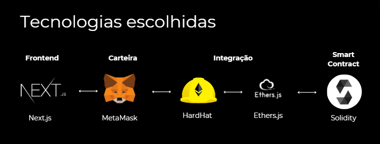
  <p><b>Fonte:</b> elaboração pela equipe Ethos.</p>
</div>

&emsp;&emsp;A imagem acima representa as tecnologias-chave que escolhemos para desenvolver a Plataforma de Transparência de Preços da Alliance. A escolha dessas tecnologias não foi aleatória; cada uma foi selecionada por suas características específicas que satisfazem as necessidades do projeto.

- Frontend (Next.js): Next.js foi escolhido ao invés de outros frameworks como Angular ou Vue.js devido à sua capacidade de renderização do lado do servidor, otimização para mecanismos de busca e sua eficiente divisão de código.
- Carteira (MetaMask): MetaMask é uma das carteiras de criptomoedas mais populares, e a mesma foi selecionada em detrimento de alternativas como Trust Wallet ou Coinbase Wallet pela sua ampla adoção, integração simplificada com Ethereum e outros blockchains compatíveis com EVM, além de sua extensa comunidade de desenvolvedores.
- Integração (HardHat e Ethers.js): HardHat é um ambiente de desenvolvimento Ethereum que fornece a capacidade de testar em um ambiente de blockchain local, superando outras ferramentas como Truffle. Ethers.js foi selecionado por sua leveza e fácil manipulação de contratos inteligentes quando comparado a web3.js.
- Backend Web3 (Solidity): A linguagem Solidity é a escolha para o desenvolvimento de contratos inteligentes devido à sua segurança, eficiência e suporte pela comunidade Ethereum.
- Backend Web2 (PostgreSQL): PostgreSQL foi escolhido por ser um sistema de gerenciamento de banco de dados relacional robusto e confiável, com performance superior a concorrentes como MySQL, especialmente em casos de uso complexos e grandes volumes de dados.

&emsp;&emsp;**Arquitetura**


&emsp;&emsp;A imagem a seguir detalha a arquitetura planejada para a plataforma *Tempus*. A arquitetura é uma representação visual das tecnologias utilizadas e de como elas se conectam para fornecer uma solução completa:

<div align="center">
  <p> <b>Figura 09 </b> - Tecnologias Escolhidas</p>

  <p><b>Fonte:</b> elaboração pela equipe Ethos.</p>
</div>

&emsp;&emsp;Front-end:

- **Next.js:** Baseado no framework React, o Next.js é utilizado para programação front-end. Sua escolha se deve à otimização SEO inerente, à renderização server-side que melhora a performance e à divisão automática de código que agiliza o carregamento de páginas.
- **Fuse.js:** Esta biblioteca é implementada para pesquisas dinâmicas no cliente. É leve e simples, proporcionando uma experiência de pesquisa rápida e eficiente sem a necessidade de um back-end de pesquisa dedicado.
- **Ethers.js:** Atua como a ponte entre o front-end e a blockchain, facilitando a interação com smart contracts e a carteira digital MetaMask, permitindo transações e consultas à blockchain.

&emsp;&emsp;Back-end Web 3.0:

- **Hardhat:** É um ambiente de desenvolvimento Ethereum que facilita a criação e o teste de aplicações Web3 e smart contracts. Suas ferramentas avançadas de depuração e testes tornam o desenvolvimento mais eficiente.
- **Smart Contract:** Programas de computador que executam ações especificadas automaticamente quando certas condições são atendidas, sem necessidade de intervenção de terceiros. São escritos em Solidity, uma linguagem de programação para implementar contratos inteligentes.
- **Sepolia:** Uma rede de teste pública para desenvolvedores testarem smart contracts e aplicações antes de serem lançados na mainnet. Essencial para a validação da prova de conceito.

&emsp;&emsp;Back-end Web 2.0:

- **PostgreSQL:** É o banco de dados relacional escolhido por sua robustez e confiabilidade. Com suporte a uma grande variedade de tipos de dados e operações complexas, é ideal para gerenciar grandes quantidades de dados com integridade.
- **Fastify:** Um framework web altamente performático para construção de servidores HTTP, escolhido por sua velocidade e eficiência, que é utilizada para criar o servidor da API.
- **Zod:** Uma biblioteca que fornece tipagem de esquemas de banco de dados, garantindo que os dados manipulados pela aplicação estão corretos e seguros.
- **Prisma:** É uma ORM (Object-Relational Mapping) que facilita o trabalho com o banco de dados, permitindo aos desenvolvedores criar aplicações mais rapidamente devido à sua abstração de alto nível e facilidade de uso.

&emsp;&emsp;**Integração e Deploy**

&emsp;&emsp;A imagem abaixo destaca como as partes front-end e back-end da nossa arquitetura se comunicam e se integram. Em seguida há uma descrição que aprofunda no processo:

<div align="center">
  <p> <b>Figura 10 </b> - Tecnologias Escolhidas</p>

  <p><b>Fonte:</b> elaboração pela equipe Ethos.</p>
</div>

&emsp;&emsp;Front-end:

- Utiliza o **Next.js** para a interface do usuário, fornecendo uma experiência rica e dinâmica.
- **Ethers.js** é a biblioteca que permite interações com a blockchain, como a execução de funções em smart contracts e a comunicação com MetaMask para transações.

&emsp;&emsp;Back-end Web3:

- **Hardhat** é a ferramenta de desenvolvimento que facilita a criação e implantação de smart contracts na blockchain.
- Os smart contracts interagem com o front-end através de Ethers.js, enquanto a MetaMask gerencia a autenticação e as transações dos usuários.

&emsp;&emsp;Back-end Web2:

- **Fastify**, um framework de servidor leve e rápido, é utilizado para criar uma API eficiente.
- O banco de dados **PostgreSQL** armazena e gerencia os dados que não são adequados para a blockchain devido a questões de eficiência ou privacidade.

&emsp;&emsp;Comunicação:

- A comunicação entre front-end e back-end Web2 é estabelecida pelo Fastify, que serve como ponte para consultas ao banco de dados e operações relacionadas.
- O front-end comunica-se com o back-end Web3 utilizando Ethers.js, que interage diretamente com os smart contracts hospedados na blockchain.

&emsp;&emsp;Deploy:

- A plataforma front-end é hospedada na **Vercel**, conhecida por sua simplicidade e rápida configuração, além de sua integração contínua com repositórios de código, como GitHub.
- O back-end Web2 é implantado na **Render**, uma plataforma de nuvem que oferece serviços variados e maneja tanto as operações de deploy como o escalonamento automático.

&emsp;&emsp;Dessa forma a prova de conceito em uma rede de testes aberta assegura a validação e segurança das funcionalidades antes de serem transferidas para um ambiente de produção. Com o uso de tecnologias de ponta, estamos não só avançando no processo de cotação mas também na maneira como os stakeholders interagem dentro do ecossistema de Supply Chain.


### 6.4 Diagrama de Fluxo

&emsp;&emsp;Para ilustrar como funcionará as principais funcionalidades da plataforma, e como se daria a relação do usuário com elas, em casos positivos, foi feito o seguinte fluxograma, chamado Fluxo Principal. Segundo Robert C. Martin, em seu livro “Clean Architecture: A Craftsman's Guide to Software Structure and Design" <sup><a href="#referencia-12">12</a></sup> o termo "fluxo principal" ou "caminho feliz" na arquitetura de softwares refere-se ao cenário em que todas as operações ocorrem conforme o esperado, sem erros ou exceções. Este conceito é fundamental para o design e desenvolvimento de software, pois enfatiza a importância de planejar e otimizar a experiência mais comum e ideal que um usuário ou sistema terá ao utilizar um aplicativo ou serviço. Segue portanto o Fluxo Principal desenvolvido pelo grupo Ethos para o projeto desenvolvido em parceria com a Alliance:


<div align="center">
  <p><b>Figura 11</b> - Diagrama de Fluxo</p>
  
  <p><b>Fonte:</b> elaboração pela equipe Ethos.</p>
</div>

<div align="center">
  <p><b>Figura 12</b> - Regras de Negócios relacionadas ao Diagrama de Fluxo</p>
  
  <p><b>Fonte:</b> elaboração pela equipe Ethos.</p>
</div>

[Link para o Fluxo Principal dentro da ferramenta Miro para melhor leitura, caso necessário](https://miro.com/welcomeonboard/bVdhWnYyQXVtT3N2YnNpdTN2Z2xweEpqVzlSMlJicktCU3A5bVZnNkVrYkI5YUJuZGxzOUFzMlNpZnJHVHNDeXwzNDU4NzY0NTYwODA1ODI1NjQxfDI=?share_link_id=770960103127)


&emsp;&emsp;Nota-se que que a plataforma, e consequentemente o acesso de determinado usuário nela, para alcançar seu objetivo final, que seria a visualização do preço médio de determinado produto, teria que passar por quatro principais ramificação que estão descritas no fluxo, no qual estão denominados como “Cadastro de Usuário”, “Cadastro de Produtos”, “Cadastro de Transação” e “Cálculo do Preço Médio”.

&emsp;&emsp;Durante o Caminho Feliz foi levado em consideração quais seriam os pré-requisitos específicos para cada ação da plataforma para atender as regras de negócios consideradas relevantes para a solução. Segundo Tony Morgan em seu livro "Business Rules and Information Systems: Aligning IT with Business Goals" <sup><a href="#referencia-13">¹³</a></sup>, regras de negócios são diretrizes específicas, critérios, ou condições definidas dentro de um projeto para garantir que as operações, decisões e procedimentos do negócio alinhem-se com os objetivos estratégicos, políticas e requisitos da empresa ou organização. 

&emsp;&emsp;Em resumo as regras de negócios podem ser aplicadas em diversos níveis de um sistema, desde validações simples de dados, como a exigência de que um campo de idade não pode ser negativo, ou até mesmo lógicas complexas de processamento que afetam como os produtos são recomendados ou preços são calculados.

&emsp;&emsp;Segue as informações referentes aos fluxos específicos que representam quatro processos distintos dentro da plataforma Temphos, descritos no Fluxo do Caminho Feliz:

&emsp;&emsp;1. **Cadastro de Usuário**: Este processo envolve todas as etapas e requisitos necessários para que um novo usuário possa se registrar na plataforma com sucesso. Isso inclui a aceitação de termos de uso, a criação de uma conta fornecendo informações pessoais, e possivelmente a verificação de identidade, assegurando que o usuário possa utilizar a plataforma adequadamente.

&emsp;&emsp;2. **Cadastro de Produto:** Após se registrar, o usuário tem a capacidade de adicionar novos produtos à plataforma. Esse processo pode envolver a descrição do produto e a especificação de detalhes como preço e marca, permitindo que o produto esteja exibido na plataforma.

&emsp;&emsp;3. **Cadastro de Transação:** Esse fluxo permite ao usuário registrado documentar as transações na plataforma.

&emsp;&emsp;4. **Acesso ao Preço Médio:** Finalmente, o usuário pode consultar o preço médio de produtos específicos. Esse recurso provavelmente oferece uma ferramenta de pesquisa onde o usuário pode escolher um produto e receber informações sobre o preço médio baseado em transações anteriores.

&emsp;&emsp;Cada uma dessas ramificações representa uma funcionalidade importante da plataforma, projetada para facilitar a interação do usuário com o serviço, seja por meio do cadastro, da oferta de produtos, da realização de transações ou da obtenção de informações sobre preços, segue as interações sequenciais descritas no fluxograma:

&emsp;&emsp;**Cadastro de Usuário:**

&emsp;&emsp;1. O usuário acessa a plataforma e conecta-se utilizando a extensão MetaMask instalada em seu dispositivo (respeitando a regra de negócios n° 01).

&emsp;&emsp;2. Após ler e aceitar os termos de uso  (respeitando a regra de negócios n° 02), o usuário ganha acesso à plataforma.

&emsp;&emsp;3. Com os termos aceitos, o usuário pode realizar o login.

&emsp;&emsp;**Cadastro de Produto:**

&emsp;&emsp;4. Somente usuários registrados, podem adicionar produtos à plataforma.

&emsp;&emsp;5. O usuário registrado pode cadastrar produtos, fornecendo detalhes como nome, modelo, código SKU  –  Stock Keeping Unit (Unidade de Manutenção de Estoque) – e marca (regra de negócios nº 05).

&emsp;&emsp;6. Se o código SKU não estiver previamente cadastrado, o produto será registrado (regra de negócios nº 06) e ficará visível na plataforma.

&emsp;&emsp;**Cadastro de Transação:**

&emsp;&emsp;7. Caso o usuário esteja cadastrado, respeitando a regra de negócios n° 03, o usuário registra uma nova transação incluindo detalhes como nome do produto, SKU, quantidade, preço unitário e a carteira do usuário B (comprador ou vendedor).

&emsp;&emsp;8. O sistema valida o SKU para confirmar se está cadastrado e validado (regra nº 07).

&emsp;&emsp;9. Após a validação do SKU, as informações da transação são enviadas ao usuário B para aprovação. (regra nº 08)

&emsp;&emsp;10. Uma vez que as informações sejam confirmadas por ambas as partes e validadas pelo sistema (fase de "Limbo" – Limbo foi o nome dado pela equipe Ethos, para identificar aqueles produtos que ainda estejam em processo de avaliação do sistema), a transação é registrada na blockchain e torna-se acessível a todos os usuários.

&emsp;&emsp;**Cálculo do Preço Médio:**

&emsp;&emsp;11. A Alliance realiza o input inicial do histórico de produtos e preços.

&emsp;&emsp;12. O sistema verifica se os produtos têm código SKU válido. (regra nº 06)

&emsp;&emsp;13. Se sim, o preço médio é calculado com a Cartesi.

&emsp;&emsp;14. Após isso, novas transações ocorrerão na plataforma.

&emsp;&emsp;15. O sistema faz um novo cálculo baseado no preço médio anterior mais os novos preços (vindos das novas transações).

&emsp;&emsp;16. Esse novo preço médio é armazenado em um array alternativo, um espaço antes de ir para a rede.

&emsp;&emsp;17. O sistema faz uma nova validação do produto x preço para garantir a *confiabilidade* e *segurança*, caso algum usuário malicioso tente inserir um preço de produto direto nesta etapa, sem antes passar pelo **cadastro da transação.**

&emsp;&emsp;18. Após a validação, o novo preço médio é inserido na rede (blockchain).

&emsp;&emsp;**Verificação de Preço Médio:**

&emsp;&emsp;19. Para consultar o preço médio de um produto, o usuário deve primeiro identificar o produto pelo SKU. (regra nº 06)

&emsp;&emsp;20. O usuário pode então visualizar o preço médio do produto desejado. Que já foi calculado pelo sistema.

&emsp;&emsp;Segue uma exemplificação de qual seria a jornada inicial ideal de uma empresa dentro da plataforma Tempus: 

&emsp;&emsp;A Empresa A, interessada em determinar o preço médio de canetas da marca X para otimizar suas compras, inicia o processo na plataforma. 

- Primeiro, realiza o cadastro utilizando a extensão MetaMask, aceitando os termos de uso para acessar as funcionalidades. 

- Em seguida, cadastra um produto que planeja vender, seguindo as regras estabelecidas, embora seu objetivo principal seja verificar o preço de outro produto. Para isso, simula uma transação inserindo dados de uma caneta da marca X, incluindo nome, SKU, quantidade e preço, além da carteira de um usuário fictício da Empresa B, para testar o processo. 

- A transação é validada pela plataforma, que verifica o SKU e confirma a inserção no "Limbo" antes de oficializá-la na blockchain. 

- Finalmente, a Empresa A utiliza a funcionalidade de verificação de preço médio, procurando pelo SKU da caneta da marca X, permitindo que a plataforma apresente o preço médio baseado em transações anteriores. 

&emsp;&emsp;Com essas informações, a Empresa A consegue tomar decisões de compra mais informadas, beneficiando-se da transparência e eficiência da plataforma.

### 6.5 Diagrama de Blocos

&emsp;&emsp;Um diagrama de blocos é uma representação visual simplificada de um sistema ou processo, geralmente utilizado nas áreas de engenharia e design de sistemas. Ele utiliza blocos para representar os componentes individuais ou funções dentro do sistema, e setas ou linhas para indicar as relações ou o fluxo de informações entre esses componentes. A importância de um diagrama de blocos reside em sua capacidade de fornecer uma visão clara e rápida da estrutura e do funcionamento de um sistema complexo, permitindo aos usuários e desenvolvedores entenderem como os diferentes elementos interagem sem a necessidade de detalhes técnicos profundos.

&emsp;&emsp;No contexto de sistemas baseados em blockchain, como no diagrama desenvolvido, o diagrama de blocos é particularmente valioso pois pode descomplicar a complexidade inerente dessas tecnologias. Ele oferece uma visão geral de como os usuários finais (compradores e vendedores) interagem com a aplicação, como as transações são processadas através de smart contracts na rede blockchain, e como o sistema é mantido e administrado. Isso ajuda todos os envolvidos, desde os desenvolvedores até os usuários finais, a compreenderem suas funções e responsabilidades dentro do sistema, além de facilitar a identificação de potenciais pontos de falha e áreas para melhoria. Segue o diagrama de blocos da solução desenvolvido pela equipe Ethos.

<div align="center">
  <p> <b>Figura 13 </b> - Diagrama de Blocos</p>

  <p><b>Fonte:</b> elaboração pela equipe Ethos.</p>
</div>

&emsp;&emsp;O diagrama desenvolvido pela equipe Ethos, ilustra a arquitetura da solução blockchain desenvolvida para a empresa Alliance, como parte de um projeto de automatização de negociação (cotação) dentro da cadeia de suprimentos. A solução é focada na transparência de preços e segurança na contratação de fornecedores. Segue a descrição dos componentes presentes no diagrama:


&emsp;&emsp;1. **Dispositivo do Comprador/Vendedor**: Este bloco representa os usuários finais que interagem com o sistema, seja compradores ou vendedores. Eles acessam o sistema via um navegador web.

&emsp;&emsp;2. **Frontend**: A interface do usuário é apresentada aqui como um servidor web, hospedando a aplicação web onde os usuários podem realizar suas atividades, como registrar produtos e transações.

&emsp;&emsp;3. **Metamask Comprador/Vendedor**: Metamask é uma carteira de criptomoedas e um gateway para acessar aplicativos de blockchain. No contexto deste projeto, Metamask é utilizado para gerenciar identidades e transações na blockchain.

&emsp;&emsp;4. **Rede Blockchain (Sepolia Testnet)**: Representa a infraestrutura blockchain onde os contratos inteligentes são implantados e executados. A Sepolia Testnet é uma rede de testes usada para testar aplicações blockchain antes de serem lançadas em uma rede principal.

&emsp;&emsp;5. **Smart Contract**: Os contratos inteligentes são programas que rodam na blockchain e que permitem a execução automática de acordos. No contexto deste projeto, eles lidam com o registro de clientes, produtos e transações.

&emsp;&emsp;6. **Deploy**: Este bloco indica a implantação da solução, com a Alliance administrando o processo de implementação.

&emsp;&emsp;Segue uma relação do diagrama de blocos apresentado pela equipe Ethos com as regras de negócio descritas implementadas nos Smart Contract e descritas na seção 7.2 dessa documentação:

&emsp;&emsp;- **RN.01 (Cadastro de Clientes)**: A integração com o Metamask permite cumprir esta regra, já que o Metamask gerencia endereços de carteiras válidos e pode ser usado para garantir identificação única de clientes na plataforma.

&emsp;&emsp;- **RN.02 (Participar da Rede)**: Através do frontend e do smart contract na Sepolia Testnet, os clientes cadastrados podem ativar seu status de participação e tornarem-se participantes ativos da rede.

&emsp;&emsp;- **RN.03 (Registrar Transação)**: O smart contract na blockchain será responsável por assegurar que apenas clientes cadastrados e ativos possam registrar transações, cumprindo esta regra de negócio.

&emsp;&emsp;- **RN.04 (Obter Média das Transações de um Cliente)**: A funcionalidade de consultar a média das transações pode ser implementada no frontend.

&emsp;&emsp;- **RN.05 (Registro de Novos Produtos)**: Novos produtos podem ser adicionados por meio do frontend, e o smart contract garante que apenas produtos com SKUs únicos sejam registrados, em conformidade com essa regra.

&emsp;&emsp;- **RN.06 (Obter Informações de Produto)**: As informações do produto podem ser recuperadas por meio do frontend que interage com a blockchain, usando o SKU como chave de busca no contrato inteligente.

&emsp;&emsp;- **RN.07 (Validar Transação)**: Através dos smart contracts na Sepolia Testnet, esta regra assegura que todas as transações sejam validadas pelas partes envolvidas antes de sua execução, garantindo transparência e consenso no processo de transação.

&emsp;&emsp;- **RN.08 (Validar Detalhes da Transação)**: A funcionalidade implementada nos smart contracts permite a revisão e confirmação final dos detalhes da transação pelo receptor, promovendo uma camada adicional de verificação para assegurar a precisão e o acordo mútuo nas operações.

&emsp;&emsp;Dessa forma o Diagrama de Blocos visa melhorar a eficiência e a transparência do processo de cotação, permitindo aos usuários pagar um preço justo e fornecendo um histórico de transações auditável e transparente.

### 6.6 Diagrama da solução - UML

&emsp;&emsp;No âmbito do desenvolvimento de sistemas e processos, a utilização do Unified Modeling Language (UML) desempenha um papel fundamental na modelagem e compreensão de sistemas complexos. O UML, uma ferramenta de modelagem padronizada, oferece uma abordagem sistemática para representar visualmente a estrutura, comportamento e interações de sistemas, sendo amplamente empregado por desenvolvedores de software e profissionais de negócios de acordo com a Lucidchart [¹⁴](#referencia-14). 

&emsp;&emsp;Dentro do vasto espectro de diagramas que compõem o UML, os diagramas de sequência destacam-se por sua capacidade de descrever de forma dinâmica as interações entre objetos e processos em uma ordem cronológica, fornecendo uma visão detalhada e compreensível do fluxo de execução de um sistema. 

&emsp;&emsp;É importante ressaltar que a descrição e elaboração dos diagramas de UML a serem apresentados são realizadas conforme as funcionalidades e recursos oferecidos pela plataforma D2Lang. Veja a seguir os diagramas UML desenvolvidos seguidos de suas respectivas descrições:

<div align="center">
  <p> <b>Figura 14 </b> - UML: Visualização do preço médio </p>
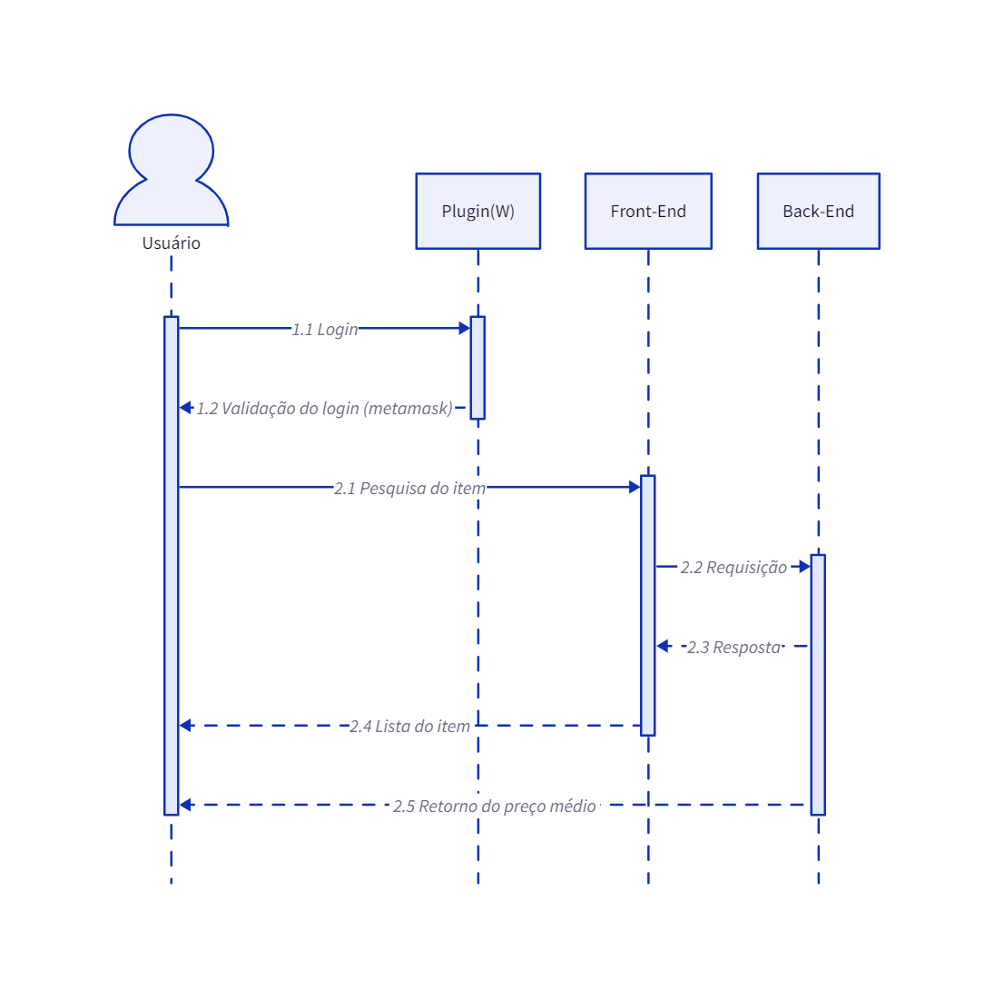
  <p><b>Fonte:</b> elaboração pela equipe Ethos.</p>
</div>


- Login ligando usuário à wallet:

&emsp;&emsp;O processo começa com o usuário fazendo login na plataforma usando sua conta MetaMask, que utiliza a carteira do usuário para validar se ele tem permissão para acessar a plataforma. Após o login, é solicitado que o usuário conecte sua carteira digital MetaMask ao sistema para autenticação, utilizando extensões de navegador ou aplicativos móveis, permitindo a identificação do usuário no blockchain.

- Login aceito (retorno ao usuário):

&emsp;&emsp;Após verificar as credenciais do usuário e estabelecer a conexão com a wallet, o sistema retorna uma confirmação de login ao usuário.

- Pesquisa do item (usuário ao front-end):

&emsp;&emsp;O usuário utiliza a interface do front-end para iniciar uma pesquisa do item desejado na plataforma. O usuário poderá fazer essa pesquisa através de uma barra de pesquisa na principal página do frontend.

- Requisição de informações do item (front-end ao back-end):

&emsp;&emsp;Após o usuário iniciar a pesquisa, o front-end envia uma requisição ao back-end solicitando informações sobre o item pesquisado. Essa requisição irá enviar ao back-end o termo de busca e os filtros selecionados pelo usuário. O back-end irá processar essa requisição, realizar consultas no banco de dados, e irá retornar os resultados para o front-end.

- Requisição completa (resposta back-end ao front-end):

&emsp;&emsp;O back-end envia os dados referentes ao histórico das transações realizadas por aquele produto para o front-end.

- Retorno do preço médio (resposta front-end ao usuário):

&emsp;&emsp;Após receber os dados do back-end, o front-end fará o cálculo do preço médio, e exibirá para o cliente por meio da interface.

<div align="center">
  <p> <b>Figura 15 </b> - UML: Cadastro de um novo item</p>
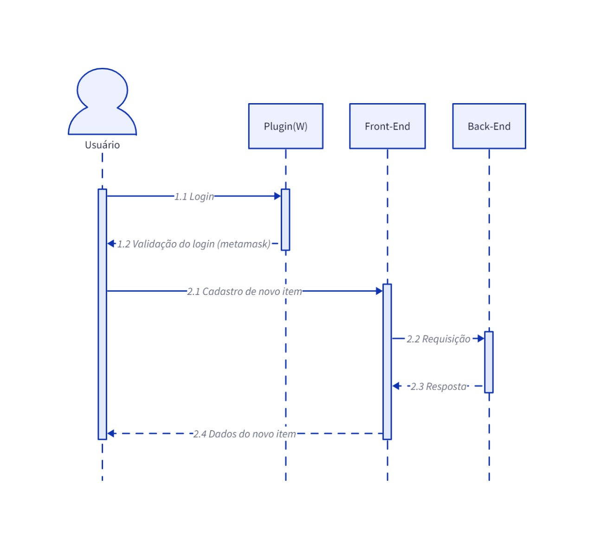
  <p><b>Fonte:</b> elaboração pela equipe Ethos.</p>
</div>

- Login ligando usuário à wallet:

&emsp;&emsp;O processo começa com o usuário fazendo login na plataforma usando sua conta MetaMask, que utiliza a carteira do usuário para validar se ele tem permissão para acessar a plataforma. Após o login, é solicitado que o usuário conecte sua carteira digital MetaMask ao sistema para autenticação, utilizando extensões de navegador ou aplicativos móveis, permitindo a identificação do usuário no blockchain.

&emsp;&emsp;Login aceito (Retorno ao usuário):
Após verificar as credenciais do usuário e estabelecer a conexão com a wallet, o sistema retorna uma confirmação de login ao usuário.

- Cadastro do produto, usuário ao front-end:

&emsp;&emsp;Ao pesquisar um item determinado, o usuário percebe que este não está cadastrado na base de dados do sistema, assim, ele inicia o processo de cadastro do novo produto, incluindo informações necessárias, o nome do item, marca e versão.

- Requisição de entradas de dados (front-end ao Back-end):

&emsp;&emsp;Após o preenchimento dos detalhes do produto, o front-end envia uma requisição ao back-end com as informações dadas pelo usuário.

- Resposta (back-end ao front-end): 

&emsp;&emsp;O back-end recebe a requisição de cadastro do produto, armazena os dados recebidos na base de dados Web 2.0 - é importante saber que o banco de dados Web 2.0 irá também enviar as informações para o Web 3.0, garantindo segurança e imutabilidade - e confirma o sucesso da operação, em seguida, o back-end manda a resposta para o front-end confirmando o cadastro do produto. 

- Retorno dos dados do item (front-end ao usuário): 

&emsp;&emsp;Após receber a confirmação do back-end, o front-end fornece os dados do produto cadastrado, o que permite que o usuário verifique as informações do produto recém-cadastrado e possa selecionar o mesmo em futuras pesquisas.

<div align="center">
  <p> <b>Figura 16 </b> - UML: Visualização do ativo com o histórico de transações</p>
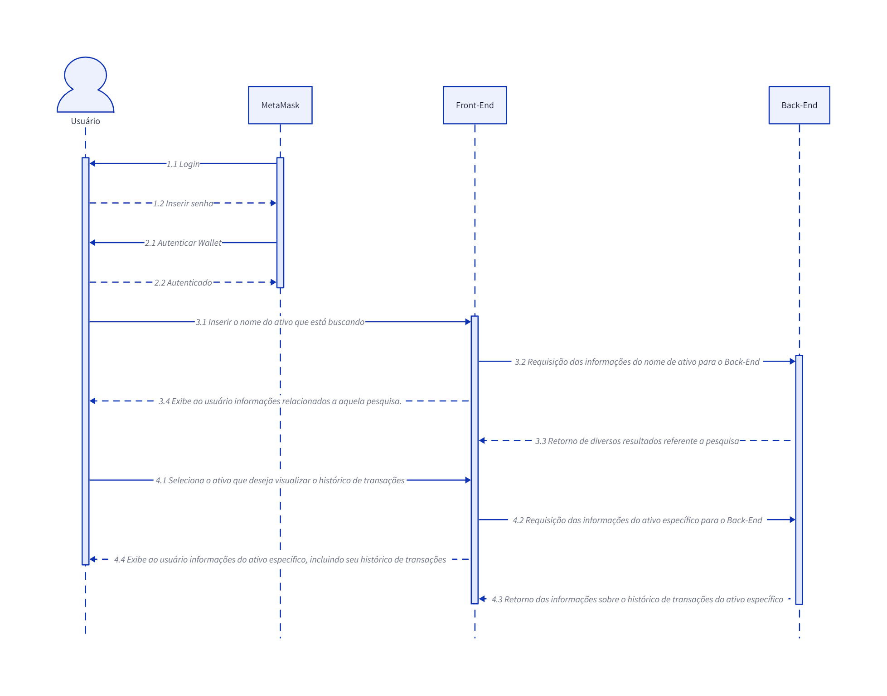
  <p><b>Fonte:</b> elaboração pela equipe Ethos.</p>
</div>

- Autenticação e Conexão com a Wallet:

&emsp;&emsp;O processo começa com o usuário fazendo login na plataforma usando sua conta MetaMask, que utiliza a carteira do usuário para validar se ele tem permissão para acessar a plataforma. Após o login, é solicitado que o usuário conecte sua carteira digital MetaMask ao sistema para autenticação, utilizando extensões de navegador ou aplicativos móveis, permitindo a identificação do usuário no blockchain.

- Busca e Visualização de Ativos:

&emsp;&emsp;O usuário insere o nome ou parte do nome do ativo que deseja buscar. A plataforma processa essa busca, consultando seu banco de dados Web 2.0 para encontrar ativos que correspondam aos critérios de pesquisa. Os resultados são então apresentados ao usuário, que pode visualizar informações detalhadas sobre os ativos encontrados, incluindo preço médio, número de transações, e quantidade de ativos transacionados.

- Histórico de Transações de Ativos:

&emsp;&emsp;Ao selecionar um ativo, o usuário pode aplicar a opção de "Histórico de Transações do Produto" para visualizar informações específicas sobre transações passadas do ativo, com valores e quantidades. Essa funcionalidade proporciona uma visão do histórico de transações do ativo, permitindo uma investigação da atividade do ativo tanto na interface quanto no blockchain.

---
REVISÃO GERAL!!
<div align="center">
  <p> <b>Figura 17 </b> - UML: Cadastro de um Novo Usuário</p>

  <p><b>Fonte:</b> elaboração pela equipe Ethos.</p>
</div>

- Cadastro Inicial e Registro na Blockchain:

&emsp;&emsp;O processo começa com o usuário fazendo login na plataforma usando sua conta MetaMask, que utiliza a carteira do usuário para validar se ele tem permissão para acessar a plataforma. Após o login, é solicitado que o usuário conecte sua carteira digital MetaMask ao sistema para autenticação, utilizando extensões de navegador ou aplicativos móveis, permitindo a identificação do usuário no blockchain.

- Login e Autenticação:

&emsp;&emsp;O usuário realiza o login na MetaMask para acessar sua carteira, utilizando sua senha, chave privada ou assinatura digital. Esta etapa verifica a propriedade do endereço da carteira usada no login.

- Confirmação e Pagamento de Gas:

&emsp;&emsp;Antes de realizar o pagamento do gas, a plataforma solicita que o usuário confirme a transação, garantindo que esteja ciente do pagamento e de seu valor. Após a confirmação, o pagamento é processado e registrado na blockchain, proporcionando transparência e rastreabilidade do processo.

- Finalização do Cadastro:

&emsp;&emsp;Uma vez que o pagamento do gas é validado pela rede blockchain, a transação de registro do usuário é processada e confirmada. As informações de cadastro são então armazenadas de forma segura na blockchain, completando o processo de cadastro e permitindo ao usuário acessar e interagir com a plataforma.

<div align="center">
  <p> <b>Figura 18 </b> - UML: Registro/Validação de Transação</p>
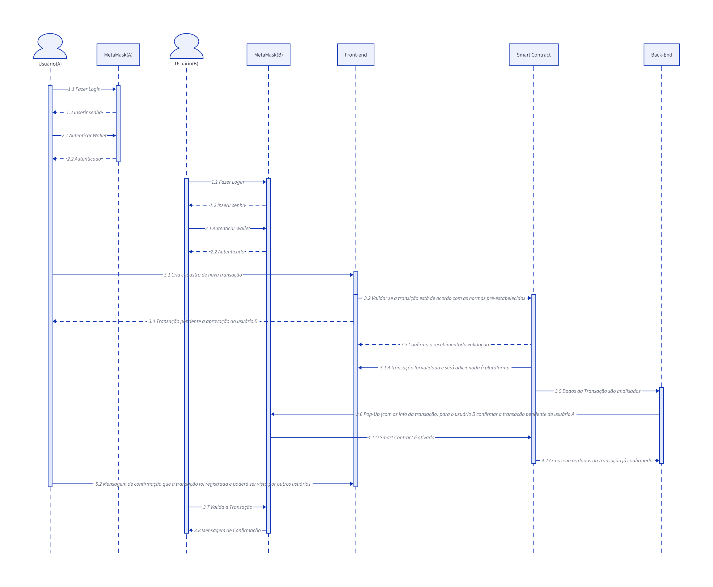
  <p><b>Fonte:</b> elaboração pela equipe Ethos.</p>
</div>

- Autenticação e Conexão com a Wallet:

&emsp;&emsp;O processo começa com o usuário fazendo login na plataforma usando sua conta MetaMask, que utiliza a carteira do usuário para validar se ele tem permissão para acessar a plataforma. Após o login, é solicitado que o usuário conecte sua carteira digital MetaMask ao sistema para autenticação, utilizando extensões de navegador ou aplicativos móveis, permitindo a identificação do usuário no blockchain.

- Cadastro e Validação de Transações:

&emsp;&emsp;O usuário procede para cadastrar uma nova transação, fornecendo detalhes como destinatário, quantidade, data da transação e valor. Um pop-up é apresentado ao usuário B para confirmar ou rejeitar a transação pendente.

- Processamento e Registro da Transação:

&emsp;&emsp;Com a aprovação do usuário B, o smart contract é ativado, processando a transação de acordo com as regras codificadas. Os detalhes da transação confirmada são armazenados de forma segura na blockchain, garantindo imutabilidade e transparência. A transação é então oficialmente registrada na blockchain e se torna parte do histórico público. Além disso as informações são também enviadas para um banco de dados Web 2.0 que armazenará esses dados, que no futuro se tornarão o preço médio.

&emsp;&emsp;Dessa forma, a apresentação do UML de como ocorre a comunicação entre os diferentes aspectos da tecnologia e arquitetura da solução, a implementação desses Unified Modeling Language (UML) no processo de desenvolvimento e análise de sistemas emerge como uma prática indispensável para a visualização, especificação, construção e documentação de artefatos de sistemas de software. Através da adoção de UML, equipes conseguem ultrapassar as barreiras da complexidade, promovendo uma compreensão uniforme das estruturas operacionais dos sistemas em desenvolvimento. A capacidade do UML de adaptar-se a diversos contextos, desde a modelagem de sistemas empresariais até o desenho de contratos inteligentes em plataformas de blockchain, evidencia sua eficácia. Ademais, com ferramentas como a D2Lang, que otimizam a interpretação de diagramas UML, profissionais dispõem de recursos valiosos para aprimorar a qualidade de seus projetos. Portanto, o UML não é apenas uma linguagem de modelagem; é uma ponte para a inovação e excelência no universo do desenvolvimento de software.

### 6.7 Arquitetura da Integração
&emsp;&emsp;O planejamento da integração entre o smart contract e o front-end é um componente importante no desenvolvimento de soluções blockchain eficazes. O uso de diagramas de sequência UML oferece uma abordagem sistemática para visualizar a interação entre diferentes elementos de software, facilitando uma compreensão mais profunda das operações e fluxos de dados. Este método ajuda a promover clareza e eficiência na comunicação entre desenvolvedores e stakeholders, garantindo que todos os aspectos técnicos e de negócios sejam adequadamente endereçados e alinhados.

&emsp;&emsp;Essses UMLs se diferenciam daqueles criados na seção 7.6 Diagrama da Arquitetura pois exploram com mais profundidade as tecnologias que foram utilizadas na criação de cada fluxo dentro da solução *Tempus*, além de citarem as respectivas funções do smart contract atreladas a elas e documentar na descrição os códigos em TypeScrit (Next.js) onde ocorre cada uma das relações abordadas anteriormente. Neste contexto, os diagramas de sequência UML permitem-nos visualizar e planejar as interações entre o front-end, o smart contract, e demais componentes, como a carteira MetaMask e o backend. Esses diagramas estão ligados ao código implementado no smart contract, refletindo as regras de negócio e garantindo que a solução final esteja alinhada com as necessidades dos usuários finais, conforme mostrado nas user stories fornecidas. Dessa forma segue os UMLs planejados para a integração do sistema, considerando diferentes perspectivas que a aplicação suporta:

<div align="center">
  <p> <b>Figura 19 </b> - UML: Visualização do preço médio</p>

  <p><b>Fonte:</b> elaboração pela equipe Ethos.</p>
</div>

- Autenticação:

&emsp;&emsp;O usuário inicia o processo solicitando a visualização do preço médio de transações. Para isso, o sistema pede que o usuário se autentique usando a MetaMask, o que confirma sua identidade e permite prosseguir com a solicitação.

- Obtenção do Preço Médio:

&emsp;&emsp;Uma vez autenticado, o sistema chama a função obterMediaTransacoes() no frontend da aplicação, que consulta a base de dados Web 2.0 para obter os dados das transações. O sistema processa esses dados, calcula o preço médio e envia o resultado para a interface do usuário.


<div align="center">
  <p> <b>Figura 20 </b> - UML: Cadastro de um novo item</p>

  <p><b>Fonte:</b> elaboração pela equipe Ethos.</p>
</div>

- Autenticação:

&emsp;&emsp;O processo começa com o usuário iniciando o cadastro de um novo item no sistema. O front-end solicita a autenticação do usuário via MetaMask, garantindo a segurança e a propriedade da ação.

- Cadastro do Item:

&emsp;&emsp;Após a autenticação, o front-end chama a função adicionarProduto(nome, detalhes) no smart contract Tempus para registrar o novo item. O smart contract valida e as informações são enviadas simultâneamente à aplicação blockchain e à base de dados Web 2.0, confirmando o sucesso do cadastro. O front-end, então, notifica o usuário sobre o sucesso do cadastro do item.

&emsp;&emsp;O procedimento para cadastramento de um novo produto, detalhado anteriormente, está incorporado no código e pode ser examinado com atenção por meio da função Smart Contract, bem como através da integração realizada no front-end. Ambos os componentes são apresentados a seguir:

````
    // A função a seguir adiciona um novo produto
    // Regra de Negócio - Registro de Novos Produtos, essa restrição garante que o inventário de produtos seja gerido de maneira centralizada e controlada.
    function adicionarProduto(bytes32 _sku, string memory _nome)
        external
        apenasProprietario
    {
        require(
            msg.sender == owner,
            "Apenas o proprietario pode adicionar produtos"
        );
        require(
            bytes(produtos[_sku].nome).length == 0,
            "Produto ja adicionado"
        );
        produtos[_sku] = Produto(_nome, msg.sender);
    }
````

&emsp;&emsp;A integração desta função é demonstrada na interface de Cadastrar uma nova Transação do projeto, especificamente no arquivo 2024-T0010-SI05-G02\src\tempus\src\app\cadastro-transacao\page.tsx, onde a lógica de adição de um novo cliente é implementada:

````javascript
  // Função para adicionar um novo produto ao contrato inteligente
  async function adicionarProduto() {
    if (window.ethereum) {
      try {
        // Solicitação para conectar com a carteira MetaMask do usuário
        await window.ethereum.request({ method: "eth_requestAccounts" });
        const provider = new ethers.BrowserProvider(window.ethereum);
        const signer = await provider.getSigner();
        const contrato = new ethers.Contract(
          contractAddress,
          ContratoTempusABI,
          signer
        );

        // Chama a função do contrato inteligente para adicionar um novo produto
        const tx = await contrato.adicionarProduto(sku, produto);

        await tx.wait();
        alert("Produto cadastrado com sucesso!");
        setNoOptions(false);
      } catch (error) {
        console.error("Erro ao cadastrar produto:", error);
        alert("Erro ao cadastrar produto. Veja o console para mais detalhes.");
      }
    } else {
      alert("Por favor, instale o MetaMask.");
    }
  }
````

<div align="center">
  <p> <b>Figura 21 </b> - UML: Visualização do ativo com o histórico de transações</p>

  <p><b>Fonte:</b> elaboração pela equipe Ethos.</p>
</div>

- Autenticação:

&emsp;&emsp;O usuário solicita a visualização do histórico de transações de um ativo específico. O sistema requer a autenticação do usuário através da MetaMask para prosseguir.

- Visualização do Histórico:

&emsp;&emsp;Após a autenticação, o front-end chama a função obterMediaTransacoes() no smart contract Tempus para obter o histórico de transações do ativo. O smart contract valida e busca as informações no backend, retornando o histórico de transações para o front-end, que exibe as informações ao usuário.

<div align="center">
  <p> <b>Figura 22 </b> - UML: Cadastro de Usuário</p>

  <p><b>Fonte:</b> elaboração pela equipe Ethos.</p>
</div>

- Autenticação MetaMask:

&emsp;&emsp;O processo inicia com o usuário solicitando cadastro na plataforma. A autenticação do usuário é feita via MetaMask, garantindo segurança na identificação.

- Cadastro do Usuário:

&emsp;&emsp;Com a autenticação confirmada, o front-end chama a função cadastrarCliente(nome, carteiraMetamask) no smart contract Tempus para registrar o novo usuário. Após a validação dos dados pelo smart contract e backend, a confirmação de cadastro é enviada para o front-end, que notifica o usuário sobre o sucesso do cadastro.

**Documentação da Integração Projeto Tempus**

&emsp;&emsp;O Projeto Tempus implementa uma solução inovadora na intersecção da tecnologia blockchain e da gestão de carteiras digitais, como a MetaMask. Utilizando o HardHat como ambiente de desenvolvimento, a arquitetura do projeto permite aos usuários cadastrar informações pessoais e de carteira digital. Após a autorização e transferência da taxa de Gas para a transação especificada, os usuários são registrados na plataforma, assegurando uma experiência segura e transparente de interação com contratos inteligentes.

- Cadastro de Novo Cliente no Smart Contract

&emsp;&emsp;O processo de registro de clientes é governado pelo seguinte trecho de código Solidity, assegurando que endereços de carteira inválidos sejam rejeitados e que cada cliente seja identificado de maneira única:

````solidity
// Registra um novo cliente
// Requisito: Cadastro de Clientes
// O sistema deve rejeitar endereços de carteiras inválidos e garantir identificação única do cliente.
function cadastrarCliente(string memory _nome, address _carteiraMetamask) external {
    require(_carteiraMetamask != address(0), "Endereço da carteira Metamask inválido");
    bytes32 hashCarteira = keccak256(abi.encodePacked(_carteiraMetamask));
    clientesPorHash[hashCarteira].push(Cliente(_nome, false, new uint256[](0)));
    emit ClienteCadastrado(_nome, _carteiraMetamask, false);
}
````

- Conexão com o Smart Contract via HardHat

&emsp;&emsp;A conexão com o contrato inteligente é facilitada pelo arquivo ABI (Application Binary Interface), localizado em 2024-T0010-SI05-G02\src\tempus\src\constants\abi.ts. Este arquivo contém os dados necessários para interagir com todas as funções do contrato, incluindo cadastrarCliente().

&emsp;&emsp;A integração desta função é demonstrada na interface de login do projeto, especificamente no arquivo 2024-T0010-SI05-G02\src\tempus\src\app\login\page.tsx, onde a lógica de adição de um novo cliente é implementada:

````javascript
'use client'
import { useState } from 'react';
import { ethers } from 'ethers';
import ContratoTempusABI from '@/constants/abi';

const contractAddress = 'YOUR_CONTRACT_ADDRESS';

export default function Home() {
  const [nome, setNome] = useState('');
  const [enderecoCarteira, setEnderecoCarteira] = useState('');

  async function adicionarCliente() {
    if (typeof window.ethereum !== 'undefined') {
      try {
        await window.ethereum.request({ method: 'eth_requestAccounts' });
        const provider = new ethers.BrowserProvider(window.ethereum);
        const signer = await provider.getSigner();
        const contrato = new ethers.Contract(contractAddress, ContratoTempusABI, signer);

        const tx = await contrato.cadastrarCliente(nome, enderecoCarteira);
        await tx.wait();
        alert('Cliente adicionado com sucesso!');
      } catch (error) {
        console.error(error);
        alert('Erro ao adicionar cliente.');
      }
    } else {
      alert('Instale o MetaMask.');
    }
  }

  return (
    <main className="flex min-h-screen flex-col items-center justify-center p-4">
      <input type="text" placeholder="Nome do Cliente" value={nome} onChange={(e) => setNome(e.target.value)} className="mb-2" />
      <input type="text" placeholder="Endereço da Carteira Metamask" value={enderecoCarteira} onChange={(e) => setEnderecoCarteira(e.target.value)} className="mb-2" />
      <button onClick={adicionarCliente} className="btn">
        Adicionar Cliente
      </button>
    </main>
  );
}
````

- Visão do Usuário

&emsp;&emsp;Um vídeo demonstrativo do processo de conexão do ponto de vista do usuário cadastrado está disponível para análise em: [Link do Vídeo](https://drive.google.com/file/d/16pSr0I3lfC4YQR-Io9m82LaOX2swkuwQ/view).

<div align="center">
  <p> <b>Figura 23 </b> - UML: Registro/Validação de Transação</p>

  <p><b>Fonte:</b> elaboração pela equipe Ethos.</p>
</div>

- Autenticação dos Usuários (A e B):

&emsp;&emsp;Ambos os usuários, A e B, fazem login no MetaMask e fornecem senha para autenticação, permitindo que prossigam com a transação.

- Início do Registro de Transação:

&emsp;&emsp;Usuário A solicita o registro de uma nova transação, que é criada no blockchain através da função registrarTransacao() chamada pelo front-end no smart contract Tempus.

- Aprovação do Usuário B:

&emsp;&emsp;Usuário B confirma sua participação na transação. O front-end chama a função validarTransação no smart contract para validar os detalhes da transação, garantindo que todos os termos sejam acordados.

- Finalização do Registro de Transação:

&emsp;&emsp;A transação é finalmente validada e registrada no sistema. Ambos os usuários recebem uma notificação de confirmação, e o processo de registro da transação na base de dados é completado.

&emsp;&emsp;O procedimento para a autenticação em duas etapas, detalhado anteriormente, está incorporado no código e pode ser examinado com atenção por meio da função Smart Contract, bem como através da integração realizada no front-end. Ambos os componentes são apresentados a seguir:

````
    // A função a seguir valida os detalhes de uma transação pendente
    // Regra de Negócio - Confirmação Detalhada de Transações Pendentes, esta etapa de validação detalhada é crítica para a conclusão da transação.
    function validarDetalhesTransacao(
        address _carteira1,
        address _carteira2,
        bytes32 _sku,
        uint256 _quantidade,
        uint256 _preco,
        uint256 _timestamp
    ) external {
        DetalhesTransacao storage detalhes = detalhesTransacaoPendente[_carteira2];

        require(
            detalhes.carteira1 == _carteira1 &&
            detalhes.carteira2 == _carteira2 &&
            detalhes.sku == _sku &&
            detalhes.quantidade == _quantidade &&
            detalhes.preco == _preco &&
            detalhes.timestamp == _timestamp &&
            !detalhes.validado,
            "Detalhes da transacao nao correspondem ou ja foram validados"
        );

        detalhes.validado = true;

        emit TransacaoRegistradaDetalhada(
            _carteira1,
            _carteira2,
            _sku,
            _quantidade,
            _preco,
            _timestamp,
            detalhes.validado  // Adicionado o valor de 'validado' ao evento
        );
    }
````

&emsp;&emsp;A integração desta função é demonstrada na interface de login do projeto, especificamente no arquivo 2024-T0010-SI05-G02\src\tempus\src\app\busca\page.tsx, onde a lógica de adição de um novo cliente é implementada:

````javascript
  async function registrarDetalhesTransacao() {
    if (!detalhesDaTransacao || !window.ethereum) return;

    try {
        await window.ethereum.request({ method: "eth_requestAccounts" });
        const provider = new ethers.BrowserProvider(window.ethereum);
        const signer = await provider.getSigner();
        const contrato = new ethers.Contract(
          contractAddress,
          ContratoTempusABI,
          signer
        );
        
        const tx = await contrato.validarDetalhesTransacao(
          detalhesDaTransacao.carteira1,
          detalhesDaTransacao.carteira2,
          `0x${detalhesDaTransacao.sku}`,
          detalhesDaTransacao.quantidade,
          detalhesDaTransacao.preco,
          Math.floor(new Date(detalhesDaTransacao.data.split("/").reverse().join("-")).getTime() / 1000)
        );
  
        await tx.wait();
        alert("Transação validada com sucesso!");
      } catch (error) {
        console.error(Math.floor(new Date(detalhesDaTransacao.data).getTime() / 1000));
        
        console.error("Erro ao validar a transação:", error);
        alert("Erro ao validar a transação. Veja o console para mais detalhes.");
      }}
````
- Conclusão:

&emsp;&emsp;Usuário A solicita e recebe o status e os detalhes da transação, concluindo o processo com transparência e segurança.

&emsp;&emsp;Dessa forma, a conclusão a ser tirada desse contexto é que a utilização dos diagramas de sequência UML é fundamental para a organização e a comunicação eficiente em projetos de desenvolvimento de soluções blockchain. 

&emsp;&emsp;Essa abordagem não apenas facilita a compreensão das complexas interações entre front-end, smart contracts, e outros componentes do sistema, mas também promove uma colaboração mais estreita entre desenvolvedores e stakeholders. 

&emsp;&emsp;Ao visualizar o processo de integração e operação de maneira sistemática, é possível identificar potenciais gargalos, otimizar fluxos de trabalho e garantir que a solução final seja segura, eficiente e alinhada às expectativas dos usuários. Assim, os diagramas de sequência UML se tornam ferramentas indispensáveis no arsenal de desenvolvedores de blockchain, contribuindo significativamente para o sucesso de projetos nesse campo inovador e em constante evolução.

### 6.8 Diagrama de Implantação

&emsp;&emsp;Esta seção descreve o diagrama de implantação da nossa solução, que é uma representação visual da arquitetura física do sistema de software. Ele ilustra como os diferentes componentes de software estão distribuídos e interagem entre si em um ambiente de implantação real. Essa representação é valiosa para entender como o sistema será implantado em diferentes nós de uma rede e como os componentes de software se comunicam. Isso ajuda no momento de planejar e entender os requisitos de implantação e garantir uma integração eficaz do sistema.

<div align="center">
  <p> <b>Figura 24 </b> - UML: Diagrama de Implantação</p>

  <p><b>Fonte:</b> elaboração pela equipe Ethos.</p>
</div>

<b>Descrição do Diagrama:</b>

&emsp;&emsp;O diagrama acima representa a implantação de um sistema relacionado à tecnologia blockchain Ethereum na rede de teste Sepolia.

&emsp;&emsp;<b>Blockchain Nodes:</b> Este nó representa os nós da blockchain Ethereum na rede Sepolia, onde normalmente os contratos inteligentes são executados. UNele o contrato do projeto, denominado "Smart Contract", está implantado neste nó.

&emsp;&emsp;<b>Application Server (Servidor da Aplicação):</b> Este nó hospeda uma aplicação Next.js, que interage com a blockchain Ethereum de alguma forma.

&emsp;&emsp;<b>HardHat Environment (Ambiente HardHat):</b> Este nó representa o ambiente de desenvolvimento utilizado para o desenvolvimento de contratos inteligentes.

&emsp;&emsp;<b>User's Computer (Computador do Usuário):</b> Este nó representa o computador do usuário final. Nele, há dois componentes: a Interface do Usuário (UI) e o MetaMask. A UI e o MetaMask são executados no navegador da web do usuário. O MetaMask é uma extensão que facilita a interação do usuário com a blockchain Ethereum.

&emsp;&emsp;<b>Artefato "ContratoTempus.sol":</b> Este artefato representa um contrato inteligente específico chamado "ContratoTempus.sol".

<b>Associações e Dependências:</b>

&emsp;&emsp;O Application Server fornece a interface de usuário (UI) para o navegador do usuário.
A UI interage com o MetaMask utilizando a biblioteca Ethers.js para facilitar a interação com os contratos inteligentes na blockchain Ethereum.

&emsp;&emsp;O computador do usuário acessa a UI e habilita a interação com os contratos inteligentes usando o MetaMask. O ambiente de desenvolvimento de contratos inteligentes compila e implanta os contratos inteligentes, incluindo o "ContratoTempus.sol".

&emsp;&emsp;Portanto, o diagrama mostra como os diferentes componentes do sistema estão distribuídos e interagem entre si em um ambiente de implantação real. Ele ilustra como os usuários interagem com os contratos inteligentes por meio de uma interface web utilizando o MetaMask, e como os desenvolvedores desenvolvem e implantam contratos inteligentes na rede Ethereum.


## <a name="c10"></a>7. Desenvolvimento com testes
> Documentação de Testes Automatizados do Contrato Tempus

&emsp;&emsp;No desenvolvimento de qualquer software, a qualidade é um aspecto crucial que determina o sucesso e a eficácia do produto final. De acordo com a ISO/IEC 25010<sup><a href="#referencia-2">¹⁶</a></sup>, o modelo de qualidade é "a pedra angular de um sistema de avaliação da qualidade do produto". Este modelo define as características de qualidade que serão consideradas ao avaliar as propriedades de um produto, refletindo as necessidades declaradas e implícitas.

&emsp;&emsp;Para o sistema Tempus, que utiliza a tecnologia blockchain para dinamizar o processo de cotação de fornecedores, a qualidade é especial.

&emsp;&emsp;Dentro do modelo de qualidade da ISO/IEC 25010, a característica de Adequação Funcional (Functional Suitability) é particularmente relevante pois representa o grau em que um produto ou sistema fornece funções que atendem às necessidades declaradas e implícitas quando usado sob condições especificadas. Ela é composta por três sub-características essenciais:

- **Completude Funcional:** Refere-se ao grau em que o conjunto de funções abrange todas as tarefas especificadas e os objetivos dos usuários pretendidos.
 
- **Correção Funcional:** Indica o grau em que um produto ou sistema fornece resultados precisos quando utilizado pelos usuários pretendidos.
 
- **Apropriabilidade Funcional:** Representa o grau em que as funções facilitam a realização de tarefas e objetivos especificados.

&emsp;&emsp;Para garantir que o sistema atenda adequadamente a essas sub-características e, consequentemente, à característica de Adequação Funcional, é crucial realizar testes automatizados rigorosos no código antes da aplicação real da solução. Esses testes ajudarão a identificar e corrigir eventuais falhas ou inconsistências nas funcionalidades do sistema, assegurando sua confiabilidade. Levando isso em consideração, veja a seguir as os testes realizados.

### 7.1 Contrato de Testes `Tempus_test.sol`

&emsp;&emsp;O contrato de testes `Tempus_test.sol` foi desenvolvido para testar as funcionalidades principais do contrato Tempus em solidity e testado na plataforma Remix com sua extensão que permite a realização de testes unitários. Abaixo estão detalhadas as funções de teste implementadas seguindo a ordem de Regras de Negócio:

 **Cadastro de Cliente**

>Teste 1: Cadastro de Cliente com Endereço Válido:

- **Pré-condição:** Nenhum cliente cadastrado.
- **Procedimento de Teste:** Chamar a função `cadastrarCliente` com um nome único e um endereço de carteira Metamask válido.
- **Resultado Esperado:** Cliente cadastrado com sucesso.
- **Pós-condição:** Cliente registrado no sistema.

```solidity
function testeCadastroClienteEnderecoValido() public {
    try contratoTempus.cadastrarCliente("Cliente 1", enderecoCarteiraValido) {
        // Se a função cadastrarCliente for executada sem erros, o teste passa
        Assert.ok(true, "O cliente foi cadastrado com sucesso.");
    } catch Error(string memory reason) {
        // Se a função cadastrarCliente lançar um erro, o teste falha
        Assert.ok(false, "O cliente nao foi cadastrado com sucesso.");
    }
}
```

>Teste 2: Cadastro de Cliente com Endereço Inválido:
- **Pré-condição:** Nenhum cliente cadastrado.
- **Procedimento de Teste:** Chamar a função `cadastrarCliente` com um nome único e um endereço de carteira Metamask inválido.
- **Resultado Esperado:** Erro informando que o endereço da carteira Metamask é inválido.
- **Pós-condição:** Nenhum cliente registrado no sistema.

```solidity
function testeCadastroClienteEnderecoInvalido() public {
    Assert.equal(enderecoCarteiraInvalido, address(0), "O endereco da carteira deveria ser zero");
    bool result = true;
    try contratoTempus.cadastrarCliente("Cliente 2", enderecoCarteiraInvalido) {
        result = false; // Se a função não falhar, definimos o resultado como falso
    } catch Error(string memory reason) {
        Assert.equal(reason, "Endereco da carteira Metamask invalido", "A mensagem de erro retornada nao e a esperada.");
    }
    Assert.ok(result, "O cadastro do cliente com enderco invalido nao deveria ser permitido.");
}
```


**3. Registro de Transação**

>Teste 3: Registrar Transação com Cliente Participante:
- **Pré-condição:** Cliente cadastrado e participando da rede.
- **Procedimento de Teste:** Chamar a função `registrarTransacao` com detalhes válidos da transação.
- **Resultado Esperado:** Transação registrada com sucesso.
- **Pós-condição:** Transação vinculada ao cliente que a executou.

```solidity
function testeRegistrarTransacaoClienteParticipante() public {
    // Cadastra um cliente e o torna participante da rede
    contratoTempus.cadastrarCliente("Cliente 1", enderecoCarteiraValido);
    contratoTempus.participarRede();
    // Chama a função registrarTransacao com detalhes válidos da transação
    contratoTempus.registrarTransacao(enderecoCarteiraValido, enderecoCarteiraValido, keccak256("produto"), 1, 100, block.timestamp);
    // Verifica se a transação foi registrada corretamente
    (address carteira1, , bytes32 sku, , , , ) = contratoTempus.getDetalhesTransacaoPendente(enderecoCarteiraValido);
    Assert.equal(carteira1, enderecoCarteiraValido, "A carteira do cliente na transacao registrada nao e a esperada.");
    Assert.equal(sku, keccak256("produto"), "O SKU do produto na transacao registrada nao e o esperado.");
}
```

>Teste 4: Registrar Transação com Cliente Não Participante:
- **Pré-condição:** Cliente cadastrado, mas não participando da rede.
- **Procedimento de Teste:** Chamar a função `registrarTransacao` com detalhes válidos da transação.
- **Resultado Esperado:** Erro informando que o cliente não está ativo na rede.
- **Pós-condição:** Nenhuma transação registrada.

```solidity
function testeRegistrarTransacaoClienteNaoParticipante() public {
    // Cadastra um cliente
    contratoTempus.cadastrarCliente("Cliente 2", enderecoCarteiraValido);
    bool result = true;
    try contratoTempus.registrarTransacao(enderecoCarteiraValido, enderecoCarteiraValido, keccak256("produto"), 1, 100, block.timestamp) {
        result = false; // Se a função não falhar, definimos o resultado como falso
    } catch Error(string memory reason) {
        Assert.equal(reason, "Cliente nao esta ativo na rede", "A mensagem de erro retornada nao e a esperada.");
    }
    Assert.ok(result, "A registro de transacao por um cliente nao participante nao deveria ser permitido.");
}
```

**Adição de Produto**

>Teste 5: Adicionar Produto pelo Proprietário:
- **Pré-condição:** Nenhum produto cadastrado.
- **Procedimento de Teste:** Chamar a função `adicionarProduto` pelo proprietário com um SKU único e um nome de produto válido.
- **Resultado Esperado:** Produto adicionado com sucesso.
- **Pós-condição:** Produto registrado no sistema.

```solidity
function testeAdicionarProdutoPeloProprietario() public {
    // Chama a função adicionarProduto pelo proprietário com um SKU único e um nome de produto válido
    contratoTempus.adicionarProduto(keccak256("produto"), "Produto 1");
    // Verifica se o produto foi adicionado corretamente
    (string memory nome, ) = contratoTempus.getProduto(keccak256("produto"));
    Assert.equal(nome, "Produto

1", "O nome do produto adicionado nao e o esperado.");
}
```

>Teste 6: Adicionar Produto por Cliente Não Proprietário:
- **Pré-condição:** Nenhum produto cadastrado.
- **Procedimento de Teste:** Chamar a função `adicionarProduto` por um cliente que não seja o proprietário.
- **Resultado Esperado:** Erro informando que apenas o proprietário pode adicionar produtos.
- **Pós-condição:** Nenhum produto registrado no sistema.

```solidity
function testeAdicionarProdutoPorClienteNaoProprietario() public {
    bool result = true;
    try contratoTempus.adicionarProduto(keccak256("produto"), "Produto 2") {
        result = false; // Se a função não falhar, definimos o resultado como falso
    } catch Error(string memory reason) {
        Assert.equal(reason, "Apenas o proprietario pode adicionar produtos", "A mensagem de erro retornada nao e a esperada.");
    }
    Assert.ok(result, "A adicao de produto por um cliente nao proprietario nao deveria ser permitida.");
}
```

### 7.2 Resultados dos Testes

&emsp;&emsp;Os resultados dos testes executados no contrato `Tempus_test.sol` foram os seguintes:

**✓ Teste cadastro cliente endereço válido**

<div align="center">
  <p> <b>Figura 26 </b> - Caso de Teste 1: Cadastro de Cliente com Endereço Válido</p>
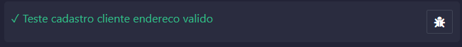
  <p><b>Fonte:</b> elaboração pela equipe Ethos.</p>
</div>  

&emsp;&emsp;O teste "cadastro cliente endereço válido" foi bem-sucedido, indicando que o sistema é capaz de cadastrar um cliente quando fornecido um endereço de carteira válido.

**✓ Teste cadastro cliente endereco invalido**  

<div align="center">
  <p> <b>Figura 27 </b> - Caso de Teste 2: Cadastro de Cliente com Endereço Inválido</p>
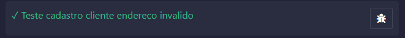
  <p><b>Fonte:</b> elaboração pela equipe Ethos.</p>
</div>  

&emsp;&emsp;Da mesma forma, o teste "cadastro cliente endereço invalido" foi realizado com sucesso, demonstrando que o sistema rejeita corretamente endereços de carteira inválidos durante o processo de cadastro.

**✓ Teste registrar transação cliente participante**
<div align="center">
  <p> <b>Figura 28 </b> - Caso de Teste 3: Registrar Transação com Cliente Participante</p>
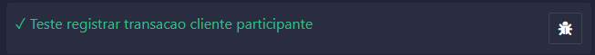
  <p><b>Fonte:</b> elaboração pela equipe Ethos.</p>
</div>  

&emsp;&emsp;Continuando, o teste "registrar transação cliente participante" foi bem-sucedido, validando que transações podem ser registradas corretamente para clientes que são participantes ativos na rede Tempus. Isso confirma que o sistema reconhece e permite transações apenas de clientes que estão devidamente cadastrados e participando ativamente da plataforma.

**✘ Teste registrar transação cliente não participante**
  - **Erro:** "A registro de transação por um cliente não participante não deveria ser permitido."
  - **Resultado Recebido:** false

<div align="center">
  <p> <b>Figura 29 </b> - Caso de Teste 4: Registrar Transação com Cliente Não Participante</p>
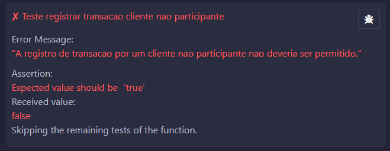
  <p><b>Fonte:</b> elaboração pela equipe Ethos.</p>
</div>  

&emsp;&emsp; Já no teste de "registrar transação cliente não participante" falhou, indicando que o sistema permitiu o registro de uma transação para um cliente que não está ativo na rede Tempus. A mensagem de erro destaca que essa operação não deveria ser permitida, e o teste esperava um valor 'true', mas recebeu 'false'. Esse resultado ressalta a necessidade de ajustes no código para garantir que transações só sejam registradas por clientes participantes ativos na plataforma.

**✓ Teste adicionar produto pelo proprietário**  
<div align="center">
  <p> <b>Figura 30 </b> - Caso de Teste 5: Adicionar Produto pelo Proprietário</p>
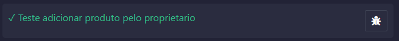
  <p><b>Fonte:</b> elaboração pela equipe Ethos.</p>
</div>  

&emsp;&emsp;O teste "adicionar produto pelo proprietário" foi bem-sucedido, indicando que a funcionalidade de adicionar um produto ao sistema funciona corretamente quando realizada pelo proprietário.

**✘ Teste adicionar produto por cliente não proprietário**  
  - **Erro:** "A adição de produto por um cliente nao proprietario nao deveria ser permitida."
  - **Resultado Recebido:** false

  <div align="center">
  <p> <b>Figura 31 </b> - Caso de Teste 6: Adicionar Produto por Cliente Não Proprietário</p>
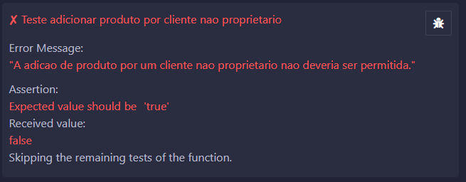
  <p><b>Fonte:</b> elaboração pela equipe Ethos.</p>
</div>  

&emsp;&emsp;Por fim, o teste "adicionar produto por cliente não proprietário" falhou, conforme esperado. A mensagem de erro indicou que a tentativa de adicionar um produto por um cliente sem as permissões adequadas não foi permitida, alinhando-se com a lógica de negócio do sistema que restringe essa funcionalidade apenas ao proprietário do produto.

&emsp;&emsp;Durante essa fase de teste do contrato Tempus, o Grupo Ethos identificou importantes áreas de melhoria e direcionamento para aprimorar os testes automatizados. A identificação de falhas, como a tentativa de registro de transação por um cliente não participante, destacou a necessidade de fortalecer os mecanismos de validação e restrição de acesso no contrato. A mensagem de erro específica, "A registro de transação por um cliente não participante não deveria ser permitido", evidenciam a importância de aperfeiçoar os controles de permissão no sistema. Justamente para evitar impactos descontrolados no futuro após a publicação da solução.

&emsp;&emsp;Vale ressaltar que, durante o processo de pesquisa para realização dos testes, foram exploradas diversas ferramentas, incluindo HardHat e o Foundry. No entanto, optou-se por utilizar o Remix devido à sua interface mais visual e intuitiva, que facilitou a execução e interpretação dos testes, contribuindo para uma análise mais eficaz e ágil dos resultados.

&emsp;&emsp;Portanto, os testes automatizados realizados pelo Grupo Ethos não apenas validaram o contrato Tempus, mas também proporcionaram insights valiosos para otimizar e aprimorar continuamente práticas de teste. Os testes se provaram úteis em identificar erros, e foi por meio deles que o grupo Ethos entendeu onde foram deixadas brechas que precisam ser arrumadas.

### 7.3 Medidas a Serem Tomadas com os Resultados dos Testes

&emsp;&emsp;Com base nos resultados dos testes automatizados realizados no Smart Contract do sistema Tempus, o grupo Ethos identificou erros graves que estavam comprometendo a realização dos testes automatizados a partir da visão geral dos testes vista na imagem a seguir. Por isso, se identificou áreas que necessitam de aprimoramento para garantir a conformidade com as regras de negócio estabelecidas. Abaixo estão as medidas sugeridas:

<div align="center">
  <p> <b>Figura 32 </b> - Testes Automatizados - Remix</p>
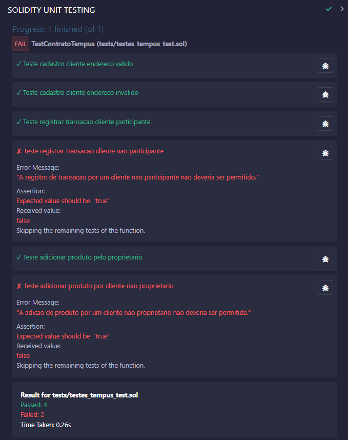
  <p><b>Fonte:</b> elaboração pela equipe Ethos.</p>
</div>

**1. Aprimoramento das Regras de Negócio**
- **Teste: Cadastro de Cliente com Endereço Inválido**: O sistema deve validar adequadamente os endereços das carteiras dos clientes antes de permitir o cadastro. Existe um potencial erro da forma como as carteiras estão sendo tratadas no backend, e por mais que os testes deram certo, existem meios de tornar a função relaciona a cadastro dos clientes mais sucinta.
 
**2. Refinamento da Lógica de Transações**
- **Teste: Registrar Transação com Cliente Não Participante**: Deve-se implementar uma lógica menos complicada que verifique a participação ativa do cliente na rede antes de permitir o registro de transações. 

**3. Restrição de Funcionalidades por Permissões**
- **Teste: Adicionar Produto por Cliente Não Proprietário**: É essencial implementar uma lógica que restringe certas funcionalidades apenas ao proprietário do contrato, conforme as regras de negócio estabelecidas. Essas permissões precisam ser reavaliadas.

**4. Testes Adicionais**
- É recomendável expandir os testes automatizados para cobrir outros cenários e funcionalidades do Smart Contract, garantindo assim uma cobertura abrangente das regras de negócio e maior confiabilidade do sistema.

**5. Revisão e Testes Adicionais**
- Considerando a utilização de outras ferramentas como HardHat e o Foundry para testes, é fundamental realizar uma revisão mais ampla do código e realizar testes adicionais para garantir a consistência das funcionalidades implementadas.

&emsp;&emsp;Em conclusão, os testes demonstraram sucesso ao atingir o objetivo principal de avaliar a plataforma e as regras de negócio do smart contract, promovendo aprimoramentos. Mesmo não tendo todos sido aprovados, cumpriram sua função essencial de identificar áreas para melhoria na plataforma Tempus. Para assegurar a funcionalidade e conformidade com as regras de negócio, é crucial implementar as melhorias sugeridas. Testes adicionais e uma análise detalhada do código são fundamentais para elevar a qualidade e a segurança do Smart Contract.


## <a name="c12"></a>8. Conclusões e Recomendações

&emsp;&emsp;O projeto foi concluído com êxito, entregando uma plataforma avançada que utiliza tecnologia web3, integração de smart contract e Metamask para otimizar o processo de cotação de fornecedores e promover transparência e segurança na contratação. A solução desenvolvida se destaca pela combinação eficaz de elementos de web2 e web3, proporcionando uma experiência de usuário mais eficiente, segura e descentralizada.

&emsp;&emsp;A plataforma oferece em uma solução para os usuários finais, os fornecedores e administradores. Na interface, foram implementadas funcionalidades essenciais como cadastro de produtos, seleção de fornecedores, realização de transações, consulta de preço médio e histórico de transações, tudo isso junto de telas de *feedback* e tutorial sobre o que é Blockchain. Os usuários podem acessar facilmente a plataforma, escolher fornecedores confiáveis e realizar transações seguras com total transparência e rastreabilidade.

&emsp;&emsp;Para a perspectiva da perosona de fornecedores e administradores, foram implementadas funcionalidades avançadas como listagem de produtos, gestão de transações e monitoramento de atividades. Os fornecedores têm total visibilidade das transações realizadas e podem gerenciar eficientemente as solicitações e transações dos usuários com acesso a rpincipalmente o preço médio.

### 8.1 Resultados Alcançados:

- **Plataforma Funcional Web3:** Desenvolvimento de uma aplicação web3 integrada com smart contract e Metamask, possibilitando uma experiência descentralizada, segura e transparente para os usuários e fornecedores.

- **Interfaces Intuitivas e Bem Projetadas:** Implementação de interfaces de usuário e fornecedor intuitivas e eficientes, facilitando a interação e gerenciamento de transações na plataforma.

- **Funcionalidades Completas e Otimizadas:** Implementação de funcionalidades essenciais e avançadas que atendem às necessidades dos usuários e fornecedores, como cadastro, seleção de fornecedores, transações seguras, monitoramento de atividades e gestão de produtos.

- **Segurança e Transparência:** Garantia de transações seguras e transparentes através da utilização da tecnologia blockchain, proporcionando confiança e credibilidade para os usuários e fornecedores.

- **Eficiência e Escalabilidade:** Desenvolvimento de uma solução otimizada que permite o gerenciamento eficiente de transações e atividades, garantindo a escalabilidade e adaptabilidade da plataforma às necessidades do mercado.

### 8.2 Plano de Ação para Continuidade do Projeto:

1. **Desenvolvimento Orientado a Testes:**
   - Aprimorar as regras de negócio e lógica de transações através da implementação de testes rigorosos e validações mais rigorosas.

2. **Otimização da Arquitetura e Performance:**
   - Avaliar e otimizar a arquitetura da solução, identificando e transferindo partes para web2 para reduzir taxa de gas e aumentar a velocidade de processamento.

3. **Expansão e Cobertura de Testes:**
   - Expandir os testes automatizados para garantir uma cobertura abrangente das funcionalidades implementadas, utilizando ferramentas como HardHat ou Remix para testes adicionais e revisão do código.

4. **Monitoramento e Feedback Contínuo:**
   - Implementar um sistema de monitoramento e coleta de feedback dos usuários e fornecedores para avaliar o desempenho e a eficácia da plataforma, permitindo ajustes e melhorias constantes.

5. **Cuidados Especiais com Escalabilidade em Relação a Web2:**
   - Otimização de Consultas e Armazenamento de Dados:
     - Implementar estratégias de otimização para consultas e armazenamento de dados, como a utilização de índices e técnicas de cache para reduzir o tempo de resposta e melhorar o desempenho da plataforma.
   - Descentralização e Distribuição de Tarefas:
     - Implementar uma arquitetura descentralizada e distribuída para distribuir tarefas e processamento entre os nós da rede, melhorando a eficiência e a escalabilidade da solução.
   - Integração com Bancos de Dados Relacionais e Não-Relacionais:
     - Utilizar bancos de dados relacionais e não-relacionais adequados para armazenar e gerenciar os dados da plataforma, garantindo a escalabilidade e a disponibilidade dos dados conforme o crescimento da plataforma.
   - Otimização de Código e Performance:
     - Realizar revisões e otimizações constantes no código da plataforma para melhorar a performance e a eficiência das operações, garantindo uma experiência de usuário rápida e responsiva.

6. **Melhorias Pensando em Escalabilidade para o Smart Contract:**
   - Refatoração e Otimização de Código:
     - Refatorar o código do smart contract para otimizar a estrutura e o desempenho das funções.
     - Ações Sugeridas:
       - Revisar e simplificar a lógica de funções complexas, como `validarDetalhesTransacao` e `registrarTransacao`, para melhorar a eficiência e reduzir o consumo de gas.
       - Eliminar redundâncias e consolidar funções similares para tornar o código mais limpo e legível.
   - Utilização de Estruturas de Dados Eficientes:
     - Utilizar estruturas de dados eficientes para armazenar e gerenciar os dados do smart contract de forma escalável.
     - Ações Sugeridas:
       - Substituir arrays dinâmicos por mapeamentos, sempre que possível, para melhorar a eficiência e o acesso aos dados, como na função `cadastrarCliente`.
       - Utilizar `mapping` para armazenar informações de produtos e transações, garantindo acesso rápido e eficiente.
   - Otimização de Gas e Taxas de Transação:
     - Realizar otimizações no código do smart contract para reduzir o consumo de gas e as taxas de transação.
     - Ações Sugeridas:
       - Revisar e simplificar operações que consomem muito gas, como iterações de loops em funções como `obterMediaTransacoes`.
       - Utilizar operações de `view` sempre que possível, em vez de `external`, para evitar o consumo desnecessário de gas.
   - Implementação de Testes e Auditorias de Segurança:
     - Implementar testes rigorosos e auditorias de segurança no smart contract para garantir a integridade, a segurança e a robustez do código.
     - Ações Sugeridas:
       - Desenvolver e executar testes unitários e de integração abrangentes para validar todas as funcionalidades do smart contract.
       - Realizar auditorias de código por especialistas em segurança de smart contracts para identificar e corrigir potenciais vulnerabilidades e falhas.

7. **Facilitação de Deploy Automatizado:**
   - Implementação de Página HTML com Express:
     - Desenvolvimento de uma página HTML simples e intuitiva que utilize o framework Express para criar um servidor Node.js.
     - Integração de um botão "Deploy" na interface da página para executar o processo de deploy automaticamente.
     - Implementação de scripts de automação para compilar, construir e implantar o projeto em um ambiente de hospedagem pré-configurado (como Vercel ou Render).
     - Documentação e tutoriais para orientar os usuários sobre como utilizar a página de deploy.

8. **Otimização de Custos com Transações:**
   - Integração com Polygon (Matic) ou Binance Smart Chain (BSC):
     - Análise e seleção da rede mais adequada (Polygon ou BSC) com base nos requisitos e custos de transação.
     - Adaptação e modificação dos contratos inteligentes existentes para serem compatíveis com a nova rede escolhida.
     - Desenvolvimento e implementação de um módulo de integração na aplicação para permitir a seleção e troca dinâmica entre Ethereum, Polygon (Matic) e BSC.
     - Testes extensivos para garantir a segurança e a eficácia das transações na nova rede.

9. **Implementação de Sistema de Monitoramento e Saúde da Solução:**
   - Implementação de Healthy Checks:
     - Desenvolvimento de um sistema de monitoramento contínuo utilizando ferramentas como Prometheus e Grafana ou soluções específicas de monitoramento de autoria própria.
     - Configuração de métricas e alertas para monitorar o desempenho, a disponibilidade e a integridade da aplicação, banco de dados e contratos inteligentes.
     - Integração de notificações por e-mail, SMS ou outros meios para alertar a equipe de desenvolvimento sobre quaisquer problemas ou falhas detectadas.
     - Criação de painéis de monitoramento para visualização em tempo real do status da aplicação e análise de tendências e padrões de uso.

10. **Reforço de Anonimato e Segurança:**
    - Sistema Dinâmico de Anonimato:
      - Desenvolvimento de um sistema que gere e gerencie carteiras de forma dinâmica para os usuários, utilizando bibliotecas como `web3.js` ou `ethers.js`.
      - Implementação de mecanismos de criptografia e ofuscação para proteger as transações e dados pessoais dos usuários.
      - Criação de políticas de segurança e privacidade claras e transparentes para informar os usuários sobre como suas informações são protegidas e utilizadas.
      - Testes de segurança e auditorias para validar a robustez e a eficácia dos mecanismos de anonimato e proteção de dados.

11. **Codificação de Chaves de Forma Assimétrica:**
    - Proteção de Dados com Hash de Chaves:
      - Implementação de um algoritmo de codificação assimétrica utilizando o hash dos usuários para proteger e autenticar as transações e consultas.
      - Desenvolvimento de interfaces e métodos seguros para gerenciar e armazenar as chaves privadas e públicas dos usuários.
      - Realização de testes de segurança e simulações para avaliar a resistência e a confiabilidade da codificação assimétrica implementada.
      - Monitoramento contínuo e atualizações periódicas para mitigar possíveis vulnerabilidades e manter a integridade e segurança dos dados dos usuários.

12. **Implementação das Regras de Negócio Não Cumpridas:**
  - **RN.02: Participar da Rede -** Desenvolver um mecanismo que ative o status de participação para os clientes cadastrados, permitindo que apenas clientes registrados e confirmados possam se tornar participantes ativos da rede.
  
  - **RN.03: Registrar Transação -** Criar um sistema que vincule cada transação registrada ao cliente que a executou, assegurando a rastreabilidade e a verificação das operações. Este sistema deve validar a participação ativa do cliente na rede antes de permitir o registro da transação.
  
  - **RN.04: Obter Média das Transações de um Cliente -** Implementar uma funcionalidade que permita aos clientes participantes da rede consultar a média de suas transações registradas. Esta funcionalidade deve ser integrada ao perfil do cliente, oferecendo uma visão clara e transparente do histórico de transações e da média calculada.
  
  - **RN.08: Validar Detalhes da Transação -** Desenvolver um sistema de validação detalhada que exija a confirmação dos detalhes da transação pelo receptor antes da conclusão da mesma. Este sistema deve garantir que as informações correspondam exatamente às acordadas entre as partes envolvidas no contrato, promovendo uma conclusão segura e confiável da transação.

&emsp;&emsp;Ao implementar estas regras de negócio e recomendações no plano de ação existente, a plataforma Tempus estará mais alinhada com os objetivos e as expectativas do projeto, fortalecendo a base de funcionalidades e garantindo uma experiência de usuário transparente, confiável e eficiente.

### 8.3 Conclusão Final:

&emsp;&emsp;Portanto, o projeto não apenas alcançou, mas superou seus objetivos fundamentais ao criar uma plataforma inovadora que combina elementos da Web 2.0 e da Web 3.0. Ao integrar avançadas tecnologias de front-end com Next.js e bibliotecas como Ethers.js, *Tempus* oferece uma experiência de usuário dinâmica, responsiva e interativa, alinhada com os padrões de interatividade e colaboração da Web 2.0.

&emsp;&emsp;Adicionalmente, o projeto promove transparência e segurança sem precedentes no processo de cotação de fornecedores. Com o uso de contratos inteligentes, automatizamos acordos e transações, eliminando intermediários e garantindo uma execução mais eficiente e confiável. Além disso, a integração com MetaMask e Hardhat demonstra compromisso em utilizar as tecnologias blockchain de forma otimizada, reforçando a inovação.

&emsp;&emsp;Ao conectar essas tecnologias avançadas com um back-end robusto, utilizando Fastify para criação de APIs e PostgreSQL para armazenamento seguro de dados, conseguiu-se criar uma plataforma escalável. Com isso, proporciona-se uma nova abordagem para o mercado, combinando eficiência, segurança e escalabilidade.

&emsp;&emsp;Por fim, *Tempus* feita pelo grupo **Ethos** representa um avanço significativo na utilização de tecnologias emergentes para otimizar processos empresariais e promover a inovação no setor. Esta síntese bem-sucedida das melhores práticas da Web 2.0 e das possibilidades emocionantes da Web 3.0 está construindo uma experiência única e revolucionária para os futuros usuários da solução.


## <a name="c13"></a>9. Referências
1. <a name="referencia-1"></a>Gushiken, A. (2023, 23 de outubro). Value Proposition Canvas: o que é e como funciona essa metodologia? G4 Educação. https://g4educacao.com/portal/value-proposition-canvas. Acesso em: 15 fev. 2024.
2. <a name="referencia-2"></a>Napoleão, B. M. (2019, 29 de junho). Matriz de Riscos (Matriz de Probabilidade e Impacto). Ferramentas de Qualidade. https://ferramentasdaqualidade.org/matriz-de-riscos-matriz-de-probabilidade-e-impacto/. Acesso em: 15 fev. 2024.
3. <a name="referencia-3"></a>Chan Kim, W., & Mauborgne, R. (2019). A estratégia do oceano azul: Como criar novos mercados e tornar a concorrência irrelevante (A. Celso da Cunha Serra, Trad.; 2a ed.). Editora Sextante.
4. <a name="referencia-4"></a> Sobre Nós. (s.d.). Soluções inteligentes para seu negócio | Thomson Reuters. https://www.thomsonreuters.com.br/pt/sobre-nos.html. Acesso em: 14 fev. 2024.
5. <a name="referencia-5"></a>Sobre nós. (s.d.). Grant Thornton Brasil - Auditoria, Consultoria e Tributos. https://www.grantthornton.com.br/sobre-nos/. Acesso em: 14 fev. 2024.
6. <a name="referencia-6"></a>Babich, N. (2017, 29 de setembro). Putting Personas to Work in UX Design: What They Are and Why They’re Important. Welcome to the Adobe Blog. https://blog.adobe.com/en/publish/2017/09/29/putting-personas-to-work-in-ux-design-what-they-are-and-why-theyre-important. Acesso em: 14 fev. 2024.
7. <a name="referencia-7"></a>What is User Centered Design (UCD)? (2016, 5 de junho). The Interaction Design Foundation. https://www.interaction-design.org/literature/topics/user-centered-design. Acesso em: 08 fev. 2024.
8. <a name="referencia-8"></a> ARRUDA, Ricardo. **O que são User Stories (Estórias de Usuário)? - Agile Expert**. 14 maio 2021. Disponível em: https://www.agilexpert.com.br/2021/05/14/o-que-sao-user-stories-historias-de-usuario/. Acesso em: 26 fev. 2024.
9. <a name="referencia-9"></a> Fáwọlé, J., & Ciattaglia, L. (2023, 14 de dezembro). Blockchain Security: Common Vulnerabilities and How to Protect Against Them - Hacken. Hacken. https://hacken.io/insights/blockchain-security-vulnerabilities. Acesso em: 08 fev. 2024.
10. <a name="referencia-10"></a>Seifried, K. (2020, 26 de outubro). Blockchain Attacks, Vulnerabilities and Weaknesses | CSA. Home | CSA. https://cloudsecurityalliance.org/blog/2020/10/26/blockchain-attacks-vulnerabilities-and-weaknesses. Acesso em: 08 fev. 2024.
11. <a name="referencia-11">DALLAVALLE, Silvia Inês; CAZARINI, Edson Walmir. Regras do Negócio, um fator chave de sucesso no processo de desenvolvimento de Sistemas de Informação. Anais do XX ENEGEP-Encontro Nacional de Engenharia de Produção. São Paulo, 2000</a>
12. <a name="referencia-12">MARTIN, Robert C. Clean Architecture: A Craftsman's Guide to Software Structure and Design. Prentice Hall, 2017.</a>
13. <a name="referencia-13">MORGAN, Tony. Business Rules and Information Systems: Aligning IT with Business Goals. Boston: Addison-Wesley Professional, Março de 2002. ISBN: 9780201743913.</a> 
14. <a name="referencia-14">GasNow: Disponível em: https://gasnow.io/. Acesso em: 12 de março de 2024.</a>
15. <a name="referencia-15">Alliance Consultoria: Disponível em: https://www.allianceconsultoria.com.br/. Acesso em: 12 de março de 2024.</a>
16. <a name="referencia-16"></a> ISO 25010. Disponível em: https://iso25000.com/index.php/en/iso-25000-standards/iso-25010. Acesso em: 28 março de 2024.

## <a name="c14"></a>10. Anexos
Vídeo de demonstração:
[aqui](https://www.youtube.com/watch?v=nrI4xnV_RZo)
Vídeo de demonstração do Deploy:
[aqui](https://drive.google.com/file/d/1_GJWaYOb1sqPdU46SfkgzGtHCFYVyLrj/view)
